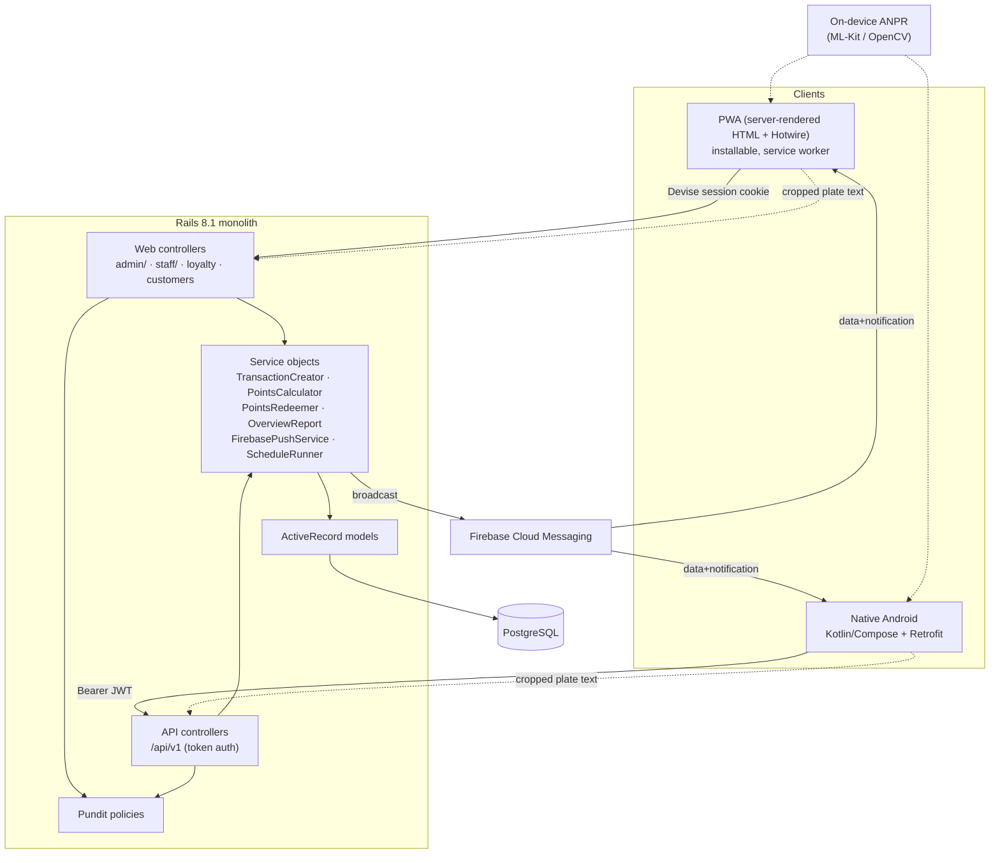

# AceFuels — Current Architecture (as-built)

An accurate map of what exists **today** in `fuel-loyalty`, verified by reading the
code. This is not a plan and not the requirement sheet — it documents the shipped
system so the gap analysis and feature specs can build on solid ground.

Provenance: Rails 8.1 schema (`db/schema.rb:13`), app at Android `versionCode 5 /
1.1.1` (`android/app/build.gradle.kts:28-29`), package `com.acefuel.loyalty`.

---

## 1. System topology

Five cooperating pieces share **one Rails backend and one Postgres database**:

| Piece | What it is | Entry point |
|---|---|---|
| **Rails server** | Rails 8.1 monolith (API + server-rendered PWA) | `config/routes.rb` |
| **PWA** | Server-rendered HTML + Hotwire, installable; manifest + service worker served by Rails | `PwaController` (`config/routes.rb:7-8`), `app/assets/javascripts/vehicle_plate_scanner.js` |
| **Native Android** | Kotlin/Compose app talking to the JSON API | `android/app/src/main/kotlin/com/acefuel/loyalty` |
| **JSON API** | `/api/v1/*`, token-authenticated, backs Android | `config/routes.rb:16-88` |
| **FCM push** | Firebase Cloud Messaging fan-out to web + Android tokens | `app/services/firebase_push_service.rb` |
| **Plate scanner** | On-device ANPR (web JS + Android CameraX/ML-Kit) posting cropped text to the server | `vehicle_plate_scanner.js`, `ui/scanner/PlateScannerScreen.kt`, `app/services/vehicle_plate_recognizer.rb` |

Key property: **the PWA and Android are two front-ends over the same models and
business services.** The PWA renders server-side and calls the same service objects
(`TransactionCreator`, `PointsRedeemer`) directly; Android calls the `/api/v1`
controllers, which call those same services. There is no separate business logic on
the client.



---

## 2. Auth model

Two authentication schemes over the **same `users` table**, both funneling through
the same Devise credential resolver and the same active/soft-delete gates.

### 2.1 Web (PWA) — Devise session
- Devise modules: `:database_authenticatable, :recoverable, :rememberable,
  :validatable` (`app/models/user.rb:28`). DB-backed password auth; **no OTP/SMS**.
- Login accepts **username OR email OR 10-digit phone**, resolved by
  `User.find_for_database_authentication` (`app/models/user.rb:84-102`) — it builds a
  `LOWER(username)=… OR LOWER(email)=… OR phone_number=…` query scoped to `kept`
  (non-soft-deleted) users.
- Gates: `active_for_authentication?` requires `active? && !soft_deleted?`
  (`app/models/user.rb:132-134`).
- Phone-only accounts get a synthesized internal email
  (`user-<digits>@users.fuel-loyalty.local`, `app/models/user.rb:120-126,264-270`) so
  Devise's email validations are satisfied without a real address.

### 2.2 API (Android) — stateless JWT
- `Api::TokenService` (`app/services/api/token_service.rb`) issues an **access token
  (30 min)** and a **refresh token (30 days)**, both HS256-signed (not encrypted).
  Signing key derives from `secret_key_base` unless `API_JWT_SECRET` is set
  (`token_service.rb:72-76`).
- `POST /api/v1/auth/login` reuses the same Devise resolver + gates
  (`sessions_controller.rb:11-27`); `refresh`, `logout` (client-side discard), `me`.
- Every API request re-validates the bearer token AND re-checks
  `active_for_authentication?` on each call (`api/v1/base_controller.rb:42-51`), so a
  deactivated user is locked out on the next request even with a live token.
- **No server-side revocation list** — logout is token discard; password/role changes
  take effect at next access-token expiry (documented in `token_service.rb:10-12`).
- Android token plumbing: `TokenStore`, `AuthInterceptor` (attaches Bearer),
  `TokenAuthenticator` (401 → refresh) in `core/network/` and `core/auth/`.

### 2.3 Roles & policies
- Role is an enum on `users`: `{ admin: 0, staff: 1 }`, default `staff`
  (`app/models/user.rb:10`).
- **Authorization is enforced by controller base classes, one per surface**, all
  checking the same role predicate:
  - Web admin: `Admin::BaseController#ensure_admin!` (`admin/base_controller.rb:8-10`).
  - Web staff: `Staff::BaseController#ensure_staff_access` — admin **or** staff
    (`staff/base_controller.rb:8-11`).
  - API admin: `Api::V1::Admin::BaseController#ensure_admin`
    (`api/v1/admin/base_controller.rb:11-13`).
  - API staff: `Api::V1::Staff::BaseController#ensure_staff_access`
    (`api/v1/staff/base_controller.rb:11-16`).
- **Pundit** is included in both `ApplicationController` and the API base; policies
  live in `app/policies/` (16 policies: customer, transaction, dashboard, fuel_pump,
  user, shift_*, etc.). Failures raise `Pundit::NotAuthorizedError` → web redirect /
  API 403 (`api/v1/base_controller.rb:70-73`).

> Note the audit finding **S-MYPUMP / S-PAUSE**: "My Pump" and per-customer
> "pause rewards" are reachable by staff today, which is the *opposite* of the sheet's
> constraint that those be hidden from staff. That is a policy-surface gap, not an
> auth-scheme gap.

---

## 3. Loyalty / points pipeline

This is the core value flow. **A transaction stores only a rupee amount today
(`transactions.fuel_amount`, decimal 10,2 — `db/schema.rb:279`); there are no litres,
no meter readings, no discount.** Points are derived from the ₹ amount.

### 3.1 Earning — `TransactionCreator` (`app/services/transaction_creator.rb`)
One DB transaction (`transaction_creator.rb:21`) does everything:

1. **Resolve customer + vehicle** by either phone lookup or vehicle-number lookup
   (`resolve_customer_and_vehicle!`, lines 54-65); both paths enforce the customer is
   `active?`.
2. **Resolve pump + nozzle** (`resolve_fuel_pump_and_nozzle!`, lines 140-186):
   - If `RewardSetting.nozzle_feature_enabled?` (the default), the pump comes from the
     operator's **My Pump** assignment (`user.transaction_fuel_pump`), and the nozzle
     must be one of the operator's assigned nozzles AND its fuel type must match the
     vehicle's fuel type (lines 143-171).
   - If the nozzle feature is off, the operator just picks an active pump; no nozzle
     (`resolve_selected_pump!`, lines 174-186).
3. **Create the transaction** with `fuel_amount` + `payment_mode` (cash/credit)
   (lines 26-33).
4. **Award points** unless `customer.rewards_paused?` (lines 34-44): calls
   `PointsCalculator` and writes an `earn` row to `points_ledgers`.

### 3.2 Point math — `PointsCalculator` (`app/services/points_calculator.rb`)
```
points = floor(fuel_amount / rupees_per_reward_unit) * points_per_100
```
- `rupees_per_reward_unit` comes from `RewardSetting.current` (default 100,
  `reward_setting.rb:3,35`).
- `points_per_100` is **vehicle-type override first, fuel-type fallback**
  (`points_calculator.rb:20-26`): `VehicleType.reward_points_per_100_for(vehicle_kind)`
  if present, else `FuelRewardRate.points_per_100_for(fuel_type)`. This is the shipped
  form of requirements **C1/C2/C3**.

### 3.3 Redeeming — `PointsRedeemer` (`app/services/points_redeemer.rb`)
- Redemption increment = the customer's effective minimum redeemable points
  (`redemption_increment`, `points_redeemer.rb:10-14`; `reward_setting.rb:63-65`),
  defaulting to 100.
- Validates: rewards not paused, at/above minimum, positive, a multiple of the
  increment, not over `max_redeemable_points` (lines 30-64).
- Writes a negative-points `redeem` row; the cash value is snapshotted onto the ledger
  entry (`points_ledgers.cash_reward_amount`) at write time from
  `RewardSetting.cash_value_for_points` (`points_ledger.rb:30-37`,
  `reward_setting.rb:53-57`) — implements the "cash reward per point" side of **C1**.

### 3.4 Ledger — `points_ledgers`
`entry_type` enum `{ earn:0, redeem:1, expire:2, adjust:3 }`
(`points_ledger.rb:5`). `earn`/`redeem` are produced by the two services above;
`adjust` is produced by the admin points-adjustment path
(`admin/points_adjustments_controller`, `api/v1/admin/points_adjustments_controller`).
A customer's balance is `points_ledgers.sum(:points)` (`customer.rb:36-40`).

**Public loyalty lookup:** an unauthenticated customer can check their balance via
`/loyalty` (`LoyaltyController`) / `POST /api/v1/loyalty/lookup`
(`api/v1/loyalty_controller`), gated by a signed `LoyaltyLookupToken`
(`app/services/loyalty_lookup_token.rb`) — no login required.

---

## 4. Notification pipeline

**Broadcast-only, untargeted push** (audit finding F3). No per-customer or
per-segment targeting, no offer object, no automatic loyalty push.

### 4.1 Subscriptions
- `push_subscriptions(token, platform, active)` — **anonymous tokens, no customer/user
  FK** (`db/schema.rb:162`; per audit). Registered via `POST /push/subscriptions`
  (`push_subscriptions_controller`), from both web (FCM web SDK, gated by
  `FirebaseAppConfig.web_push_ready?`, `application_controller.rb:155-168`) and Android
  (`core/push/Push.kt`, `AceFuelMessagingService.kt`).

### 4.2 Delivery — `FirebasePushService` (`app/services/firebase_push_service.rb`)
- `broadcast(title:, message:)` fans out to **all active subscriptions** in batches of
  500 (`firebase_push_service.rb:31-66`), calling FCM v1 `messages:send` per token with
  an OAuth access token from the service account (`fetch_access_token`, lines 76-82).
- Payload carries both `notification` and `data` blocks plus platform-specific
  `android` (channel `fuel_loyalty_broadcast`, line 16) and `webpush` sections
  (lines 124-164).
- Self-healing: tokens returning `UNREGISTERED`/`INVALID_ARGUMENT` are deactivated
  (`deactivate!`, lines 105-108).

### 4.3 Scheduling
- `notification_schedules(title, message, frequency, scheduled_time, day_of_week,
  day_of_month, scheduled_date, last_sent_at, active)` (`db/schema.rb:134`).
- **Immediate send:** admin "send now" → `Admin::NotificationDeliveriesController` /
  `POST /api/v1/admin/notifications/send` → `FirebasePushService#broadcast`.
- **Scheduled send:** `NotificationScheduleRunner`
  (`app/services/notification_schedule_runner.rb`) evaluates each active schedule's
  next occurrence (`is_due?` / `occurrence_at`, lines 20-52) for once/daily/weekly/
  monthly, then broadcasts and stamps `last_sent_at` (once-schedules auto-deactivate,
  line 94). A **`SchedulerLease`** row provides distributed mutual exclusion with a
  10-minute heartbeat lease so concurrent runners don't double-send (lines 118-158).
  Triggered by `POST /admin/schedules/run` and its API twin.

---

## 5. Shift / attendance subsystem (exceeds the sheet)

The requirement sheet asks only for **shift definitions (A8) and assigning operators
to shifts (A9)**. The as-built system implements a **far richer rostering + attendance
engine** that goes well beyond that.

Models: `shift_template`, `shift_cycle` (+`shift_cycle_step`), `shift_assignment`,
`shift_swap`, `attendance_run`, `attendance_entry` (+`attendance_entry_change`),
`scheduler_lease`.

Capabilities present today:
- **Shift templates** with configurable start/duration (`shift_template.rb`), covering
  the sheet's 24/12/8-hour patterns.
- **Rotating shift cycles** — ordered `shift_cycle_step`s the sheet never asked for
  (`shift_cycle.rb`).
- **Time-bounded assignments** — `shift_assignment` has `effective_from`/`effective_to`
  windows and an `active` flag, with `effective_at` scoping so an operator's current
  shift is resolved for any point in time (`shift_assignment.rb:6-11,90-92`;
  `user.rb:160-171`).
- **Shift swaps** between operators (`shift_swap.rb`).
- **Attendance runs & entries** — a roster is materialized per run
  (`AttendanceRosterBuilder`), each `attendance_entry` tracking scheduled vs actual vs
  replacement operator with an audit trail of `attendance_entry_change`s and
  invalidate/mark-valid controls (`admin/attendance_runs_controller`, routes
  `config/routes.rb:75-80,127-130`).

Admin controllers: `shift_templates`, `shift_cycles`, `staff_members` (+nested
`shift_assignments`), `attendance_runs` — mirrored under `/api/v1/admin/*`. Android
surfaces: `ui/admin/shifts`, `ui/admin/cycles`, `ui/admin/attendance`,
`ui/admin/staff`.

> This subsystem is the single largest area where the code **exceeds** the requirement.
> It is worth flagging so the gap analysis does not treat A8/A9 as partial — they are
> over-delivered.

---

## 6. Per-layer feature inventory

Feature IDs match the shared scheme. "Android" lists the Compose screen package under
`android/app/src/main/kotlin/com/acefuel/loyalty/`. API endpoints all live under
`/api/v1` (see `config/routes.rb:16-88`).

| Feature (ID) | Rails model(s) | Web controller(s) | API controller(s) | Android screen |
|---|---|---|---|---|
| Pumps (A1) | `fuel_pump` | `admin/fuel_pumps` | `admin/fuel_pumps` | `ui/admin/pumps` |
| Nozzles + fuel-type-per-nozzle (A2/A4) | `fuel_pump_nozzle`, `fuel_type` | `admin/fuel_pumps` (feature_settings), `admin/fuel_types` | `admin/fuel_pumps`, `admin/fuel_types` | `ui/admin/pumps`, `ui/admin/fueltypes` |
| Assign nozzle to operator / My Pump (A3/A10) | `user_pump_nozzle_assignment`, `fuel_pump_nozzle` | `my_pumps` | `my_pump`, `staff/catalog` | `ui/mypump` |
| Vehicle types (A6) | `vehicle_type` | `admin/vehicle_types` | `admin/vehicle_types` | `ui/admin/vehicletypes` |
| Operator/user setup (A7) | `user` | `admin/users`, `admin/staff_members` | `admin/users`, `admin/staff_members` | `ui/admin/users`, `ui/admin/staff` |
| Shifts + assignment (A8/A9) *(exceeds sheet)* | `shift_template`, `shift_cycle(_step)`, `shift_assignment`, `shift_swap`, `attendance_run`, `attendance_entry` | `admin/shift_templates`, `admin/shift_cycles`, `admin/staff_members`, `admin/attendance_runs` | same under `/api/v1/admin` | `ui/admin/shifts`, `ui/admin/cycles`, `ui/admin/attendance` |
| Customer master (B1) | `customer`, `vehicle` | `staff/customers`, `admin/customers`, `customers`, `vehicles` | `staff/customers`, `staff/vehicles` | `ui/customers` |
| Per-visit transaction capture (B2 partial) | `transaction` | `staff/transactions` | `staff/transactions` | `ui/transaction` |
| Reward settings — ₹/100, by fuel, by vtype, per-customer pause (C1–C4) | `reward_setting`, `fuel_reward_rate`, `vehicle_type` | `admin/fuel_reward_rates`, `staff/customers` (pause) | `admin/reward_rates`, `staff/customers` (pause/resume) | `ui/admin/rewardrates` |
| Loyalty accrual/redemption (C5) | `points_ledger`, `transaction` | `staff/redemptions`, `loyalty`, `admin/points_adjustments` | `staff/redemptions`, `loyalty`, `admin/points_adjustments` | `ui/redeem`, `ui/loyalty`, `ui/adjust` |
| Dashboard / KPIs (E2 partial) | aggregates over `transaction`, `customer`, `points_ledger` | `admin/dashboard` (+`data`) | `admin/dashboard` (`#data`) | `ui/admin/dashboard` |
| Transactions view (G1 partial) | `transaction` | `admin/transactions` (index only) | `admin/transactions` (index) | `ui/admin/transactions` |
| Notifications / push (F3 partial) | `notification_schedule`, `push_subscription` | `admin/notifications`, `admin/notification_deliveries`, `admin/schedules`, `push_subscriptions` | `admin/notifications`, `admin/schedules` | `ui/admin/schedules` |
| Theme / branding | `theme_setting` | `admin/theme_settings` | `theme`, `admin/theme_settings` | `ui/admin/theme`, `core/theme` |
| Plate scanner (ANPR) | (none; text-only) `vehicle` | `staff/transactions#recognize_plate` | `staff/transactions#recognize_plate` | `ui/scanner` |
| Account / session | `user` | Devise, `passwords` | `auth/sessions`, `password` | `ui/account`, `ui/login` |

Business services backing the above: `TransactionCreator`, `PointsCalculator`,
`PointsRedeemer` (loyalty); `Admin::Dashboard::OverviewReport` (dashboard, see §7);
`FirebasePushService` + `NotificationScheduleRunner` (notifications);
`VehiclePlateRecognizer` + `VehiclePlateText` (ANPR); `AttendanceRosterBuilder`
(shifts); `LoyaltyLookupToken` (public lookup); `Api::TokenService` (JWT).

---

## 7. Dashboard reporting engine — `Admin::Dashboard::OverviewReport`

`app/services/admin/dashboard/overview_report.rb` is a single ~700-line service that
computes the entire admin dashboard JSON payload (consumed by both the web dashboard
and `GET /api/v1/admin/dashboard`).

- **Period presets** `today / this_week / this_month / last_month` plus an explicit
  start/end range (`QUICK_RANGES`, lines 5-10,108-124), a **segment** filter
  (all/new/repeat, lines 11-15), and a **fuel-type** filter (lines 100-106).
- **Summary cards** with period-over-period % change: total/active customers,
  transactions, revenue (+fuel-type breakdown), points issued/redeemed, avg spend/visit,
  visits/customer (`summary_cards`, lines 293-337).
- **Charts:** transactions/revenue/points/active-users trends, repeat-vs-new,
  **visits distribution** (1 / 2-5 / 6+ visits), top customers by count and revenue,
  top redemption slabs, by-hour and by-weekday histograms (`chart_payload`, lines
  362-376).

Audit caveat (**E2**): the tiles are computed but **not click-through** to a customer
list, and there is **no per-customer cadence / last-visit / churn** view — those are
the E-series gaps.

---

## 8. What the data model does NOT capture today

Load-bearing for the gap analysis and the locked units decision (litres = source of
truth):

- **No litres, no meter/nozzle readings, no discount** on `transactions` — only
  `fuel_amount` in ₹ (`db/schema.rb:276-291`). Points are derived from ₹, the inverse
  of the locked Q1 decision.
- **No product catalog / MRP / selling price / lubes / stock** anywhere (no such
  model; A5, D1-D2, D8 absent).
- **No Daily Settlement** model or subsystem (D-series absent) — the shift/attendance
  subsystem is unrelated to shift-end cash settlement.
- **Customer master is thin** (`customers`: name, phone, vehicle_number, active,
  rewards_paused — `db/schema.rb:83-92`): no driver/supervisor/owner triple, no
  contacted flag, no customer type (OTP/TT/Drive-in/Credit). Commercial contact info
  lives on `vehicles` as a single company/contact block
  (`commercial_*` columns, `db/schema.rb:360-374`), not the sheet's three-contact model.
- **Push has no targeting and no offer object** (`push_subscriptions` has no
  customer/user FK); no WhatsApp/SMS channel (F1/F2/F4 absent).
- **No global reward pause** — only per-customer `rewards_paused`
  (`reward_settings` has no such flag; C4 partial).
