# AceFuels — Target Data Model (03)

The schema **after every gap in the requirement is built**, honoring the three
LOCKED DECISIONS (2026-07-21):

- **Q1 — Litres are the source of truth.** Capture meter readings / litres, and
  **derive ₹** from the product-catalog selling price. `transactions` today store
  only `fuel_amount` (₹); that becomes a *derived* value, not the input.
- **Q2 — Both surfaces.** Every table below backs the Rails PWA **and** the native
  Android app through the JSON API. No table is web-only or Android-only.
- **Q3 — Operator KYC = profile fields only.** Add Photo, Address, Aadhaar #,
  ID-card photo. Keep username/mobile + password login. **No OTP / SMS.**

Baseline is `db/schema.rb` (`ActiveRecord::Schema[8.1]`, version
`2026_07_13_010000`). Feature IDs (A1–G1, S-*) are the shared IDs from the gap
analysis. Money = `decimal(10,2)` ₹. Litres = `decimal(10,3)`. Meter readings =
`decimal(12,3)` (they run to lakhs of litres over a nozzle's life).

Legend: **NEW** table = does not exist today · **CHANGE** = altered existing
table · autopop = value pre-filled in the UI, still stored as a snapshot.

---

## 0. Design decisions that shape the model

### 0.1 Litres: extend `transactions`, and add a *separate* nozzle-reading concept — do BOTH

There are **two different "litres"** in the requirement, and conflating them is the
main modelling trap:

| Concept | Grain | Purpose | Home |
|---|---|---|---|
| **Per-customer litres filled** (CustomerDetailsEntry, B2) | one customer visit | loyalty accrual, CRM, discounts | **extend `transactions`** |
| **Per-nozzle shift meter litres** (DailySettlement D1) | one nozzle per shift | cash reconciliation, stock, shortage | **new `settlement_nozzle_readings`** |

**They are not the same number and must not share a row.** A nozzle's net litres for
a shift ≈ the *sum of all dispenses through it*, but only a fraction of those are
captured as named-customer transactions (walk-in cash is often anonymous). Meter
readings reconcile the shift's cash; customer transactions drive loyalty. So:

- **`transactions`** gains `litres`, `price_per_litre`, `gross_amount`,
  `discount_amount`, `net_amount`, `product_id`. **No meter reading on
  `transactions`** — a per-visit fill has no "opening reading". (This answers the
  `opening_reading?` question: opening/closing readings live **only** on
  `settlement_nozzle_readings`.)
- **`settlement_nozzle_readings`** owns `opening_reading` / `closing_reading` /
  `testing_litres` / `net_litres` / `price_per_litre` / `amount`.

`transactions.fuel_amount` (existing, `null: false`) is **retained but redefined as
`net_amount`** for backward-compat with the loyalty engine and existing rows; new
writes set `fuel_amount = net_amount`. Eventually deprecate it (see §11).

### 0.2 Price derivation must be date-accurate → `product_price_history`

Because ₹ is *derived* and admins can **edit past days** (G1) and view historical
settlements (D9), we cannot read "today's" `selling_price` when re-deriving an old
row. Every priced row therefore **snapshots** its `price_per_litre` / `price_per_unit`
at write time, **and** we keep `product_price_history` so a correct price can be
re-derived for any business date. Snapshot = fast + immutable; history = auditable +
re-derivable. We keep both.

---

## 1. Product Catalog  (A5 — keystone dependency)

### `products`  — **NEW**
The single priced catalog of everything sold: fuels (HSD/MS) *and* lubes/oils/AdBlue.

| Column | Type | Notes |
|---|---|---|
| `id` | bigint PK | |
| `sku` | string, null:false | unique business code, e.g. `HSD`, `MS`, `2T-20ML`, `ADBLUE-5L` |
| `name` | string, null:false | "High Speed Diesel", "2T Oil 20ml", "AdBlue 5L" |
| `category` | integer, null:false | enum `fuel:0`, `lube:1` |
| `fuel_type_code` | string, null:true | FK → `fuel_types.code`; **set iff `category=fuel`** (links a fuel product to its nozzle fuel type) |
| `pack_size` | string, null:true | display pack, e.g. `20ml`, `800ml`, `5L`; null for bulk fuel |
| `unit` | integer, null:false | enum `litre:0`, `millilitre:1`, `piece:2` (billing/stock unit) |
| `batch` | string, null:true | current batch/lot for lubes |
| `mrp` | decimal(10,2), null:false | printed MRP |
| `selling_price` | decimal(10,2), null:false | actual selling price (**the ₹-derivation source**) |
| `active` | boolean, default:true, null:false | |
| `created_at`/`updated_at` | datetime | |

Indexes: unique `sku`; `category`; `active`; `fuel_type_code`.
FK: `fuel_type_code` → `fuel_types(code)`.

> Seed the 14 catalog rows from the requirement (HSD, MS, 2T-20/40/60ml, 10W30-800ml,
> 2T-500ml, Milex Petrol 5/40ml, Milex Diesel 10/50ml, AdBlue 5/10/20L).

### `product_price_history`  — **NEW**
| Column | Type | Notes |
|---|---|---|
| `id` | bigint PK | |
| `product_id` | bigint, null:false | FK → `products` |
| `mrp` | decimal(10,2), null:false | |
| `selling_price` | decimal(10,2), null:false | |
| `effective_from` | datetime, null:false | |
| `effective_to` | datetime, null:true | null = current price |
| `recorded_by_id` | bigint, null:true | FK → `users` |
| `created_at`/`updated_at` | datetime | |

Indexes: `(product_id, effective_from)`; partial/`effective_to`.
FK: `product_id` → `products`; `recorded_by_id` → `users`.

---

## 2. Inventory / Stock  (D2 stock, D8 stock-received + decantation)

### `product_stocks`  — **NEW** (running snapshot)
| Column | Type | Notes |
|---|---|---|
| `id` | bigint PK | |
| `product_id` | bigint, null:false | FK → `products` |
| `quantity_on_hand` | decimal(12,3), null:false, default:0 | in the product's `unit` |
| `last_counted_at` | datetime, null:true | from the latest settlement closing stock |
| `created_at`/`updated_at` | datetime | |

Indexes: unique `product_id`. FK → `products`.

### `stock_receipts`  — **NEW** (D8: "Stock Received", MS/HSD and lubes)
| Column | Type | Notes |
|---|---|---|
| `id` | bigint PK | |
| `product_id` | bigint, null:false | FK → `products` (MS/HSD are products too) |
| `quantity` | decimal(12,3), null:false | received qty in product `unit` |
| `unit_cost` | decimal(10,2), null:true | purchase cost if tracked |
| `received_on` | date, null:false | business date |
| `settlement_id` | bigint, null:true | FK → `settlements` when logged at shift end |
| `recorded_by_id` | bigint, null:false | FK → `users` |
| `notes` | text, null:true | |
| `created_at`/`updated_at` | datetime | |

Indexes: `(product_id, received_on)`; `settlement_id`.
FKs: `product_id` → `products`; `settlement_id` → `settlements`; `recorded_by_id` → `users`.

### `tank_decantations`  — **NEW** (D8: tank KL readings when a tanker unloads)
| Column | Type | Notes |
|---|---|---|
| `id` | bigint PK | |
| `fuel_type_code` | string, null:false | FK → `fuel_types.code` (which underground tank) |
| `settlement_id` | bigint, null:true | FK → `settlements` |
| `opening_reading_kl` | decimal(10,3), null:false | tank dip before decantation (KL) |
| `closing_reading_kl` | decimal(10,3), null:false | tank dip after |
| `decanted_litres` | decimal(12,3), null:true | derived = (closing−opening)×1000 |
| `reading_on` | date, null:false | |
| `recorded_by_id` | bigint, null:false | FK → `users` |
| `notes` | text, null:true | tanker no. etc. |
| `created_at`/`updated_at` | datetime | |

Indexes: `(fuel_type_code, reading_on)`; `settlement_id`.
FKs: `fuel_type_code` → `fuel_types(code)`; `settlement_id` → `settlements`; `recorded_by_id` → `users`.

> Per-**lube** opening/closing stock lives on `settlement_lube_lines` (§4) because it
> is captured *inline* on the settlement; `product_stocks` is updated from those
> closing values. Bulk fuel stock arrives via `stock_receipts` + `tank_decantations`.

---

## 3. Litres model — `transactions`  **CHANGE**  (B2 / C5 / litres-source-of-truth)

Repurpose `transactions` as the **CustomerDetailsEntry** per-visit record.

New / changed columns:

| Column | Type | Notes |
|---|---|---|
| `litres` | decimal(10,3), null:true | **source of truth**; null only for legacy ₹-only rows |
| `product_id` | bigint, null:true | FK → `products` (the fuel dispensed; usually resolved from nozzle) |
| `price_per_litre` | decimal(8,3), null:true | snapshot of `products.selling_price` at write time |
| `gross_amount` | decimal(10,2), null:true | derived = `litres × price_per_litre` |
| `discount_amount` | decimal(10,2), null:false, default:0 | per-visit discount |
| `net_amount` | decimal(10,2), null:true | derived = `gross_amount − discount_amount` |
| `fuel_amount` | decimal(10,2), null:false | **retained**; now mirrors `net_amount` (backward-compat) |
| `fleet_otp` | boolean, null:false, default:false | Fleet/OTP flag (Yes/No) |
| `driver_name` | string, null:true | per-visit snapshot (also upserts customer contact, §6) |
| `driver_mobile` | string, null:true | per-visit snapshot |
| `business_date` | date, null:true | autopop; enables per-day grouping without TZ math on `created_at` |

Unchanged FKs remain: `customer_id`, `user_id`, `vehicle_id`, `fuel_pump_id`,
`fuel_pump_nozzle_id`, `payment_mode`. New FK: `product_id` → `products`.
New indexes: `product_id`; `business_date`; `fleet_otp`.

> Transport / manager / owner details from the CustomerDetailsEntry form are **not**
> duplicated onto every transaction — they upsert into `customers` +
> `customer_contacts` (§6). Only the two most volatile per-visit fields
> (`driver_name`/`driver_mobile`) are snapshotted here.

---

## 4. Daily Settlement  (D1, D2, D5, D6, D7, D9, G1)

One `settlements` header per **pump × business_date × shift**, with child lines.

### `settlements`  — **NEW**
| Column | Type | Notes |
|---|---|---|
| `id` | bigint PK | |
| `fuel_pump_id` | bigint, null:false | FK → `fuel_pumps` |
| `shift_template_id` | bigint, null:true | FK → `shift_templates` |
| `fsm_user_id` | bigint, null:false | FK → `users` — "Name of FSM" |
| `business_date` | date, null:false | |
| `status` | integer, null:false, default:0 | enum `draft:0`, `submitted:1`, `approved:2`, `reopened:3` |
| `phonepe_pos_amount` | decimal(10,2), null:false, default:0 | D4 machine |
| `phonepe_scanner_amount`| decimal(10,2), null:false, default:0 | D4 scanner |
| `fuel_sold_amount` | decimal(12,2), null:true | derived Σ nozzle amounts |
| `lube_sold_amount` | decimal(12,2), null:true | derived Σ lube amounts |
| `discounts_amount` | decimal(12,2), null:true | derived Σ credit/discount lines |
| `final_settle_amount` | decimal(12,2), null:true | **D6** = (fuel+lube) − (discounts + pos + scanner) |
| `expected_cash_amount` | decimal(12,2), null:true | cash the pump *should* hold |
| `counted_cash_amount` | decimal(12,2), null:true | Σ `settlement_cash_counts` |
| `shortage_amount` | decimal(12,2), null:true | **D7** = expected − counted, per pump |
| `submitted_at` | datetime, null:true | |
| `approved_by_id` | bigint, null:true | FK → `users` (admin) |
| `notes` | text, null:true | |
| `recorded_by_id` | bigint, null:false | FK → `users` |
| `created_at`/`updated_at` | datetime | |

Indexes: **unique** `(fuel_pump_id, business_date, shift_template_id)`;
`status`; `business_date`; `fsm_user_id`.
FKs: `fuel_pump_id`→`fuel_pumps`; `shift_template_id`→`shift_templates`;
`fsm_user_id`/`approved_by_id`/`recorded_by_id`→`users`.

### `settlement_nozzle_readings`  — **NEW** (D1 — the reconciliation litres)
| Column | Type | Notes |
|---|---|---|
| `id` | bigint PK | |
| `settlement_id` | bigint, null:false | FK → `settlements` |
| `fuel_pump_nozzle_id` | bigint, null:false | FK → `fuel_pump_nozzles` |
| `fuel_type_code` | string, null:false | snapshot of the nozzle's fuel |
| `opening_reading` | decimal(12,3), null:false | **autopop = prior shift's closing** |
| `closing_reading` | decimal(12,3), null:false | today's reading |
| `testing_litres` | decimal(10,3), null:false, default:0 | subtracted |
| `net_litres` | decimal(12,3), null:true | derived = closing − opening − testing |
| `price_per_litre` | decimal(8,3), null:false | autopop from catalog |
| `amount` | decimal(12,2), null:true | derived = net_litres × price_per_litre |
| `created_at`/`updated_at` | datetime | |

Indexes: unique `(settlement_id, fuel_pump_nozzle_id)`; `fuel_pump_nozzle_id`.
FKs: `settlement_id`→`settlements`; `fuel_pump_nozzle_id`→`fuel_pump_nozzles`;
`fuel_type_code`→`fuel_types(code)`.

### `settlement_lube_lines`  — **NEW** (D2)
| Column | Type | Notes |
|---|---|---|
| `id` | bigint PK | |
| `settlement_id` | bigint, null:false | FK → `settlements` |
| `product_id` | bigint, null:false | FK → `products` (category=lube) |
| `quantity` | decimal(12,3), null:false | units sold |
| `price_per_unit` | decimal(10,2), null:false | autopop from catalog |
| `amount` | decimal(12,2), null:true | derived = quantity × price_per_unit |
| `opening_stock` | decimal(12,3), null:true | |
| `closing_stock` | decimal(12,3), null:true | feeds `product_stocks` |
| `created_at`/`updated_at` | datetime | |

Indexes: unique `(settlement_id, product_id)`.
FKs: `settlement_id`→`settlements`; `product_id`→`products`.

### `settlement_credit_lines`  — **NEW** (D5: Fleet/OTP + TT credit + pulled discounts)
| Column | Type | Notes |
|---|---|---|
| `id` | bigint PK | |
| `settlement_id` | bigint, null:false | FK → `settlements` |
| `credit_type` | integer, null:false | enum `fleet_otp:0`, `drive_in:2`, `credit:3` — mirrors the Customer account types; `tt:1` retired and migrated to `credit` |
| `vehicle_number` | string, null:true | e.g. `NL-01/AE-2471` |
| `litres` | decimal(10,3), null:true | |
| `discount_amount` | decimal(10,2), null:false, default:0 | |
| `amount` | decimal(12,2), null:true | credit value |
| `customer_id` | bigint, null:true | FK → `customers` when matched |
| `transport_name` | string, null:true | |
| `driver_name` | string, null:true | denormalized from source visit |
| `driver_mobile` | string, null:true | |
| `note` | text, null:true | |
| `created_at`/`updated_at` | datetime | |

Indexes: `settlement_id`; `credit_type`; `customer_id`.
FKs: `settlement_id`→`settlements`; `customer_id`→`customers`.

### `settlement_payments`  — **NEW** (D4 — extensible non-cash tenders)
| Column | Type | Notes |
|---|---|---|
| `id` | bigint PK | |
| `settlement_id` | bigint, null:false | FK → `settlements` |
| `method` | integer, null:false | enum `phonepe_pos:0`, `phonepe_scanner:1`, `card:2`, `other:3` |
| `amount` | decimal(12,2), null:false | |
| `reference` | string, null:true | |
| `created_at`/`updated_at` | datetime | |

Indexes: `(settlement_id, method)`.
FK: `settlement_id`→`settlements`.

> `settlements.phonepe_pos_amount` / `phonepe_scanner_amount` are kept as convenience
> columns for the D6 final-amount formula and simple UIs; `settlement_payments` is the
> authoritative, extensible ledger. Keep the two in sync in the service layer, or treat
> the columns as caches. (Alternative: drop the two columns and always aggregate —
> chosen to keep them for formula readability.)

### `settlement_cash_counts`  — **NEW** (D7 denomination breakdown)
| Column | Type | Notes |
|---|---|---|
| `id` | bigint PK | |
| `settlement_id` | bigint, null:false | FK → `settlements` |
| `denomination` | integer, null:false | 500/200/100/50/20/10/5/2/1 |
| `quantity` | integer, null:false, default:0 | notes counted |
| `amount` | integer, null:true | derived = denomination × quantity |
| `created_at`/`updated_at` | datetime | |

Indexes: unique `(settlement_id, denomination)`.
FK: `settlement_id`→`settlements`.

> **Rate comparison (D10, JIO-BP vs own price)** needs no core table — it reads
> `products.selling_price` against an admin-entered competitor figure. Store the
> competitor number on `settlements.notes` for now, or add a tiny
> `competitor_rate_snapshots` table later (out of MVP scope; flagged, not built).

---

## 5. Rewards — `reward_settings`  **CHANGE**  (C4 global pause)

| Column | Type | Notes |
|---|---|---|
| `rewards_paused` | boolean, null:false, default:false | **global** pause switch |

`customers.rewards_paused` (already present) stays as the **per-customer** pause.
Accrual is blocked when *either* is true. Distinct switches, distinct grains.

---

## 6. Customer expansion  (B1, E4, E5, E6)

### `customers`  **CHANGE**
| Column | Type | Notes |
|---|---|---|
| `customer_type` | integer, null:false, default:0 | enum `drivein:0`, `credit:1`, `fleet_otp:2` — *taxonomy to confirm* (OTP=fleet/credit billed by litres; Drive-in=walk-in cash; Credit=credit account) |
| `transport_name` | string, null:true | transporter/fleet name |
| `approx_vehicle_count` | integer, null:true | "Approx Number of Vehicles" |
| `contacted_by` | integer, null:true | enum `owner:0`, `supervisor:1`, `driver:2` (E5 contacted-by checkbox) |
| `last_contacted_at` | datetime, null:true | E5 last-contact / conversion tracking |

Indexes: `customer_type`; `last_contacted_at`.

### `customer_contacts`  — **NEW** (B1 driver/supervisor/owner/manager triple, "info button")
Chosen over six flat columns: extensible, supports the "info button" that lists all
contacts, and lets a contact carry the `contacted_by` semantics cleanly.

| Column | Type | Notes |
|---|---|---|
| `id` | bigint PK | |
| `customer_id` | bigint, null:false | FK → `customers` |
| `role` | integer, null:false | enum `driver:0`, `supervisor:1`, `owner:2`, `manager:3` |
| `name` | string, null:true | |
| `mobile` | string, null:true | |
| `is_primary` | boolean, null:false, default:false | primary contact per role |
| `created_at`/`updated_at` | datetime | |

Indexes: `(customer_id, role)`. FK: `customer_id`→`customers`.

> **Reconcile with `vehicles.commercial_*`:** the existing single
> `commercial_contact_name` / `commercial_contact_phone_number` /
> `commercial_company_name` / `commercial_address` on `vehicles` overlap this. Migrate
> those into `customers.transport_name` + `customer_contacts` (role=manager/owner), then
> deprecate the per-vehicle contact columns (keep `commercial_notes` if still useful).
> See §11.

> **Lost-customer / cadence (E6, E2, E3)** are **computed** from
> `transactions.business_date` per customer (last visit, weekly/biweekly gap). No table;
> a SQL/materialized view or service query. Flagged as derived, not stored.

---

## 7. Campaigns  (F1, F2)

### `campaigns`  — **NEW**
| Column | Type | Notes |
|---|---|---|
| `id` | bigint PK | |
| `name` | string, null:false | |
| `description` | text, null:true | |
| `period` | integer, null:false | enum `day:0`, `week:1`, `month:2`, `year:3` (min-purchase window) |
| `min_purchase_amount` | decimal(10,2), null:true | ₹ threshold |
| `min_purchase_litres` | decimal(10,3), null:true | litres threshold |
| `reward_type` | integer, null:false | enum `discount:0`, `gift:1`, `points:2` |
| `reward_value` | decimal(10,2), null:true | ₹ / points |
| `gift_description` | string, null:true | |
| `starts_on` | date, null:false | |
| `ends_on` | date, null:true | |
| `active` | boolean, null:false, default:true | |
| `created_by_id` | bigint, null:false | FK → `users` |
| `created_at`/`updated_at` | datetime | |

Indexes: `active`; `(starts_on, ends_on)`. FK: `created_by_id`→`users`.

### `campaign_targets`  — **NEW** (F2: individual / customer-type / selected)
| Column | Type | Notes |
|---|---|---|
| `id` | bigint PK | |
| `campaign_id` | bigint, null:false | FK → `campaigns` |
| `target_type` | integer, null:false | enum `all:0`, `customer_type:1`, `customer:2` |
| `customer_type` | integer, null:true | set when target_type=customer_type |
| `customer_id` | bigint, null:true | FK → `customers`; set when target_type=customer |
| `created_at`/`updated_at` | datetime | |

Indexes: `(campaign_id, target_type)`; `customer_id`.
FKs: `campaign_id`→`campaigns`; `customer_id`→`customers`.

### `campaign_redemptions`  — **NEW** (fulfilment tracking)
| Column | Type | Notes |
|---|---|---|
| `id` | bigint PK | |
| `campaign_id` | bigint, null:false | FK → `campaigns` |
| `customer_id` | bigint, null:false | FK → `customers` |
| `transaction_id` | bigint, null:true | FK → `transactions` that triggered it |
| `reward_type` | integer, null:false | mirrors campaign at redemption time |
| `reward_value` | decimal(10,2), null:true | |
| `redeemed_at` | datetime, null:false | |
| `recorded_by_id` | bigint, null:true | FK → `users` |
| `created_at`/`updated_at` | datetime | |

Indexes: `(campaign_id, customer_id)`; `transaction_id`.
FKs: `campaign_id`→`campaigns`; `customer_id`→`customers`;
`transaction_id`→`transactions`; `recorded_by_id`→`users`.

---

## 8. Push linkage  (F3, F4)

### `push_subscriptions`  **CHANGE**
| Column | Type | Notes |
|---|---|---|
| `customer_id` | bigint, null:true | FK → `customers` — enables **targeted** push |
| `user_id` | bigint, null:true | FK → `users` — staff-device tokens |

Both nullable (anonymous tokens still allowed). Indexes: `customer_id`; `user_id`.

### `notification_schedules`  **CHANGE**
| Column | Type | Notes |
|---|---|---|
| `campaign_id` | bigint, null:true | FK → `campaigns` — a scheduled push that promotes an offer (F3 offer object + auto loyalty push) |
| `audience_type` | integer, null:false, default:0 | enum `all:0`, `customer_type:1`, `customer:2` (targeted sends) |
| `audience_customer_type` | integer, null:true | |

Index: `campaign_id`. FK: `campaign_id`→`campaigns`.

> WhatsApp/SMS (F4) is a **delivery channel**, not schema — it reuses these tables with
> an added `channel` enum on the send record. No new table required for the data model;
> provider wiring is an ops concern (and out of the Q3 no-SMS-for-auth scope, but
> allowed for marketing).

---

## 9. Operator KYC  (A7 / Q3)

### `users`  **CHANGE**
| Column | Type | Notes |
|---|---|---|
| `address` | text, null:true | operator address |
| `aadhaar_number` | string, null:true | **PII — encrypt at rest** (`encrypts` / Active Record Encryption); store deterministic-hash column if lookup needed, else non-deterministic |

**ActiveStorage attachments** (no columns on `users`; standard AS tables):
`has_one_attached :photo` and `has_one_attached :id_card_photo`. Login stays
username/mobile + password (Devise); **no OTP**.

### ActiveStorage tables  — **NEW** (not yet in schema)
`active_storage_blobs`, `active_storage_attachments`, `active_storage_variant_records`
must be added (`bin/rails active_storage:install`). Needed for operator Photo + ID-card
(A7) and any future product/lube images.

---

## 10. Feedback  (E7)

### `customer_feedbacks`  — **NEW**
| Column | Type | Notes |
|---|---|---|
| `id` | bigint PK | |
| `customer_id` | bigint, null:false | FK → `customers` |
| `transaction_id` | bigint, null:true | FK → `transactions` (visit that prompted it) |
| `rating` | integer, null:false | 1–5 |
| `comment` | text, null:true | |
| `source` | integer, null:false, default:0 | enum `staff:0`, `push:1`, `web:2` |
| `recorded_by_id` | bigint, null:true | FK → `users` |
| `created_at`/`updated_at` | datetime | |

Indexes: `customer_id`; `rating`. FKs: `customer_id`→`customers`;
`transaction_id`→`transactions`; `recorded_by_id`→`users`.

---

## 11. Migration & PII concerns

**Migration order (dependency-safe):**
1. `active_storage:install` (independent).
2. `products` → `product_price_history` → `product_stocks` (catalog is the keystone; seed 14 rows).
3. `settlements` → its child tables (`*_nozzle_readings`, `*_lube_lines`,
   `*_credit_lines`, `*_payments`, `*_cash_counts`); then `stock_receipts`,
   `tank_decantations` (they FK `settlements`).
4. `transactions` ALTER (add litres columns) — **backfill** `litres` where derivable
   (`fuel_amount ÷ price_at_date`); leave null otherwise; keep `fuel_amount`.
5. `customers` ALTER + `customer_contacts`; **backfill** from `vehicles.commercial_*`,
   then a later migration deprecates those vehicle columns.
6. `reward_settings.rewards_paused`, `users` KYC columns, `push_subscriptions` FKs,
   `notification_schedules` extras.
7. `campaigns` → `campaign_targets` → `campaign_redemptions`; `customer_feedbacks`.

**Backward-compat:** `transactions.fuel_amount` stays `null: false`; the loyalty
engine keeps reading it (now = `net_amount`). New writes set both. Don't drop it until
Android + PWA read `net_amount` everywhere.

**Nullable-then-tighten:** add `transactions.litres`, `products.selling_price`
consumers, and settlement derived columns as nullable; tighten to `null: false` in a
follow-up once backfilled and all writers updated.

**PII (elevated handling required):**
- `users.aadhaar_number` and the **ID-card photo** are government-ID PII. Encrypt the
  number with Active Record Encryption; store the image in a **private** ActiveStorage
  service (no public URLs; signed, expiring URLs only). Restrict read to admins;
  exclude from API serializers by default; log access.
- `customer_contacts.mobile`, `driver_mobile`, owner/manager mobiles are personal
  contact data — keep out of URL params, redact in analytics events, and honor the
  existing privacy posture (`push_subscriptions` already avoids customer FKs for
  anonymity; the new nullable FK must not leak identity into anonymous tokens).
- Aadhaar must **never** appear in `analytics_events.properties`, logs, or Android
  crash reports. Add it to Rails `filter_parameters`.

**Uniqueness / integrity guards:**
- `settlements` unique `(fuel_pump_id, business_date, shift_template_id)` prevents
  double settlement of a shift.
- `settlement_nozzle_readings.opening_reading` should be validated ≥ prior closing
  (app-level) to catch meter rollovers/typos before ₹ derivation.

---

## 12. Consolidated ER diagram (new / changed entities)

```mermaid
erDiagram
    fuel_types ||--o{ products : "fuel_type_code"
    products ||--o{ product_price_history : "prices over time"
    products ||--|| product_stocks : "running stock"
    products ||--o{ stock_receipts : "received"
    products ||--o{ settlement_lube_lines : "lube sold"
    products ||--o{ transactions : "fuel dispensed"

    fuel_pumps ||--o{ settlements : "per pump/date/shift"
    shift_templates ||--o{ settlements : ""
    users ||--o{ settlements : "fsm / approver / recorder"

    settlements ||--o{ settlement_nozzle_readings : "D1 readings"
    settlements ||--o{ settlement_lube_lines : "D2 lubes"
    settlements ||--o{ settlement_credit_lines : "D5 OTP/TT/discount"
    settlements ||--o{ settlement_payments : "D4 phonepe"
    settlements ||--o{ settlement_cash_counts : "D7 denominations"
    settlements ||--o{ stock_receipts : "D8 received"
    settlements ||--o{ tank_decantations : "D8 tank KL"
    fuel_pump_nozzles ||--o{ settlement_nozzle_readings : ""
    fuel_types ||--o{ tank_decantations : "per tank"

    customers ||--o{ customer_contacts : "driver/supervisor/owner/manager"
    customers ||--o{ transactions : "visits"
    customers ||--o{ settlement_credit_lines : "matched credit"
    customers ||--o{ customer_feedbacks : "E7 rating"
    customers ||--o{ campaign_targets : "targeted"
    customers ||--o{ campaign_redemptions : "fulfilled"
    customers ||--o{ push_subscriptions : "F3 targeted push"

    transactions ||--o{ customer_feedbacks : ""
    transactions ||--o{ campaign_redemptions : "trigger"

    campaigns ||--o{ campaign_targets : "F2"
    campaigns ||--o{ campaign_redemptions : "F1"
    campaigns ||--o{ notification_schedules : "offer push"

    users ||--o{ push_subscriptions : "staff device"
    users ||--o{ customer_feedbacks : "recorded_by"

    users {
        text address "NEW"
        string aadhaar_number "NEW · PII encrypted"
        attachment photo "NEW · ActiveStorage"
        attachment id_card_photo "NEW · ActiveStorage private"
    }
    customers {
        int customer_type "NEW enum"
        string transport_name "NEW"
        int approx_vehicle_count "NEW"
        int contacted_by "NEW enum"
        datetime last_contacted_at "NEW"
    }
    transactions {
        decimal litres "NEW · source of truth"
        decimal price_per_litre "NEW snapshot"
        decimal gross_amount "NEW derived"
        decimal discount_amount "NEW"
        decimal net_amount "NEW derived"
        decimal fuel_amount "CHANGED = net_amount"
        boolean fleet_otp "NEW"
    }
    reward_settings {
        boolean rewards_paused "NEW global"
    }
    products {
        string sku
        int category "fuel|lube"
        decimal mrp
        decimal selling_price "₹ derivation source"
        string batch
    }
    settlements {
        date business_date
        int status "draft|submitted|approved|reopened"
        decimal final_settle_amount "D6 derived"
        decimal shortage_amount "D7 derived"
    }
```

---

## 13. Coverage map (requirement → tables)

| Feature | Delivered by |
|---|---|
| A5 product catalog + MRP/selling + batch + lubes | `products`, `product_price_history` |
| A7 operator KYC (photo/address/aadhaar/ID) | `users` (+cols), ActiveStorage tables |
| B1 customer master (driver/supervisor/owner + contacted-by) | `customers` (+cols), `customer_contacts` |
| B2 per-visit capture (litres/discount/fleet-otp/transport…) | `transactions` (+cols), upsert `customer_contacts` |
| C4 global pause | `reward_settings.rewards_paused` |
| D1 per-nozzle readings | `settlement_nozzle_readings` |
| D2 lubes + opening/closing stock | `settlement_lube_lines`, `product_stocks` |
| D3 discount pull | `settlement_credit_lines(credit_type=discount)` |
| D4 PhonePe POS/Scanner | `settlement_payments`, `settlements.phonepe_*` |
| D5 Fleet-OTP / TT credit | `settlement_credit_lines` |
| D6 final-settle calc | `settlements.final_settle_amount` |
| D7 denomination + shortage | `settlement_cash_counts`, `settlements.shortage_amount` |
| D8 stock received + decantation | `stock_receipts`, `tank_decantations` |
| D9 admin settlement view/edit | `settlements.status` + admin scope |
| D10 rate comparison | `settlements.notes` (MVP) / future table |
| E4 customer-type view | `customers.customer_type` |
| E5 contact tracking + conversion | `customers.contacted_by/last_contacted_at`, `customer_contacts` |
| E6 churn / lost-customer | derived from `transactions.business_date` (view) |
| E7 feedback / rating | `customer_feedbacks` |
| F1 campaigns | `campaigns`, `campaign_redemptions` |
| F2 targeting | `campaign_targets` |
| F3 targeted/offer push + auto loyalty push | `push_subscriptions` (+FKs), `notification_schedules` (+cols) |
| F4 WhatsApp/SMS | channel flag on send record (no new table) |
| G1 per-pump visualize + edit past days | `settlements` + `transactions.business_date` |
