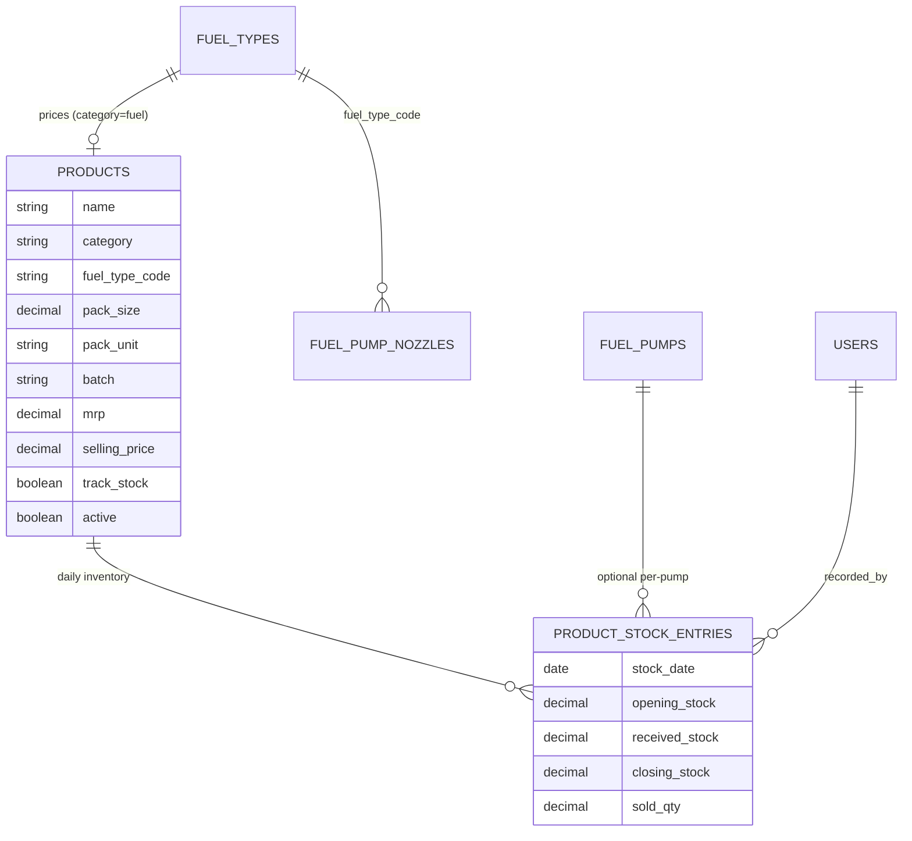
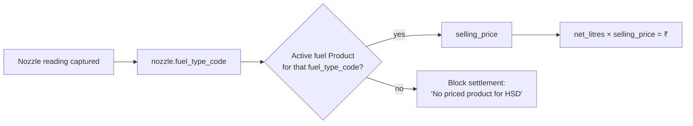

# Product Catalog + Inventory / Stock

## Purpose

Introduce a first-class, priced **Product** entity that is the single source of truth for everything the outlet sells — fuels (HSD, MS), lubricants/oils (2T, 10W30, Milex), and additives (AdBlue) — each with MRP, selling price, batch, pack size/unit, and category. Fuel products are linked to fuel types (and therefore to nozzles) so that meter readings can be **derived into ₹ using the catalog selling price** (per LOCKED Q1: litres/readings are the source of truth). The same entity carries daily **opening/closing stock and stock-received** so lubes and fuel inventory can be reconciled at settlement. This is the **keystone** feature: without a priced catalog, Daily Settlement (D1/D2/D6), per-nozzle auto-pricing (A4→D1), reports in litres/₹ (E1), and campaign/gift fulfilment (F1) cannot be built.

> **Implementation status (2026-07-22):** ✅ **Catalog shipped on all surfaces** — `products` table + `Product` model (category enum fuel/lubricant/oil/additive, fuel-type linkage, `selling_price ≤ mrp` rule, single-active-fuel-per-type, `Product.fuel_price_for`), 14 rows seeded via migration, admin CRUD on the web (`Admin::ProductsController` + views + nav link), JSON API (`/api/v1/admin/products` + `/catalog`), and the native **Android admin Products screen** (`ui/admin/products/*` + a "Products" tile in admin Settings). `ProductPolicy` + serializer. Covered by model + web + API tests; Android compiles. **Deferred to Phase 2 (D2/D8):** the **stock ledger** (`product_stock_entries`).

## Requirements covered

| ID | One-line |
|----|----------|
| **A5** | Product catalog listing every item sold at the outlet with MRP, selling price, batch, and (for lubes) pack size — including lubricants/oils/AdBlue. |
| A4 (supports) | Fuel products link to fuel types → nozzles, so a nozzle knows its current selling price. |
| D1 (unblocks) | Per-nozzle reading × selling price = fuel amount at settlement. |
| D2 (unblocks) | Lube products selectable at settlement with price + opening/closing stock. |
| D6 (unblocks) | Final settlement figures priced from the catalog. |
| E1 (unblocks) | Reports in litres and ₹ require a price source. |
| B2 (supports) | Per-visit litres can be valued using the fuel product price. |

## Current state

There is **no product or price entity anywhere**. Prices, MRP, batches, pack sizes, and stock do not exist in the schema.

- `FuelType` carries only `code`, `name`, `active` — no price. `app/models/fuel_type.rb:24-26`; table at `db/schema.rb` (`create_table "fuel_types"` has only `active`, `code`, `name`, timestamps).
- `FuelPumpNozzle` links to a fuel type by `fuel_type_code` (`app/models/fuel_pump_nozzle.rb:3-8`, association at `fuel_type.rb:12`) but has **no price** — table `fuel_pump_nozzles` has `fuel_type_code`, `sequence_number`, `active` only.
- `transactions` stores `fuel_amount` (₹ decimal, `precision: 10, scale: 2`) and **no litres, no reading, no product reference** (`db/schema.rb` `create_table "transactions"`). `TransactionCreator` writes `fuel_amount` directly from staff input (`app/services/transaction_creator.rb:30-35`); nothing prices litres.
- Admin fuel-type CRUD permits only `name`/`active`: web `app/controllers/admin/fuel_types_controller.rb:60`; API `app/controllers/api/v1/admin/fuel_types_controller.rb:22-40`; serializer emits only `id/code/name/active/timestamps` (`app/serializers/api/v1/admin/fuel_type_serializer.rb`).
- Android fuel-types area (`android/app/src/main/kotlin/com/acefuel/loyalty/ui/admin/fueltypes/`) has `FuelTypeDto(id, code, name, active, …)` with an explicit comment "there are no decimals in this payload" (`FuelTypesDtos.kt:10`).
- `VehicleType` is the closest precedent for a settings entity with decimal reward fields (`app/models/vehicle_type.rb`), useful as a CRUD pattern but unrelated to products.
- Authorization pattern to copy: `app/policies/fuel_type_policy.rb` (all actions `user&.admin?`).

**Missing:** the entire `products` table, price history, batch, pack size/unit, category, fuel-type linkage for pricing, and any daily stock ledger. Nothing seeds the 14 catalog rows from the sheet.

## Target design

### Data model

Two new tables. `products` is the master catalog; `product_stock_entries` is the per-product/per-day inventory ledger. Fuel products connect to the existing `fuel_types` by `fuel_type_code` so a nozzle resolves to a price.

#### `products`

| Column | Type | Notes / rationale |
|--------|------|-------------------|
| `id` | bigint PK | |
| `sl_num` | integer | Display order matching the sheet's SlNum; unique among active. |
| `name` | string, null: false | e.g. "HSD", "2T Oil", "AdBlue". |
| `category` | string, null: false | Enum-backed: `fuel`, `lubricant`, `oil`, `additive`. Drives which UI shows it (fuel → nozzle pricing/settlement readings; others → lube checklist). |
| `fuel_type_code` | string, null: true | Present only when `category = fuel`; FK-by-code to `fuel_types.code`. Links HSD→diesel, MS→petrol so nozzles inherit a price. |
| `pack_size` | decimal(10,3), null: true | Numeric pack size for lubes/additives (e.g. 20, 40, 800, 5). Null for fuel (sold by litre). |
| `pack_unit` | string, null: true | `ml`, `L`, `g`, `kg`, or `litre` for fuel. |
| `batch` | string, null: true | Batch/lot label from the sheet's Batch column. |
| `mrp` | decimal(10,2), null: false, default: 0 | Maximum retail price. |
| `selling_price` | decimal(10,2), null: false, default: 0 | The price used to derive ₹ from litres/qty. **Source of truth for D1/D2/D6.** |
| `hsn_code` | string, null: true | Optional tax code (future-proofing invoices). |
| `track_stock` | boolean, null: false, default: true | Whether this product participates in opening/closing/received reconciliation. |
| `active` | boolean, null: false, default: true | Hidden from new selections when false; never destroyed if referenced. |
| `created_at` / `updated_at` | datetime | |

Indexes: unique `sl_num` (partial on active is simplest as plain non-unique + app-level ordering — use plain index to avoid resequencing pain), index `category`, index `fuel_type_code`, index `active`.

> **Fuel pricing linkage.** Exactly one active `product` per fuel type is treated as the price source. Add a partial unique index `index_products_on_fuel_type_code_active_fuel` on `(fuel_type_code)` `WHERE category = 'fuel' AND active`. A nozzle's price = `Product.active.fuel.find_by(fuel_type_code: nozzle.fuel_type_code).selling_price`.

#### `product_stock_entries`

Per product, per day, one row capturing the day's inventory movement. Fuel "stock" is tank litres; lubes are unit counts.

| Column | Type | Notes |
|--------|------|-------|
| `id` | bigint PK | |
| `product_id` | bigint, null: false | FK → products. |
| `fuel_pump_id` | bigint, null: true | Optional: lube stock is outlet-wide (null); fuel/tank stock may be per-pump if desired. |
| `stock_date` | date, null: false | The business day. |
| `opening_stock` | decimal(12,3), null: false, default: 0 | Auto-populated from prior day's closing (see rules). |
| `received_stock` | decimal(12,3), null: false, default: 0 | Stock received / decanted during the day. |
| `closing_stock` | decimal(12,3), null: false, default: 0 | Counted at shift end. |
| `sold_qty` | decimal(12,3), null: true | Derived/entered: `opening + received − closing` (reconciliation). |
| `recorded_by_id` | bigint, null: true | FK → users (the FSM/admin who saved it). |
| `created_at` / `updated_at` | datetime | |

Unique index on `(product_id, fuel_pump_id, stock_date)` (treat null pump as a distinct slot). Indexes on `stock_date` and `product_id`.

> This spec creates the **table and admin/API plumbing** for stock. The full settlement workflow that *reads/writes* these rows at shift end is specified in D2/D8; here we guarantee the schema, the seed, the CRUD, and the auto-population rule exist so those specs can build on them.

### Business rules

1. **Selling price is the source of truth for money.** All downstream ₹ derivations (D1 nozzle reading × price, D2 lube qty × price) read `products.selling_price`. `selling_price ≤ mrp` is enforced with a soft warning, not a hard block (dealers occasionally sell below MRP; selling *above* MRP is the illegal case → hard error).
2. **Fuel product uniqueness.** At most one active `category=fuel` product per `fuel_type_code`. Activating a second fuel product for the same fuel type deactivates/rejects to keep nozzle pricing unambiguous.
3. **Category gating.** `fuel_type_code` required iff `category=fuel`; `pack_size`/`pack_unit` expected for non-fuel; validation warns if a lube has no pack size.
4. **Deletion guard (mirror `FuelType`).** A product referenced by any settlement/transaction/stock entry cannot be destroyed — deactivate instead (`before_destroy` `throw :abort`, surfaced as 409, exactly like `fuel_type.rb:135-140`).
5. **Opening-stock auto-population.** When a `product_stock_entry` is created for `stock_date = D`, `opening_stock` defaults to the `closing_stock` of the most recent prior entry for the same `(product, pump)`. This satisfies the sheet's "Yesterday Reading auto-populated" for stock.
6. **Price is not versioned in v1** beyond `updated_at`; a settlement records the price it used at write time (D1/D2 will snapshot `unit_price` onto their own line rows), so later catalog edits never retroactively change past settlements.

### Seed (14 catalog rows)

A seed/data-migration inserts the sheet's rows idempotently (find-or-create by `name`+`pack_size`), linking fuels to the seeded fuel types (`petrol`→MS, `diesel`→HSD, from `FuelType::DEFAULT_OPTIONS`).

| Sl | Name | Category | fuel_type_code | pack_size | unit | MRP | Selling |
|----|------|----------|----------------|-----------|------|-----|---------|
| 1 | HSD | fuel | diesel | — | litre | 98.95 | 98.95 |
| 2 | MS | fuel | petrol | — | litre | 111.36 | 111.36 |
| 3 | 2T | lubricant | — | 20 | ml | 12 | 12 |
| 4 | 2T | lubricant | — | 40 | ml | — | — |
| 5 | 2T | lubricant | — | 60 | ml | — | — |
| 6 | 10W30 | oil | — | 800 | ml | 350 | 350 |
| 7 | 2T | lubricant | — | 500 | ml | — | — |
| 8 | Milex Petrol | additive | — | 5 | ml | 12 | 12 |
| 9 | Milex Petrol | additive | — | 40 | ml | 150 | 150 |
| 10 | Milex Diesel | additive | — | 10 | ml | 25 | 25 |
| 11 | Milex Diesel | additive | — | 50 | ml | 150 | 150 |
| 12 | AdBlue | additive | — | 5 | L | — | 680 |
| 13 | AdBlue | additive | — | 10 | L | — | 1080 |
| 14 | AdBlue | additive | — | 20 | L | — | 1730 |

Rows where the sheet left MRP blank seed `mrp = selling_price` (or `0` where both blank, flagged for admin to complete). `track_stock = true` for all.



### Workflow: nozzle → price resolution (used by D1)



## API changes

New admin-only JSON resource mirroring the fuel-types controller/serializer pattern, plus a nested stock resource. Add under the existing `namespace :api, :v1, :admin` block (`config/routes.rb:51-88`).

```ruby
# config/routes.rb  (inside namespace :api → :v1 → :admin)
resources :products, only: %i[index create update destroy] do
  resources :stock_entries, only: %i[index create update], module: :products
end
get "products/catalog", to: "products#catalog"   # flat active catalog for settlement pickers
```

### `GET /api/v1/admin/products`

Response `200`:
```json
{ "products": [
  { "id": 1, "sl_num": 1, "name": "HSD", "category": "fuel",
    "fuel_type_code": "diesel", "pack_size": null, "pack_unit": "litre",
    "batch": null, "mrp": "98.95", "selling_price": "98.95",
    "track_stock": true, "active": true,
    "created_at": "…", "updated_at": "…" },
  { "id": 6, "name": "10W30", "category": "oil", "pack_size": "800.0",
    "pack_unit": "ml", "mrp": "350.00", "selling_price": "350.00", … }
] }
```

### `POST /api/v1/admin/products`
Request (canonical nested envelope, like `FuelTypeEnvelope`):
```json
{ "product": { "name": "AdBlue", "category": "additive", "pack_size": 20,
  "pack_unit": "L", "batch": "B-2026-04", "mrp": 1730, "selling_price": 1730,
  "fuel_type_code": null, "track_stock": true, "active": true } }
```
Response `201`: the created product object. `422` with `{ "errors": [...] }` on validation failure (e.g. selling_price > mrp, missing fuel_type_code for a fuel).

### `PATCH /api/v1/admin/products/:id`
Same body (partial); `200` returns the object. Changing a fuel product's `fuel_type_code`/`active` is subject to the uniqueness rule → `422` `code: "duplicate_fuel_product"` if it would create two active fuel products for one fuel type.

### `DELETE /api/v1/admin/products/:id`
`200 { id, message }`; `409 { code: "delete_restricted", message }` when referenced by stock/settlement (mirrors `fuel_types_controller.rb:47-51`).

### `GET /api/v1/admin/products/catalog`
Flat list of active products (id, name, category, pack_size, pack_unit, selling_price) for settlement/visit pickers. `200 { catalog: [...] }`.

### Stock

- `GET /api/v1/admin/products/:product_id/stock_entries?date=YYYY-MM-DD&fuel_pump_id=` → `{ stock_entries: [ { id, stock_date, opening_stock, received_stock, closing_stock, sold_qty, fuel_pump_id, recorded_by_id } ] }`. Server computes `opening_stock` default from prior day when creating.
- `POST /api/v1/admin/products/:product_id/stock_entries` body `{ stock_entry: { stock_date, fuel_pump_id, received_stock, closing_stock } }` → `201`. Upsert-by-`(product,pump,date)`.
- `PATCH …/stock_entries/:id` → `200`.

All endpoints go through `ProductPolicy` (copy `fuel_type_policy.rb`, all `user&.admin?`). Serializer `Api::V1::Admin::ProductSerializer` (decimals as strings, timestamps ISO-8601), matching the existing serializer convention.

## UI

### Rails PWA

New admin area **Products / Catalog**, modeled on `app/views/admin/fuel_types/` (`index` two-column layout with an add form beside an editable list) and `Admin::FuelTypesController` (`app/controllers/admin/fuel_types_controller.rb`).

- **Route:** add `resources :products, only: %i[index create edit update destroy]` with nested `stock_entries` to the web `namespace :admin` (`config/routes.rb:113-155`), next to `fuel_types`.
- **`admin/products#index`:** left card = "Add Product" form; right card = grouped list with section headers **Fuels**, **Lubricants & Oils**, **Additives (AdBlue/Milex)** ordered by `sl_num`. Each row shows name + pack (e.g. "AdBlue 20 L"), batch, MRP, selling price, active toggle, edit/remove. Add a sidebar/nav link near Fuel Types.
- **`_form` partial:** fields — Name; Category (select: Fuel / Lubricant / Oil / Additive); when Category=Fuel show a **Fuel type** select (populated from `FuelType.active_options`) and hide pack fields; when non-fuel show **Pack size** + **Unit**; Batch; MRP; Selling price; "Track stock" checkbox; Active switch. Inline hint on Fuel Types page: "Selling price here is what settlement uses to convert litres to ₹."
- **Stock sub-view (`admin/products/:id/stock_entries` or a per-day tab):** table of products with columns Opening (read-only, auto-filled), Received (editable), Closing (editable), Sold (computed). Date picker defaulting to today. This is the admin-facing precursor the D2/D8 settlement screen will reuse.

### Android (Compose)

New admin subpackage `ui/admin/products/` following the exact 5-file shape of `ui/admin/fueltypes/` (`ProductsApi.kt`, `ProductsDtos.kt`, `ProductsRepository.kt`, `ProductsViewModel.kt`, `ProductsScreen.kt`).

- **DTO** `ProductDto(id, slNum, name, category, fuelTypeCode, packSize, packUnit, batch, mrp, sellingPrice, trackStock, active, createdAt, updatedAt)` — note this payload **does** carry decimals (as `String` for `mrp`/`sellingPrice`/`packSize` to preserve precision), reversing the "no decimals" note in `FuelTypesDtos.kt:10`. Request envelope `ProductEnvelope(product = ProductRequest(...))`.
- **Api** Retrofit interface with `listProducts`, `catalog`, `createProduct`, `updateProduct`, `deleteProduct`, and stock endpoints, paths `api/v1/admin/products…` (relative, per the shared client convention in `FuelTypesApi.kt`).
- **Screen:** a `ProductsScreen` list grouped by category with an add/edit bottom sheet (Category selector drives which fields render — fuel-type dropdown vs pack size/unit), price fields with numeric keyboards, active switch, and delete with 409 handling. Reuse the design-system components and the ViewModel `ApiResult` pattern from `FuelTypesViewModel.kt`.
- **Navigation:** add a "Products" entry to `ui/admin/ops/AdminOpsScreen.kt` alongside the existing admin destinations.
- **Stock:** a secondary tab/screen listing products with Opening (read-only), Received, Closing inputs and a date selector.

## Validation & edge cases

- `name` required; `category` in the allowed set; reject unknown categories (422).
- `category=fuel` ⇒ `fuel_type_code` required and must be an **active** fuel type (reuse `FuelType.active_code?`, cf. `fuel_pump_nozzle.rb:66-72`); non-fuel ⇒ `fuel_type_code` must be blank.
- `selling_price ≥ 0`, `mrp ≥ 0`; **`selling_price > mrp` is a hard 422** (over-MRP sale). `selling_price < mrp` is allowed.
- Two active fuel products for the same `fuel_type_code` → 422 `duplicate_fuel_product` (enforced by partial unique index + model validation).
- Delete of a referenced product → 409, not destroyed; unreferenced → 200 (mirror `fuel_type.rb` guard).
- Nozzle with no priced fuel product: settlement/D1 must surface "No priced product for <fuel type>" rather than silently pricing at 0 (validated at read time in the price-resolution helper).
- Stock: `closing_stock ≤ opening_stock + received_stock` warned (negative sold), not blocked (testing/spillage happens); `received_stock ≥ 0`, `closing_stock ≥ 0`.
- Duplicate `(product, pump, date)` stock entry → upsert the existing row, never create a second.
- Decimal precision: money at scale 2, litres/pack/stock at scale 3; serialize decimals as strings to avoid float drift on Android.
- Seed idempotency: re-running the seed must not duplicate the 14 rows (find-or-create on `name` + `pack_size` + `pack_unit`).
- Pack size for AdBlue given in litres vs lubes in ml — keep `pack_unit` free-form from a controlled list; do not auto-convert.

## Dependencies & sequencing

**Must exist first:**
- **A1/A2/A4** — pumps, nozzles, and `fuel_type_code` per nozzle already exist (`fuel_pump_nozzles`), and `FuelType` seeding (`petrol`/`diesel`) is what fuel products link to.

**This unblocks (keystone):**
- **A4 pricing completion** — nozzles resolve a selling price via their fuel product.
- **D1** per-nozzle reading → ₹ (net litres × `selling_price`).
- **D2** lube selection at settlement with price + opening/closing stock (consumes `products` + `product_stock_entries`).
- **D6** final settlement math; **D8** stock-received/decantation (writes stock entries); **D10** rate comparison (needs own selling price to compare vs JIO-BP).
- **E1** reports in litres and ₹ (price source); **B2** valuing per-visit litres.

Recommended order: migrations + model + seed → admin/API CRUD (web + API) → Android catalog screen → stock table → then D1/D2 settlement build on top.

## Acceptance criteria

- [ ] Migrations create `products` and `product_stock_entries` with the columns/indexes above; `db/schema.rb` reflects them.
- [ ] Seed inserts exactly the 14 catalog rows; re-running the seed adds none.
- [ ] HSD links to fuel type `diesel` and MS to `petrol`; each fuel type has at most one active fuel product (DB + model enforced).
- [ ] `Product` deletion is blocked (409) when referenced by a stock entry; deactivation succeeds.
- [ ] `selling_price > mrp` returns 422 on both web and API; `selling_price < mrp` is accepted.
- [ ] `GET /api/v1/admin/products` returns all products with decimals as strings and correct category grouping; `GET …/products/catalog` returns only active products.
- [ ] Creating a stock entry for a date auto-populates `opening_stock` from the prior day's `closing_stock` for the same product/pump.
- [ ] A helper resolves a nozzle → active fuel product → `selling_price`, and raises a clear error when no priced product exists for that fuel type.
- [ ] Rails admin **Products** page lists/creates/edits/removes products grouped by category, with category-driven fields (fuel-type select vs pack size/unit).
- [ ] Android `ui/admin/products/` mirrors the fuel-types 5-file structure, lists products grouped by category, and performs create/edit/delete with 422/409 handling.
- [ ] Android **Products** entry appears in `AdminOpsScreen` navigation.
- [ ] All product/stock endpoints reject non-admin callers (ProductPolicy).
- [ ] No existing fuel-type, nozzle, or transaction behavior regresses (existing `fuel_types` CRUD unchanged).
