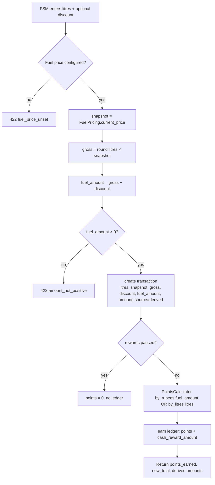

# Litres / Readings Transaction Model

**Feature IDs:** B2 (litres), D1 (nozzle readings) — implements LOCKED DECISION Q1.

## Purpose

Today a transaction stores only a rupee amount (`transactions.fuel_amount`), which the FSM types in by hand and from which loyalty points are derived. This is backwards. Per LOCKED DECISION Q1, **litres (and meter readings) are the source of truth**; the rupee value is *derived* as `litres × catalog selling_price − discount`. This spec redefines the transaction record and the loyalty pipeline so litres is the captured quantity, ₹ becomes a stored-derived column, existing ₹-only rows are migrated forward, and per-transaction litres reconcile against the per-nozzle meter deltas captured at shift-end settlement (D1/D6). Rewards remain expressible per ₹ *or* per litre, but the ₹ they consume is now a computed number, not FSM free-text.

## Requirements covered

| ID | One-line |
|----|----------|
| B2 | Capture "Number of Litres filled" per customer visit; ₹ is derived, not typed. |
| D1 | Per-nozzle Today's/Yesterday's meter readings; net litres sold reconcile against the sum of per-transaction litres for that nozzle/day. |
| C5 (touched) | Loyalty accrual now runs off derived ₹ (and optionally litres) instead of FSM-entered ₹. |

## Current state

The transaction is a pure-₹ record with no quantity, no price, and no discount.

- **Schema** — `db/schema.rb` `create_table "transactions"`: columns are `customer_id, fuel_amount decimal(10,2) NOT NULL, fuel_pump_id, fuel_pump_nozzle_id, payment_mode, user_id, vehicle_id`. **No `litres`, no `reading`, no `discount`, no `selling_price`.** `fuel_amount` is validated `> 0` (`app/models/transaction.rb:13`).
- **Fuel type / nozzle carry no price** — `create_table "fuel_types"` has `code, name, active` only; `create_table "fuel_pump_nozzles"` has `fuel_pump_id, fuel_type_code, sequence_number, active` only. There is **no product catalog and no selling price anywhere** (audit A5 = ABSENT). This is the single biggest missing dependency: litres cannot be converted to ₹ until a per-fuel selling price exists.
- **Creation service** — `app/services/transaction_creator.rb`: `initialize(...)` takes `fuel_amount:` (line 8), and writes it straight through: `customer.transactions.create!(..., fuel_amount: fuel_amount, ...)` (lines 26-33). No litres/price/discount anywhere.
- **Points pipeline** — `transaction_creator.rb:37` calls `PointsCalculator.call(fuel_amount, fuel_type:, vehicle_kind:)`; `app/services/points_calculator.rb:13` computes `((fuel_amount / rupees_per_reward_unit).floor * points_per_100)`. `rupees_per_reward_unit` defaults to 100 (`reward_settings`). Points are integer; ledger row also stores `cash_reward_amount decimal(12,2)` (`points_ledgers`), currently left `nil` on earn.
- **API** — `app/controllers/api/v1/staff/transactions_controller.rb#create` (lines 34-61) reads `transaction_params` permitting `:fuel_amount` (line 127) and echoes `fuel_amount: result.transaction.fuel_amount.to_f` back (line 54). Web equivalent: `app/controllers/staff/transactions_controller.rb:111`.
- **Android** — `TransactionCreateRequest` sends `@SerialName("fuel_amount") fuelAmount: Double` (`core/network/dto/Dtos.kt:362`); `TransactionViewModel.onFuelAmountChange` (line 193) is a free-text ₹ field; `TxnUiState.canSave` gates on `fuelAmount.toDoubleOrNull() > 0` (line 135). `TransactionResultDto.fuelAmount` (Dtos.kt:384) is displayed in the summary. **No litres field, no price display, no reading capture.**
- **Readings** — there is **no meter-reading capture anywhere**. `fuel_pump_nozzles` has no reading column; there is no settlement table. D1 = ABSENT.

**Missing, plainly:** litres column, selling-price source (product catalog A5), discount column, derived-₹ semantics, per-nozzle meter readings + a place to store them, and any reconciliation between per-transaction litres and shift totals.

## Target design

### Guiding principle

`fuel_amount` stops being an *input* and becomes a *stored-derived* column:

```
gross_amount = round(litres × selling_price_snapshot, 2)
fuel_amount  = gross_amount − discount_amount        # net ₹ actually owed
```

Litres and the price snapshot are captured/frozen at transaction time; `fuel_amount` is written from them (never typed). Points still derive from `fuel_amount` (net ₹), so rewards keep working unchanged in the ₹ path, and a new per-litre path is added.

### Data model changes

**`transactions`** — add quantity + pricing columns:

| Column | Type | Null | Rationale |
|--------|------|------|-----------|
| `litres` | `decimal(9,3)` | YES (see migration) | Source-of-truth quantity. 3 dp = ml precision; max ~999,999.999 L. |
| `selling_price_snapshot` | `decimal(8,2)` | YES | ₹/L frozen from the catalog at sale time, so later price edits never retro-change historical ₹. |
| `discount_amount` | `decimal(10,2)` NOT NULL default `0` | NO | Per-visit discount (B2 "Discount Amount"); subtracted to get net `fuel_amount`. |
| `gross_amount` | `decimal(10,2)` | YES | `litres × selling_price_snapshot` before discount. Stored (not computed on read) so reports don't re-multiply. |
| `amount_source` | `integer` NOT NULL default `0` | NO | enum `derived: 0` (litres×price), `legacy_amount: 1` (migrated ₹-only), `manual_amount: 2` (admin override). Lets the UI and reports distinguish trustworthy litres from back-filled rows. |

`fuel_amount` stays `decimal(10,2) NOT NULL` and now means **net ₹** (`gross_amount − discount_amount`). Keep the `fuel_amount > 0` validation.

**`fuel_pump_nozzles`** — add reading columns for D1 (readings are a *nozzle* attribute, since the meter lives on the nozzle):

| Column | Type | Null | Rationale |
|--------|------|------|-----------|
| `last_reading` | `decimal(12,3)` | YES | Latest confirmed cumulative meter reading (litres) from the most recent settlement. Auto-populates "Yesterday Reading" next shift. |
| `last_reading_at` | `datetime` | YES | When `last_reading` was captured. |

Per-shift reading history belongs to the Daily Settlement subsystem (D1/D6, separate spec); this spec only defines the *nozzle current-reading cache* and the reconciliation contract against it.

**Selling price source (hard dependency — A5):** `fuel_amount` derivation needs ₹/L per fuel. Until the full product catalog (A5) lands, introduce the minimal price surface this spec depends on:

`fuel_types` — add `selling_price decimal(8,2)` (NULL until set) and `price_effective_at datetime`. This is the interim price used by `selling_price_snapshot`. When A5 ships, the catalog becomes the authority and this column becomes a mirror/fallback. Fuel-price resolution is centralised in a `FuelPricing.current_price(fuel_type_code)` service so the catalog swap is one-file.

**`reward_settings`** — add reward-basis controls so rewards can key off litres:

| Column | Type | Default | Rationale |
|--------|------|---------|-----------|
| `reward_basis` | `integer` NOT NULL | `0` | enum `by_rupees: 0` (existing behaviour), `by_litres: 1`. |
| `litres_per_reward_unit` | `decimal(6,2)` | `10.00` | When `by_litres`, points = `floor(litres / this) × points_per_unit`. |

### Business rules

1. **Litres is required and positive** for new transactions (`amount_source = derived`). ₹ is never accepted from the client on the derived path.
2. **Price snapshot** is resolved server-side at create time via `FuelPricing.current_price(vehicle.fuel_type)`. If no price is configured for that fuel, reject with a clear error (`fuel_price_unset`) — do not silently store ₹0.
3. **Discount** ≥ 0 and ≤ `gross_amount` (cannot make net negative). Default 0.
4. `gross_amount = round(litres × snapshot, 2)`; `fuel_amount = gross_amount − discount_amount`; require `fuel_amount > 0`.
5. **Points** derive from the *net* `fuel_amount` in `by_rupees` mode (unchanged formula), or from `litres` in `by_litres` mode. `cash_reward_amount = points × reward_settings.cash_value_per_point` is now populated on every earn row (it is currently left nil).
6. **Reconciliation:** for a nozzle on a given day, `Σ transactions.litres` (that nozzle, that shift window) is the *expected* dispensed volume. The settlement's `net_litres_sold = today_reading − yesterday_reading − testing_litres` (D6) is the *metered* volume. Their difference is the **variance**, surfaced to admin (D9). Transactions are never auto-mutated to force a match; variance is reported, not hidden.

### Reward reconciliation (explicit)

Because ₹ is now derived, points must be **idempotently recomputable** from stored inputs:

- The earn ledger row stores `points`, `cash_reward_amount`, and (new) a denormalised `points_basis_amount` is *not* added — instead the transaction's own `litres` / `fuel_amount` / `selling_price_snapshot` are the audit trail. Given those three, `PointsCalculator` reproduces the exact points.
- **If an admin edits litres/discount/price on a past transaction (G1):** run a `TransactionReconciler` that (a) recomputes `gross_amount`/`fuel_amount`, (b) recomputes points, (c) writes an **adjustment ledger row** (`entry_type: :adjust`) for the delta rather than editing the original earn row — preserving history and keeping `customer.total_points` a pure sum. Never edit a posted earn row in place.
- **If a price snapshot was wrong** (catalog corrected after the fact): same reconciler path; the snapshot on the row is the source, so correcting the catalog does *not* move historical points unless an explicit reconcile is triggered.
- The redemption side is untouched: it still consumes integer points from `points_ledgers`.



### Migration of existing ₹-only transactions

One-way data migration, run once:

1. Add all columns nullable / with defaults (above). No backfill of `litres` is guessed.
2. For every existing row: set `gross_amount = fuel_amount`, `discount_amount = 0`, `litres = NULL`, `selling_price_snapshot = NULL`, `amount_source = legacy_amount`.
3. `litres` stays **NULL** for legacy rows — we do **not** back-compute litres from ₹ (the historical price is unknown and inventing it would corrupt reconciliation). Reports treat `amount_source = legacy_amount` rows as "₹ known, litres unknown" and exclude them from litre-based aggregates.
4. `fuel_amount` remains valid and unchanged, so all historical points, balances, and dashboards are byte-for-byte identical after migration.
5. Backfill `points_ledgers.cash_reward_amount` for historical earn rows where nil, using `points × cash_value_per_point` at current setting (flagged as best-effort in a follow-up task; not required for this spec's correctness).

## API changes

All under `/api/v1/staff/*`, token-auth (existing `Api::V1::Staff::BaseController`).

### Changed: `POST /api/v1/staff/transactions`

Request (envelope unchanged, field swap — `fuel_amount` removed from input, `litres` + `discount_amount` added):

```json
{ "transaction": {
    "lookup_mode": "vehicle",
    "vehicle_number": "KA01AB1234",
    "vehicle_id": 42,
    "litres": 12.500,
    "discount_amount": 15.00,
    "fuel_pump_nozzle_id": 7,
    "payment_mode": "cash"
} }
```

Response `201` (adds derived fields; keeps `fuel_amount` as the net value):

```json
{ "points_earned": 12, "rewards_paused": false, "new_total": 148,
  "message": "+12 reward points added. Balance updated to 148.",
  "customer": { "...": "CustomerLookupSerializer" },
  "transaction": {
    "id": 991, "litres": 12.5, "selling_price": 98.95,
    "gross_amount": 1236.88, "discount_amount": 15.0, "fuel_amount": 1221.88,
    "amount_source": "derived", "payment_mode": "cash",
    "pump": "Pump 3", "nozzle": "N5 (HSD)", "created_at": "2026-07-21T09:00:00Z"
} }
```

Errors (422, existing `render_error` envelope): `fuel_price_unset`, `litres_not_positive`, `discount_exceeds_gross`, `amount_not_positive`.

### New: `GET /api/v1/staff/nozzles/:id/price`

Lets the app show a live ₹ preview as litres are typed. Returns the price the server *would* snapshot.

```json
{ "fuel_type_code": "hsd", "fuel_type": "Diesel", "selling_price": 98.95, "price_effective_at": "2026-07-01T00:00:00Z" }
```

`404 price_unset` if no price configured.

### New: `GET /api/v1/staff/nozzles/:id/last_reading` (D1 support)

Returns the cached `last_reading` / `last_reading_at` for pre-populating "Yesterday Reading" at settlement. `{ "last_reading": 456123.500, "last_reading_at": "2026-07-20T18:00:00Z" }`.

### Admin (G1): `PATCH /api/v1/admin/transactions/:id`

Accepts `litres`, `discount_amount`, `selling_price_snapshot`, triggers `TransactionReconciler`, returns the recomputed transaction plus the adjustment-ledger delta.

## UI

### Rails PWA

Extend `app/views/staff/transactions/new` (backed by `staff/transactions_controller.rb`):

- Replace the "Amount (₹)" input with a **"Litres filled"** numeric field (3-dp) and a separate optional **"Discount (₹)"** field.
- Add a **live derived total** row: `12.500 L × ₹98.95 = ₹1,236.88  − ₹15.00 discount = ₹1,221.88`, recomputed client-side from the nozzle price (fetched via the new price endpoint on nozzle select) and re-validated server-side.
- The success/summary flash (`flash[:transaction_summary]`) shows litres, net ₹, and points.
- Permit `:litres, :discount_amount` and **drop `:fuel_amount`** from `transaction_params` (line 111). `TransactionCreator` derives ₹.
- Admin transactions view (`admin/transactions`, currently index-only, G1): add litres/discount/source columns and an edit form invoking the reconciler.

### Android (Compose)

Extend `ui/transaction/TransactionScreen.kt` + `TransactionViewModel.kt`:

- `TxnUiState`: replace `fuelAmount: String` with `litres: String` + `discountAmount: String`; add `nozzlePrice: Double?` (fetched when a nozzle is selected) and a computed `derivedNet: Double?`.
- Rename `onFuelAmountChange` → `onLitresChange` (same digit/one-dot cleaner, `TransactionViewModel.kt:193`); add `onDiscountChange`.
- `canSave` (line 130): gate on `litres.toDoubleOrNull() > 0 && nozzlePrice != null` instead of `fuelAmount > 0`.
- Show a live **"₹ derived"** readout card under the litres field (`litres × nozzlePrice − discount`), styled with the existing design system, so the FSM sees the amount before saving.
- `TransactionCreateRequest` (Dtos.kt:357): drop `fuelAmount`, add `@SerialName("litres") litres: Double` and `@SerialName("discount_amount") discountAmount: Double = 0.0`.
- `TransactionResultDto` (Dtos.kt:382): add `litres`, `sellingPrice`, `grossAmount`, `discountAmount`, `amountSource`; the ceremony/summary card shows litres + net ₹ + points.
- Add `StaffRepository.nozzlePrice(id)` calling `GET /nozzles/:id/price`; call it from `selectNozzle` / `autoSelectNozzle`.

## Validation & edge cases

- **No price configured** for the vehicle's fuel type → `fuel_price_unset` 422; block save on both surfaces (don't store ₹0).
- **Litres = 0 or negative / non-numeric** → rejected client + server.
- **Discount > gross** → `discount_exceeds_gross`; the derived-net readout warns before submit.
- **Price changes mid-day:** each transaction snapshots its own price; two sales of the same fuel on the same day may legitimately have different `selling_price_snapshot`. Reconciliation uses litres (price-independent) so this is fine.
- **Rounding:** round `gross` to 2 dp once, then subtract discount; never accumulate rounding across litres. Points floor exactly as today.
- **Legacy rows (`amount_source = legacy_amount`)** have NULL litres — every litre aggregate and reconciliation must `WHERE litres IS NOT NULL` (or filter by source) to avoid treating them as 0 L.
- **Reconciliation variance** is informational: a mismatch between `Σ litres` and metered `net_litres_sold` (unrecorded cash sales, testing litres, meter drift) is reported to admin, never used to mutate transactions.
- **Reward-basis switch** (`by_rupees` ↔ `by_litres`) affects only *future* transactions; posted ledger rows are immutable.
- **Idempotency / double-post:** unchanged; the create path is atomic (`ActiveRecord::Base.transaction`) and the client guards re-entry (`creating` flag, VM line 274).
- **Admin edit reconcile:** never edits a posted earn row; always writes an `adjust` delta so `total_points` stays a pure sum.

## Dependencies & sequencing

**Must exist first:**
- **A5 (product catalog + selling price)** — the ₹ derivation is impossible without a price per fuel. This spec ships the interim `fuel_types.selling_price` + `FuelPricing` service as the minimum; full A5 supersedes it.
- **A1/A2/A4** (pumps, nozzles, fuel-type-per-nozzle) — already PRESENT; needed so a nozzle resolves to a priced fuel.
- **C1/C2/C3 reward config** — already PRESENT; `PointsCalculator` consumes it unchanged, plus the new `reward_basis`.

**This unblocks:**
- **D1/D6/D9 Daily Settlement** — consumes `transactions.litres` (Σ per nozzle/day) and `fuel_pump_nozzles.last_reading` for the readings↔sales reconciliation and final-settle calc.
- **B2 full customer-details-entry** — litres is the first captured field of that form; this establishes the column and pipeline the rest of B2 (transport, fleet/OTP, etc.) attaches to.
- **E1/E4 reports** — litres-based daily/weekly reporting (requirement #14 "litres, discount, gifts").
- **G1 admin edit** — the reconciler defined here is the edit mechanism.

## Acceptance criteria

- [ ] `transactions` has `litres`, `selling_price_snapshot`, `gross_amount`, `discount_amount`, `amount_source`; `fuel_amount` is written from them, never accepted from the staff client.
- [ ] Creating a transaction with `litres` and no price configured returns `422 fuel_price_unset` and persists nothing.
- [ ] Given `litres=12.5`, price `98.95`, discount `15` → `gross_amount=1236.88`, `fuel_amount=1221.88`, and points equal `PointsCalculator.call(1221.88, …)`.
- [ ] In `by_litres` mode, points = `floor(litres / litres_per_reward_unit) × points_per_unit`.
- [ ] Every non-paused earn writes a `points_ledgers` row with both `points` and non-nil `cash_reward_amount`.
- [ ] After the data migration, every pre-existing transaction has `amount_source=legacy_amount`, unchanged `fuel_amount`, NULL `litres`, and identical `customer.total_points`.
- [ ] Litre-based aggregates exclude `legacy_amount` rows (no phantom 0 L).
- [ ] `selling_price_snapshot` is frozen on the row; editing the fuel price afterward does not change any historical `fuel_amount` or points until an explicit reconcile.
- [ ] Admin edit of a past transaction's litres/discount recomputes ₹ and writes an `adjust` ledger delta (original earn row untouched); `total_points` reflects the delta.
- [ ] `GET /nozzles/:id/price` returns the price the create endpoint would snapshot; `404 price_unset` when none.
- [ ] Android and PWA both show a live derived-₹ readout (`litres × price − discount`) before save and block save when `> 0` fails or price is missing.
- [ ] `TransactionCreateRequest` sends `litres`+`discount_amount` (no `fuel_amount`); `TransactionResultDto`/response echo litres, price, gross, discount, net, source.
- [ ] `fuel_pump_nozzles.last_reading`/`last_reading_at` exist and are exposed via `GET /nozzles/:id/last_reading` for settlement pre-fill.
- [ ] `discount_amount > gross_amount` is rejected on both surfaces.
