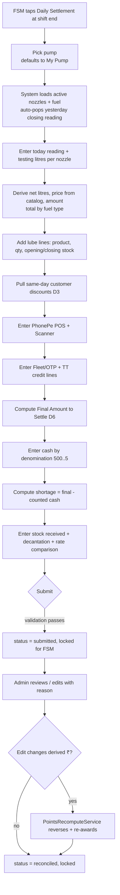
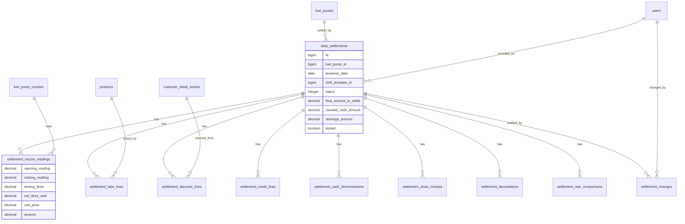

# Daily Settlement (D1–D10, Staff-1, Admin-12/13)

> **Build status (Phase 2, 2026-07-22):** 🚧 in progress. **Staff surface COMPLETE on
> all three surfaces** (D1–D8, D10 capture + D6/D7 math), tested: the `daily_settlements`
> parent + all 9 child/audit tables and models (nested attributes, `allow_destroy`,
> line-level derivation); the `Settlement::Builder` / `Settlement::Calculator` /
> `Settlement::Persister` / `Settlement::FormRows` services; the staff JSON API
> (`/api/v1/staff/settlements` + `/new`, `/:id`) with full/summary/draft serializers and
> `DailySettlementPolicy`; the Rails PWA `Staff::SettlementsController` + sectioned form
> with `settlement_form.js` live totals (browser-verified); and the Android
> `ui/settlement` area + home quick-action (compiles clean). The B2 source table is
> `visit_entries` (the spec's `customer_detail_entries`); `settlement_discount_lines.visit_entry_id`
> references it. **Admin D9 console (API + web) shipped — closes G1:** `Settlement::Differ`
> (field-level audit diffs), `PointsRecomputeService` (an admin discount-line edit linked to
> a B2 transaction re-derives that transaction's ₹ + earn points atomically), the `Persister`
> admin_edit path, the admin API (`/api/v1/admin/settlements` + `/:id`, `/reconcile`, `/summary`
> with cross-pump totals), and the `Admin::SettlementsController` console (cross-pump list/totals,
> audit-trail panel, Reconcile, edit-with-reason). ✅ **Android admin settlement view shipped**
> (`ui/admin/settlements` master-detail: cross-pump list + totals card, detail with the D6/D7
> totals, nozzle readings, audit trail + Reconcile). **➡️ Daily Settlement (D1–D10) COMPLETE
> on all three surfaces, tested (467 Rails runs green, brakeman clean, Android compiles).**
> Web-first deferrals: native **decantation** (D8 tank dips) inputs and native admin
> **line-item editing** (the native admin console covers view + reconcile).
> **Staff feedback item 3 (admin read side) shipped:** the admin console filters by
> `recorded_by_id` and shows **per-FSM totals** on web, API and Android (filter row +
> FSM on the list row); the summary serializer exposes `recorded_by_id`; the show/edit
> pages are reframed as a correction *on behalf of* the FSM; and the misattributing
> back door is closed — `DailySettlementPolicy#new?`/`#create?` are staff-only and an
> admin hitting `/staff/settlements/new` is redirected to the console (business rules
> 12–13). **Staff feedback item 3 (admin write side) — backend + JSON API shipped:**
> an admin can now *record on behalf of* a named FSM who could not file their own
> sheet (business rule 14). New nullable `daily_settlements.entered_by_id` (FK→users,
> indexed) records the admin who typed it while `recorded_by`/`fsm_name_snapshot` stay
> the FSM's; `Settlement::Builder` takes `recorded_for:` so every default resolves
> against the FSM's pump; `Settlement::Persister` grew an audited on-behalf create path
> (creates were previously unaudited); `DailySettlementPolicy#create_on_behalf?` is
> admin-only and `#new?`/`#create?` stay staff-only; `GET/POST /api/v1/admin/settlements`
> `new`/`create` carry the FSM picker (`User.settlement_recorder_candidates`, admins
> included) and the create, with a `409 settlement_exists` on an occupied slot; and the
> summary serializer exposes `entered_by_id`/`entered_by_name`/`entered_on_behalf`
> alongside `fsm_name`/`recorded_by_id`.
> **Staff feedback item 3 (admin write side) — web + Android shipped:**
> `Admin::SettlementsController#new`/`#create` render the FSM picker and then the
> *existing* `staff/settlements/_form` partial with an `on_behalf` local (mandatory
> reason, top-level hidden `recorded_by_id`, FSM-named submit buttons), reached from
> a "Record on behalf of an FSM" button on the admin index; Android reuses
> `SettlementScreen`/`SettlementViewModel` in an `onBehalf` mode (candidate chips →
> the FSM's draft → reason → audited create) behind the same button on
> `AdminSettlementsScreen`. `entered_by` is rendered next to the FSM name on the web
> index/show/form and the native list row and detail. **➡️ Business rule 14 COMPLETE
> on all three surfaces.**

Daily Settlement is the shift-end reconciliation ledger for a fuel outlet. At the end of a shift the FSM (pump operator) picks their pump, and the system shows that pump's nozzles and their fuel. The FSM enters today's meter readings; the app auto-populates yesterday's closing reading from the prior settlement, subtracts testing litres, derives net litres sold, prices each nozzle from the product catalog's selling price, and totals fuel by type. The FSM then records lubricant sales (with opening/closing stock), pulls same-day customer discounts, enters PhonePe POS and Scanner receipts, Fleet/OTP and tank-truck credit lines, and finally reconciles cash by denomination against the computed **Final Amount to Settle**, capturing shortage. Stock received, tank decantation, and a JIO-BP-vs-own rate comparison round out the record. Admins can view and edit any settlement — current or past, per pump or across pumps — with a full audit trail, and any edit that changes derived ₹ recomputes loyalty points. This is the single largest module and the source of truth for litres sold (per LOCKED Q1: readings/litres are canonical; ₹ is derived from catalog selling price).

## Requirements covered

| ID | One-line |
|----|----------|
| D1 | Per-nozzle today/yesterday readings, testing litres, net litres, auto price, amount |
| D2 | Lube lines sold in the settlement with opening/closing stock |
| D3 | Discounts pulled from same-day customer detail entries |
| D4 | PhonePe POS (machine) and PhonePe Scanner amounts |
| D5 | Fleet/OTP and TT (tank-truck) credit lines (litres + discount + reference) |
| D6 | Final-Amount-to-Settle formula |
| D7 | Cash denomination breakdown and per-pump shortage |
| D8 | Stock received (MS/HSD) and decantation (tank KL readings) |
| D9 | Admin view/edit per pump and across pumps, incl. past days, with audit trail |
| D10 | Rate comparison (JIO-BP vs own selling price) |
| Staff-1 | FSM records Daily Settlement at shift end; yesterday reading auto-populated; admin can view |
| Admin-12 | Visualize data per pump anytime and edit current/past days |
| Admin-13 | View/edit Daily Settlement per pump and across pumps |

## Current state

**Nothing settlement-like exists.** `grep -ri settlement` over `app/` returns zero Ruby/Kotlin hits; there is no settlements table, controller, model, service, or Android screen. There is likewise no readings, litres, testing, denomination, shortage, decantation, PhonePe, opening/closing-stock, or product-price concept anywhere in the schema.

What exists today and what is missing:

- **Transactions store rupees only, no litres or readings.** `app/models/transaction.rb:1-15` has `fuel_amount` (₹) and `payment_mode`, no litres/reading fields. `db/schema.rb:276-291` confirms `transactions` columns are `fuel_amount decimal(10,2)`, `fuel_pump_id`, `fuel_pump_nozzle_id`, `payment_mode`, plus FKs — no `litres`, no `reading`, no `discount`. So there is no per-transaction litre figure to aggregate into a settlement.
- **No product catalog and no prices.** `db/schema.rb:124-131` (`fuel_types`) has `code, name, active` — no price/MRP. `db/schema.rb:94-104` (`fuel_pump_nozzles`) has `fuel_type_code, sequence_number, active` — no price. There is nothing to price a nozzle's net litres or a lube line against. **This module cannot compute amounts until the catalog (A5) exists.**
- **Rupees are entered by hand, not derived.** `app/services/transaction_creator.rb:26-44` creates a transaction from a raw `fuel_amount` and immediately awards points via `PointsCalculator`. `app/services/points_calculator.rb` floors `fuel_amount / rupees_per_reward_unit` × `points_per_100`. Nothing derives ₹ from litres × catalog price.
- **Pumps expose nozzles but no reading history.** `app/models/fuel_pump.rb:2-12` gives `has_many :nozzles` (ordered) and `has_many :transactions`; there is no notion of a pump's prior-day closing reading to auto-populate.
- **No customer-detail-entry table to pull discounts from.** The B2 "Customer Details Entry" (litres, discount, transport, fleet/OTP, manager/owner) does not exist yet; there is no source for D3's discount lines.
- **An audit/edit pattern already exists and should be reused.** `app/models/attendance_entry_change.rb:1-6` (`change_reason` required, `changed_by` User) plus `AttendanceRun`'s snapshot/stale mechanics (`app/models/attendance_run.rb`) are the house pattern for "edit a recorded operational document with a reason." The settlement audit trail should mirror it.
- **API shape to mirror.** Staff endpoints live under `namespace :staff` in `config/routes.rb:29-49`; admin under `namespace :admin` at `config/routes.rb:51-86`. Android areas each carry `Api/Dtos/Repository/Screen/ViewModel` (e.g. `android/.../ui/admin/attendance/`).

Net: the entire module is greenfield and is blocked on the catalog (A5) and litre/customer-capture (B2/D1) work.

## Target design

### New tables

One parent (`daily_settlements`) plus child line-item tables and an audit table. All monetary columns are `decimal(12,2)`; litres are `decimal(12,3)`; meter readings are `decimal(12,3)` (litres, cumulative). Prices are **snapshotted** onto each line at capture time so a later catalog price change never silently rewrites a submitted settlement.

**`daily_settlements`** — one row per pump per business date per shift.

| Column | Type | Rationale |
|---|---|---|
| `fuel_pump_id` | bigint FK | Which pump this settles |
| `business_date` | date, null:false | The trading day (not `created_at`; a 6PM–6AM shift spans midnight) |
| `shift_template_id` | bigint FK, null | Which shift (6-6 / 12h / 8h); optional if outlet runs one shift |
| `recorded_by_id` | bigint FK→users | FSM the sheet belongs to (Staff-1). Never moves to an admin — not on an admin edit, not on an on-behalf create |
| `fsm_name_snapshot` | string | "Name of FSM" printed on the sheet, snapshotted |
| `entered_by_id` | bigint FK→users, **null** | The admin who *typed* a sheet its FSM could not record themselves (staff feedback item 3). NULL is the normal case — an FSM-recorded sheet has no separate enterer — so no backfill was needed |
| `status` | integer enum `draft/submitted/reconciled` default draft | Lifecycle |
| `phonepe_pos_amount` | decimal(12,2) default 0 | D4 machine |
| `phonepe_scanner_amount` | decimal(12,2) default 0 | D4 scanner |
| `total_fuel_amount` | decimal(12,2) default 0 | Σ nozzle amounts (derived, stored for reporting) |
| `total_lube_amount` | decimal(12,2) default 0 | Σ lube amounts |
| `total_discount_amount` | decimal(12,2) default 0 | Σ discount lines |
| `total_credit_amount` | decimal(12,2) default 0 | Σ credit-line values (OTP/TT) |
| `final_amount_to_settle` | decimal(12,2) default 0 | D6 formula result (stored) |
| `counted_cash_amount` | decimal(12,2) default 0 | Σ denomination lines |
| `shortage_amount` | decimal(12,2) default 0 | D7: counted vs expected cash |
| `notes` | text, null | Free notes |
| `submitted_at` | datetime, null | When FSM submitted |
| `locked` | boolean default false | Set on `reconciled`; blocks FSM re-edit |
| timestamps | | |

Unique index `(fuel_pump_id, business_date, shift_template_id)` so one FSM cannot double-file a shift (mirrors `AttendanceRun`'s `shift_window_must_be_unique`).

**`settlement_nozzle_readings`** (D1) — child, one per active nozzle on the pump.

| Column | Type | Rationale |
|---|---|---|
| `daily_settlement_id` | bigint FK | |
| `fuel_pump_nozzle_id` | bigint FK | The nozzle |
| `fuel_type_code_snapshot` | string | Fuel at capture time |
| `opening_reading` | decimal(12,3) | Yesterday's closing, **auto-pop** from prior settlement's `closing_reading` |
| `closing_reading` | decimal(12,3) | Today's reading (FSM enters) |
| `testing_litres` | decimal(12,3) default 0 | Subtracted (calibration draws) |
| `net_litres_sold` | decimal(12,3) | Derived `= closing − opening − testing` |
| `unit_price` | decimal(12,2) | Snapshot of catalog selling price for the fuel |
| `amount` | decimal(12,2) | Derived `= net_litres_sold × unit_price` |

**`settlement_lube_lines`** (D2) — child, one per lube product sold.

| Column | Type | Rationale |
|---|---|---|
| `daily_settlement_id` | bigint FK | |
| `product_id` | bigint FK→products (A5) | Which lube/oil/AdBlue |
| `product_name_snapshot` | string | Printed name |
| `quantity` | integer default 0 | Units sold |
| `unit_price` | decimal(12,2) | Snapshot of selling price |
| `amount` | decimal(12,2) | Derived `= quantity × unit_price` |
| `opening_stock` | integer, null | Shift-start stock |
| `closing_stock` | integer, null | Shift-end stock |

**`settlement_discount_lines`** (D3) — child, pulled from same-day customer detail entries (B2). Editable copies (snapshots) so a later B2 edit is auditable.

| Column | Type | Rationale |
|---|---|---|
| `daily_settlement_id` | bigint FK | |
| `customer_detail_entry_id` | bigint FK→customer_detail_entries (B2), null | Provenance |
| `transport_name` | string, null | |
| `litres` | decimal(12,3) default 0 | |
| `discount_amount` | decimal(12,2) default 0 | Reduces amount to settle |
| `driver_name` / `driver_mobile` | string, null | Snapshot |
| `manager_name` / `manager_mobile` | string, null | Snapshot |
| `owner_name` / `owner_mobile` | string, null | Snapshot |

**`settlement_credit_lines`** (D5) — Fleet/OTP and tank-truck credit.

| Column | Type | Rationale |
|---|---|---|
| `daily_settlement_id` | bigint FK | |
| `credit_type` | integer enum `fleet_otp:0 / drive_in:2 / credit:3` | Mirrors the three Customer account types (staff feedback item 9). The retired `tank_truck:1` was migrated to `credit`. |
| `litres` | decimal(12,3) default 0 | e.g. "OTP 136 Lts" |
| `discount_amount` | decimal(12,2) default 0 | Per-line discount |
| `amount` | decimal(12,2) default 0 | ₹ value of the credit line, reduces cash to settle |
| `reference` | string, null | Vehicle/reference e.g. "NL-01/AE-2471" |
| `note` | string, null | |

**`settlement_digital_receipts`** (D6) — one row per digital-payment means.

| Column | Type | Notes |
|---|---|---|
| `daily_settlement_id` | references | |
| `label` | string, null:false | "PhonePe POS", "PhonePe Scanner", "PAYTM", … Unique per settlement, case-insensitive. |
| `amount` | decimal(12,2) default 0 | |

Replaces the retired `phonepe_pos_amount` / `phonepe_scanner_amount` columns;
the two PhonePe labels are seeded on every draft. The staff API still accepts
and emits the two old keys, derived from the matching rows, so installed app
builds keep working.

**`settlement_expense_lines`** (D6) — cash taken out before settling.

| Column | Type | Notes |
|---|---|---|
| `daily_settlement_id` | references | |
| `description` | string, null:false | "Salary advance — Ravi" |
| `amount` | decimal(12,2) default 0 | |

**`settlement_cash_denominations`** (D7) — one row per denomination present.

| Column | Type | Rationale |
|---|---|---|
| `daily_settlement_id` | bigint FK | |
| `denomination` | integer | 500/200/100/50/20/10/5/2/1 |
| `quantity` | integer default 0 | |
| `amount` | decimal(12,2) | Derived `= denomination × quantity` |

**`settlement_stock_receipts`** (D8) — fuel stock received during the shift.

| Column | Type | Rationale |
|---|---|---|
| `daily_settlement_id` | bigint FK | |
| `fuel_type_code` | string | MS/HSD |
| `litres_received` | decimal(12,3) default 0 | |

**`settlement_decantations`** (D8) — tank KL readings after a tanker drop.

| Column | Type | Rationale |
|---|---|---|
| `daily_settlement_id` | bigint FK | |
| `fuel_type_code` | string | Tank's product |
| `tank_label` | string, null | Tank id |
| `opening_kl` | decimal(12,3) | Before decantation |
| `closing_kl` | decimal(12,3) | After |

**`settlement_rate_comparisons`** (D10) — competitor vs own.

| Column | Type | Rationale |
|---|---|---|
| `daily_settlement_id` | bigint FK | |
| `fuel_type_code` | string | |
| `competitor_name` | string default "JIO-BP" | |
| `competitor_price` | decimal(12,2) | |
| `own_price` | decimal(12,2) | Snapshot of catalog selling price |

**`settlement_changes`** (D9 audit) — mirrors `attendance_entry_change`.

| Column | Type | Rationale |
|---|---|---|
| `daily_settlement_id` | bigint FK | |
| `changed_by_id` | bigint FK→users | Admin who edited |
| `change_reason` | string, null:false | Required, as in `AttendanceEntryChange` |
| `field_diffs` | jsonb | `{ "col": [old, new], ... }` across parent + children |
| `recomputed_points` | boolean default false | Whether this edit triggered points recompute |
| `created_at` | datetime | |

### Business rules

1. **Yesterday auto-pop.** For each active nozzle, `opening_reading` defaults to the most recent prior settlement's `closing_reading` for that nozzle (`WHERE fuel_pump_nozzle_id = ? AND business_date < ? ORDER BY business_date DESC LIMIT 1`). If none exists (first ever settlement), opening is blank and the FSM enters it once.
2. **Derived quantities are recomputed server-side on every save** (never trusted from the client): `net_litres_sold = closing − opening − testing`; `amount = net × unit_price`; lube `amount = qty × price`; denomination `amount = denom × qty`.
3. **Pricing is snapshot-at-capture** from the catalog selling price (A5). Admin edits may re-snapshot only if the admin explicitly re-prices.
4. **Final Amount to Settle (D6):**
   `final_amount_to_settle = (total_fuel_amount + total_lube_amount) − (total_discount_amount + total_credit_amount + total_digital_receipt_amount + total_expense_amount)`.
   Digital receipts and expense lines are line items rather than fixed columns
   (staff feedback items 10 and 12): any payment means can be recorded, and cash
   taken out during the day — a salary advance — reduces what the FSM hands over.
5. **Shortage (D7):** `shortage_amount = final_amount_to_settle − counted_cash_amount`. Positive = cash short; negative = excess. `counted_cash_amount = Σ denomination amounts`.
6. **Status lifecycle:** `draft` (FSM editing) → `submitted` (FSM done; admin can view) → `reconciled` (admin confirmed; sets `locked=true`). Only admins move to `reconciled`. Only admins edit a `submitted`/`reconciled` settlement; every such edit requires a `change_reason` and writes a `settlement_changes` row.
7. **Points recompute on edit (D9 ⇄ C5).** Loyalty points accrue from per-customer visits (B2 entries → litres × catalog price → ₹ → `PointsCalculator`). When an admin edit changes a figure that feeds a customer's derived ₹ (a linked discount line's litres/discount, or a re-priced nozzle whose price is the source for that day's B2 entries), `PointsRecomputeService` reverses the affected `points_ledgers` `earn` rows and re-awards using the new derived ₹, inside one DB transaction. The `settlement_changes.recomputed_points` flag records that this happened. Settlements that touch no customer-linked figure skip recompute.
8. **Business date defaults to yesterday.** Staff record a day's transactions as they happen and settle the next morning, so a draft opened with no date is yesterday's sheet (`Settlement::Builder.default_business_date`). The FSM can still pick any date in the chooser.
9. **Keyed children are unique per settlement.** One row per nozzle, lube,
   denomination, digital means, stock line and (fuel type, competitor) pair,
   enforced by a model validation and a matching unique index. This is what
   stops a client re-posting saved rows without their ids from doubling a
   settlement (staff feedback item 6). Credit and discount lines are exempt —
   they have no natural key, so a second row may be genuine.
10. **Staff read their pump, edit their own.** An FSM sees any settlement for a
   pump they're posted to, including a colleague's shift, but may only edit one
   they recorded. Admins see and edit everything.
11. **Cross-pump view (D9/Admin-13):** admin can list/aggregate settlements for a `business_date` across all pumps, summing fuel/lube/discount/credit/cash/shortage.
12. **Per-FSM view (Admin-12, staff feedback item 3).** The admin console also
   filters by `recorded_by_id` and renders a **per-FSM totals** block — the same
   ₹ rollup grouped by the FSM who recorded each sheet — so "the settlement
   report of the users for a particular day" is answerable without opening every
   settlement. Both aggregates come from `DailySettlement.totals_for` /
   `.per_recorder_totals` so web and API cannot drift, and both ignore drafts
   (an unsubmitted sheet is not money yet). The filter's option list is
   `User.settlement_recorders` — derived from the settlements themselves, **not**
   from `role: :staff`, because admin-recorded sheets exist in the data and would
   otherwise be unreachable by every value of the filter. Both surfaces filter on
   the **raw** `fuel_pump_id`/`recorded_by_id` param and look the record up only
   to label the page: an id with no row behind it (stale bookmark, deleted user)
   must narrow the list to nothing on web and API alike, never silently drop the
   filter and list everybody. A pump filter — recognised or not — suppresses the
   cross-pump block on both surfaces; a recorder filter keeps it but qualifies
   its label (see `filtered_by` in the API contract below).
13. **The admin reads; the FSM records.** Capturing a fresh sheet is the FSM's
   job: `DailySettlementPolicy#new?`/`#create?` are staff-only, and an admin who
   reaches `/staff/settlements/new` by URL is redirected to the admin console.
   Previously both resolved through `staff_access?` (which includes admins), so
   an admin could save a sheet stamped `recorded_by = the admin` **with no audit
   row at all**, since `Settlement::Persister` audits only the `admin_edit` path.
   An admin edit is framed throughout as a correction *on behalf of* the FSM:
   `recorded_by` never moves (`@settlement.recorded_by ||= @actor`), the admin
   strong params omit `recorded_by_id`/`fuel_pump_id`/`business_date`, a blank
   `change_reason` is refused with 422, and the show page reads
   "Recorded by ‹FSM› · last corrected by ‹admin› on ‹date›".
14. **Record on behalf of a named FSM (staff feedback item 3, final part).**
   When an FSM cannot file their own sheet — absent, sick, phone dead — an admin
   records it *for* them through an admin-only flow that is nothing like the
   closed back door in rule 13:
   - **Attribution stays with the FSM.** `recorded_by` is the **named** FSM and
     `fsm_name_snapshot` is their name; the admin lands in the new
     `entered_by_id` column. The sheet is the FSM's money and rolls up under
     them in the per-FSM totals; only "who typed it" differs. `entered_by` is
     serialized and displayed everywhere `fsm_name` is, so an entered sheet
     never reads as one the FSM filled in themselves.
   - **Defaults resolve against the FSM, not the admin.** `Settlement::Builder`
     takes a `recorded_for:` kwarg; the pump, its nozzles, their
     yesterday-closing readings, the catalog price snapshots and the same-day
     pulled discounts all come from the FSM's pump. An admin's own pump
     assignment must never leak into a sheet attributed to someone else.
   - **Every create is audited.** `Settlement::Persister` previously wrote a
     `settlement_changes` row only on the `admin_edit` path, so creates were
     unaudited. An on-behalf create now writes one too, with the same mandatory
     `change_reason`, diffed against a blank sheet so the row records the
     attribution (`recorded_by_id`, `fsm_name_snapshot`, `entered_by_id`), the
     slot (pump/date/shift) and the money that was entered.
   - **The admin submits directly.** The premise is that the FSM cannot act, so
     parking the sheet in `draft` awaiting their submission would defeat the
     purpose; `status` defaults to `submitted` and a client that wants a parked
     sheet passes `draft` explicitly.
   - **Reconcile stays admin-only and is still allowed on a self-entered
     sheet** — a single-admin site would otherwise deadlock — but because
     `entered_by_id` is recorded, entry-and-approval by one person is visible
     rather than hidden. `DailySettlement#self_entered_by_admin?` marks that
     case; `#entered_on_behalf?` is true only when the enterer and the FSM are
     different people.
   - **The picker includes admins.** `User.settlement_recorder_candidates`
     (active, non-deleted, **both roles**) is the option list — an admin does
     stand a shift on a small site, and admin-recorded sheets already exist in
     the data. It is deliberately separate from `User.settlement_recorders` in
     rule 12: that one is the *filter* list, derived from settlements already on
     the books (so a departed operator's sheets stay findable); this one is the
     forward-looking *picker* list (so a brand-new FSM who has never settled is
     still selectable, and a departed one is not).
   - **Policy.** A new admin-only `DailySettlementPolicy#create_on_behalf?`.
     `#new?`/`#create?` stay staff-only — the on-behalf flow is an addition, not
     a loosening, so the unaudited back door stays shut.
   - **Duplicates.** `(pump, date, shift)` is unique, so a slot that is already
     settled comes back as a `409 settlement_exists` naming
     `existing_settlement_id`, not a 500 — the console offers "open the existing
     sheet" instead.
   - **One form, three flows.** Neither surface got a second D1–D10 form. The
     web renders `staff/settlements/_form` with an `on_behalf: true` local
     (mandatory reason, a top-level hidden `recorded_by_id`, and buttons that
     name the FSM) exactly as the admin edit console renders it with
     `admin_mode: true`; Android reuses `ui/settlement/SettlementScreen` and
     `SettlementViewModel` with an `onBehalf` flag. The FSM picker is a *state*
     of that one screen rather than a screen of its own, because the sheet below
     it cannot be hydrated until it is answered. A duplicated settlement form
     would drift line by line from the FSM's within a release or two.
   - **Filing ends the flow.** Once the on-behalf create lands, the form goes
     read-only and points at the console. A second POST would collide with the
     unique index, and a PATCH would go to the *staff* update endpoint — an
     unaudited admin write into someone else's record, which is exactly the hole
     rule 13 closed. Corrections go through the audited admin edit.





### Services

- `Settlement::Builder` — given `fuel_pump_id`, `business_date`, `shift_template_id`, returns a pre-filled draft: active nozzles with auto-popped opening readings, catalog prices, same-day discount lines from B2, and a blank denomination grid. `user:` is who is driving the form; the optional `recorded_for:` is who the sheet is *for* (business rule 14). They are the same person for an FSM capturing their own settlement — which is every caller that omits `recorded_for`, so existing behaviour is unchanged — and every default (pump → nozzles → prior readings → pulled discounts) resolves against `recorded_for`. `Result` carries `recorded_for` back alongside `settlement`/`fuel_pump`/`existing`.
- `Settlement::Calculator` — pure recompute of all derived fields and the D6/D7 totals; called on every create/update.
- `Settlement::Persister` — atomic upsert of parent + all children (nested attributes with `allow_destroy`), writes a `settlement_changes` row on admin edits **and on on-behalf creates**, and invokes `PointsRecomputeService` when a customer-linked figure changed. Attribution: with no `recorded_for:` the long-standing `recorded_by ||= actor` rule applies and nothing is audited; with `recorded_for:` the sheet is stamped `recorded_by`/`fsm_name_snapshot` = that FSM and `entered_by` = the actor, and an audit row is mandatory (a blank `change_reason` rolls the whole save back).
- `Settlement::Differ` — `PARENT_FIELDS` leads with the identity/attribution columns (`business_date`, `fuel_pump_id`, `shift_template_id`, `recorded_by_id`, `fsm_name_snapshot`, `entered_by_id`). They can never change on an admin edit (the admin strong params omit them) so they normally contribute nothing, but they are exactly what an on-behalf create must put on the record — and if authorship ever did move, the diff would say so. `Differ.blank_snapshot` is the "before" side of a sheet that did not exist yet, so a create diff lists only what was actually entered rather than every default.

## API changes

All under `namespace :api, :v1`. Staff routes added to the `staff` block (`config/routes.rb:29-49`), admin to the `admin` block (`config/routes.rb:51-86`). Auth: existing token auth; staff scoped to their own pump/shift, admin unrestricted.

### Staff (FSM)

**GET `/api/v1/staff/settlements/new`** — build the pre-filled draft.
Request query: `fuel_pump_id` (optional; defaults to My Pump), `business_date` (optional; defaults today), `shift_template_id` (optional).
Response `200`:
```json
{
  "business_date": "2026-07-21",
  "fuel_pump": { "id": 3, "display_name": "Pump 3" },
  "fsm_name": "R. Kumar",
  "existing_settlement_id": null,
  "nozzle_readings": [
    { "fuel_pump_nozzle_id": 5, "display_name": "Nozzle 5", "fuel_type_code": "hsd",
      "fuel_type": "HSD", "opening_reading": "84210.500", "opening_source": "prior_settlement",
      "unit_price": "98.95" }
  ],
  "discount_lines": [
    { "customer_detail_entry_id": 88, "transport_name": "NL Roadways", "litres": "136.000",
      "discount_amount": "340.00", "driver_name": "S. Rao", "driver_mobile": "98xxxxxx" }
  ],
  "lube_products": [ { "product_id": 12, "name": "AdBlue 10L", "unit_price": "1080.00" } ],
  "denominations": [500,200,100,50,20,10,5]
}
```

**POST `/api/v1/staff/settlements`** — create/submit.
Request:
```json
{ "settlement": {
  "fuel_pump_id": 3, "business_date": "2026-07-21", "shift_template_id": 2, "status": "submitted",
  "phonepe_pos_amount": "12500.00", "phonepe_scanner_amount": "8400.00", "notes": "",
  "nozzle_readings_attributes": [
    { "fuel_pump_nozzle_id": 5, "opening_reading": "84210.500", "closing_reading": "85990.000", "testing_litres": "5.000" }
  ],
  "lube_lines_attributes": [ { "product_id": 12, "quantity": 3, "opening_stock": 20, "closing_stock": 17 } ],
  "discount_lines_attributes": [ { "customer_detail_entry_id": 88, "transport_name": "NL Roadways", "litres": "136.000", "discount_amount": "340.00" } ],
  "credit_lines_attributes": [ { "credit_type": "fleet_otp", "litres": "136.000", "discount_amount": "0.00", "amount": "13457.20", "reference": "NL-01/AE-2471" } ],
  "cash_denominations_attributes": [ { "denomination": 500, "quantity": 40 } ],
  "stock_receipts_attributes": [ { "fuel_type_code": "hsd", "litres_received": "5000.000" } ],
  "decantations_attributes": [ { "fuel_type_code": "hsd", "tank_label": "T1", "opening_kl": "12.400", "closing_kl": "17.400" } ],
  "rate_comparisons_attributes": [ { "fuel_type_code": "hsd", "competitor_name": "JIO-BP", "competitor_price": "99.10", "own_price": "98.95" } ]
} }
```
Response `201`: the full persisted settlement with all derived fields, `final_amount_to_settle`, `counted_cash_amount`, `shortage_amount`, and per-fuel totals. `422` on validation with `details`.

**GET `/api/v1/staff/settlements`** — list the FSM's own settlements (query `business_date`, `fuel_pump_id`). Returns summary rows.
**GET `/api/v1/staff/settlements/:id`** — full read (FSM's own; blocked once `locked`/reconciled except read-only).
**PATCH `/api/v1/staff/settlements/:id`** — update while still `draft`; `409` if `locked`.

### Admin

**GET `/api/v1/admin/settlements`** — list/filter across pumps. Query: `business_date` (or `from`/`to`), `fuel_pump_id` (optional; omit = all pumps), `status`, `recorded_by_id` (optional; the FSM who recorded the sheet). Response includes per-settlement summary — each row carries `recorded_by_id` as well as the `fsm_name` display snapshot, so a client can group by user — plus:

- `per_fsm_totals`: `[{ recorded_by_id, fsm_name, settlement_count, totals: { …the same ₹ fields as `cross_pump_totals` } }]`, sorted by name, drafts excluded (Admin-12).
- `fsm_options`: `[{ id, name }]` — the option list for the `recorded_by_id` filter. Includes admins, not just `role: :staff` (see business rule 12).
- `cross_pump_totals`: only when a single date and no pump filter (Admin-13).
- `filtered_by`: `{ recorded_by_id, fsm_name }`, or `null` when no `recorded_by_id` was given. `cross_pump_totals` is still computed from the *filtered* rows, so with a recorder filter on it is one operator's money under a key that reads "the whole day across all pumps" — clients must qualify the label from this block (`fsm_name`, or "one FSM" when the id matches no user). The **object's presence** is the signal, not the id inside it: an id nobody has has still narrowed the list. The web heading appends "· ‹FSM› only" and the Android card appends the same suffix.
**GET `/api/v1/admin/settlements/new`** — hydration for "record on behalf of" (business rule 14). Query: `recorded_by_id` (optional), `fuel_pump_id`, `business_date`, `shift_template_id`. Returns `fsm_options` (the picker list — active operators of **both** roles, each with `id`, `name`, `role` and their *standing* `default_fuel_pump_id`/`default_fuel_pump`), `entered_by` (`{id,name}` — the calling admin), `recorded_for` (`{id,name}` or null), and `draft` — the same `SettlementDraftSerializer` payload the FSM's own `new` returns, built against **their** pump, or null until an FSM is named. `422 recorded_by_invalid` if an id is supplied that is not on the picker list.

**POST `/api/v1/admin/settlements`** — record on behalf of a named FSM. Top-level `recorded_by_id` and `change_reason` are both required and live **outside** the settlement body — attribution is applied server-side, so a client cannot post its way into `recorded_by_id`/`entered_by_id`. Body is the same nested-attributes shape as the staff create, and unlike the admin PATCH it must carry `fuel_pump_id`/`business_date`/`shift_template_id`. `status` is optional and defaults to `submitted`. Response `201` — the full settlement (with `entered_by_id`/`entered_by_name`/`entered_on_behalf`) plus its `changes` array containing the create's audit row. Errors: `422 change_reason_required`, `422 recorded_by_required`, `422 recorded_by_invalid`, `409 settlement_exists` (with `details.existing_settlement_id`), `422 validation_failed`, `403` for staff.

**GET `/api/v1/admin/settlements/:id`** — full settlement + `changes` audit array.
**PATCH `/api/v1/admin/settlements/:id`** — edit any field/child; **`change_reason` required** (`422` without it). Same nested-attributes body as staff create plus `change_reason`. Response returns updated settlement, a new `settlement_changes` entry, and `points_recomputed: true|false`.
**PATCH `/api/v1/admin/settlements/:id/reconcile`** — set `reconciled`, `locked=true`.
**GET `/api/v1/admin/settlements/summary`** — Admin-12 "visualize per pump anytime": query `fuel_pump_id`, `from`, `to`; returns time series of litres/₹/shortage.

Routes:
```ruby
# staff block
get "settlements/new", to: "settlements#new", as: :new_settlement
resources :settlements, only: %i[index show create update]
# admin block — new/create are "record on behalf of", NOT a second FSM capture
# route. Declared before the resource so /settlements/new is not captured as
# /settlements/:id.
get "settlements/new", to: "settlements#new", as: :new_settlement
resources :settlements, only: %i[index show create update] do
  patch :reconcile, on: :member
  get :summary, on: :collection
end
```
The web console mirrors it: `resources :settlements, only: %i[index new create show edit update]` under `namespace :admin`.

## UI

### Rails PWA

- **Staff — new area `staff/settlements`** (route added under `namespace :staff`, sibling of `resources :transactions` at `config/routes.rb:106`). A single long "Shift-End Settlement" form, sectioned to match the sheet:
  1. **Header** — pump selector (defaults to My Pump), business date, shift, FSM name (prefilled).
  2. **Nozzle readings table** — one row per active nozzle: fuel (read-only), Yesterday (auto-filled, read-only unless first-ever), Today (input), Testing (input), Net Litres (computed, read-only), Price (read-only from catalog), Amount (computed). A per-fuel subtotal row.
  3. **Lubes** — checkbox list of catalog lube products; ticking reveals Qty, Opening Stock, Closing Stock, Amount (computed).
  4. **Discounts (pulled)** — read-mostly table of same-day customer entries (transport, litres, discount, driver/manager/owner); FSM may add a manual line.
  5. **Digital receipts** — PhonePe POS, PhonePe Scanner inputs.
  6. **Credit lines** — repeatable rows: type (Fleet/OTP or TT), litres, discount, amount, reference.
  7. **Final Amount to Settle** — live-computed banner (D6 formula shown).
  8. **Cash** — denomination grid (500/200/100/50/20/10/5 × qty → amount), counted-cash total, live **Shortage** readout (D7).
  9. **Stock received / Decantation / Rate comparison** — three compact repeatable sections.
  10. Sticky **Submit** button. All computed fields recalc client-side via Stimulus for feedback; server recomputes on submit.
- **Admin — extend `admin/transactions`** area (currently index-only, `config/routes.rb:147`) or add sibling **`admin/settlements`**: an index filterable by date/pump/status/**recorded-by FSM** with **cross-pump** and **per-FSM totals** headers, a per-settlement detail page reusing the staff form in editable mode with a mandatory **"Reason for change"** field, an **Audit trail** panel listing `settlement_changes` (who/when/reason/diffs, mirroring the attendance-changes UI), and a **Reconcile** action. Admin-12 "visualize per pump" is a small chart (litres/₹/shortage over a date range) on the pump detail.
- **Admin — "Record on behalf of an FSM"** (business rule 14), reached from a button on the settlements index gated on `DailySettlementPolicy#create_on_behalf?`. `admin/settlements/new` is one page in two steps: a GET chooser (FSM, optional pump override, date) that reloads a draft hydrated against **the FSM's** pump, then `staff/settlements/_form` rendered with `on_behalf: true` + `recorded_for:` — the identical D1–D10 form, plus a mandatory reason, a hidden top-level `recorded_by_id`, and **Save as draft** / **Record & submit for ‹FSM›** buttons. A standing warning banner says the sheet will belong to the named FSM and that the reason is permanent. An occupied slot redirects into the audited edit rather than failing the create. Wherever the FSM name appears — index rows, the show header, the form header — `entered_by` is rendered beside it (branching on `entered_by_id`, **not** on `entered_on_behalf`, so a self-entered-then-reconciled sheet stays visible).

### Android (Compose)

- **New staff area `ui/settlement/`** with the house layout `SettlementApi.kt`, `SettlementDtos.kt`, `SettlementRepository.kt`, `SettlementScreen.kt`, `SettlementViewModel.kt` (same shape as `ui/admin/attendance/`). Entry point: a "Daily Settlement" tile on the FSM home (`ui/home`), enabled at shift end. `SettlementScreen` is a scrollable multi-section form mirroring the PWA sections; nozzle rows and denomination grid use editable rows with live-computed read-only fields; a pinned bottom bar shows Final Amount, Counted Cash, and Shortage. `SettlementViewModel` calls `GET new` on open to hydrate the draft (auto-popped readings, catalog prices, pulled discounts) and posts on submit; offline-safe drafts held in the ViewModel until submit.
- **New admin area `ui/admin/settlements/`** (`Api/Dtos/Repository/Screen/ViewModel`) added to `AdminShell.kt` nav next to `transactions`. List screen with date/pump/status filters and a cross-pump totals card; detail screen renders the settlement read-only with an **Edit** toggle that requires a reason before save, an **Audit** tab, and a **Reconcile** button. Reuse `ui/designsystem` components and `Nayara*` theme.
- **Record on behalf of an FSM (business rule 14)** — a "Record on behalf of an FSM" button on `AdminSettlementsScreen` pushes route `settlement_on_behalf`, which is **`SettlementScreen(onBehalf = true)`**: the same composable and the same `SettlementViewModel`, not a second form. In that mode the view model calls `GET /api/v1/admin/settlements/new` (picker first, then the named FSM's draft) and posts to `POST /api/v1/admin/settlements`; `OnBehalfState` on the UI state carries the candidate chips, the chosen FSM, the enterer, the business date and the mandatory reason, and turns the bottom bar into **Save draft / Record & submit** with both gated on a non-blank reason. An occupied slot renders "already has a settlement — open it from the list" instead of a form; a successful create switches the screen to read-only with a **Done** button. `entered_by` is rendered next to the FSM name on the admin list row, the admin detail header (`attributionLabel()`) and the settlement form header, so an on-behalf sheet never reads as the FSM's own entry.

## Validation & edge cases

- `closing_reading ≥ opening_reading`; `testing_litres ≥ 0` and `≤ (closing − opening)`; reject a net that would be negative.
- First-ever settlement for a nozzle: `opening_source = "manual"`, opening is required input, no auto-pop.
- Meter rollover (mechanical counter wraps past its max): allow an explicit `rollover` flag on the reading row so `net = (max − opening) + closing`; otherwise a smaller closing than opening is a hard error.
- Duplicate settlement: unique `(fuel_pump_id, business_date, shift_template_id)` returns `422` "already recorded for this pump/shift" (mirrors `AttendanceRun`).
- Nozzle set changed since draft was built (nozzle deactivated/added): rebuild reconciles — drop readings for now-inactive nozzles (keep them if they already have data, flagged), add zero rows for new nozzles.
- Catalog price missing for a fuel/lube at capture time: block submit with a clear "no active price for HSD — set catalog price first" (hard dependency on A5).
- Denomination qty and lube qty must be non-negative integers; a `0` qty row is ignored, not stored.
- `final_amount_to_settle` may be negative (heavy credit/PhonePe day); allowed, shortage still computed.
- Editing a `reconciled` (locked) settlement: only admin, only via the reason-required PATCH; FSM PATCH returns `409`.
- Points recompute must be idempotent and atomic: reverse-then-reaward inside one DB transaction; if recompute fails the whole edit rolls back.
- Cross-pump totals only sum settlements in the same `business_date`; drafts excluded from financial totals (only submitted/reconciled count).
- Timezone: `business_date` is the outlet's local trading day, not UTC `created_at`; a shift crossing midnight keeps one `business_date`.
- PII: driver/manager/owner mobiles snapshotted into discount lines inherit the same handling as B2 customer PII.

## Dependencies & sequencing

**Must exist first:**
- **A5 Product Catalog + selling price** — hard blocker; nozzle and lube amounts cannot be priced without it. `fuel_types`/`fuel_pump_nozzles` have no price today (`db/schema.rb:94-104,124-131`).
- **D1 / B2 litres + readings** — the meter-reading and litre concepts; today transactions carry only ₹ (`transaction.rb:1-15`, `db/schema.rb:276-291`).
- **B2 Customer Details Entry** — source of the same-day discount lines (D3) and the litre-based per-visit ₹ used for points recompute.
- **A1–A3 pumps/nozzles** (present) and **A8 shifts** (present) — pump→nozzle graph and shift templates the settlement keys off.
- **E4 customer type (OTP/TT/Drive-in/Credit)** — classifies credit lines (D5); assumed taxonomy flagged "to confirm."

**This unblocks:**
- **E1 Reports** (daily/weekly/monthly/yearly litres/discount/gifts) read from settlements + line items.
- **Admin-12/13 dashboards** (per-pump visualize, cross-pump settlement view) consume the summary endpoints.
- **D9 audit** pattern and **C5 points recompute** wiring are established here for reuse.

Suggested order: A5 → B2/D1 → **this module (D1–D10 capture + D6/D7 math)** → D3/D5 pull-through → D9 admin edit + audit + recompute → E1 reports.

## Acceptance criteria

- [ ] An FSM can open Daily Settlement, and their pump's active nozzles with the correct fuel appear automatically.
- [ ] Each nozzle's yesterday reading is auto-populated from the prior settlement's closing reading; the first-ever settlement asks for it once.
- [ ] Entering today's reading and testing litres yields net litres = closing − opening − testing, priced from the catalog selling price, with amount = net × price, and per-fuel subtotals.
- [ ] Lube products can be checkbox-selected; entering qty computes amount from the catalog price and captures opening/closing stock.
- [ ] Same-day customer discount lines (transport, litres, discount, driver/manager/owner) are pulled in from customer detail entries.
- [ ] PhonePe POS and PhonePe Scanner amounts are captured.
- [ ] Fleet/OTP and TT credit lines capture litres, discount, amount, and a reference like "NL-01/AE-2471".
- [ ] Final Amount to Settle = (Fuel + Lubes) − (Discounts + Credit + PhonePe POS + PhonePe Scanner), shown live and stored.
- [ ] Cash is entered by denomination (500…5) × qty; counted cash totals correctly and Shortage = Final − Counted is displayed.
- [ ] Stock received (per fuel), decantation (tank KL opening/closing), and JIO-BP-vs-own rate comparison are captured.
- [ ] Submitting sets status `submitted`, locks FSM edits, and is visible to admins.
- [ ] Admin can list settlements filtered by date/pump/status, and view cross-pump totals for a date.
- [ ] Admin can edit any current or past settlement only with a mandatory change reason; every edit writes a `settlement_changes` audit row with who/when/reason/diffs.
- [ ] An admin edit that changes a customer-linked derived ₹ reverses and re-awards the affected loyalty points atomically, and the audit row records that recompute occurred.
- [ ] An admin can record a settlement on behalf of a named FSM who could not file it, and the saved sheet is attributed to that FSM (`recorded_by`/`fsm_name_snapshot`) with the admin only in `entered_by`.
- [ ] The on-behalf draft resolves the FSM's pump, nozzles, yesterday-closing readings and same-day discounts — never the admin's.
- [ ] Every on-behalf create writes a `settlement_changes` row with a mandatory reason recording the attribution, the slot and the money entered.
- [ ] The FSM picker offers admins as well as staff, and a staff user is refused (403) on the on-behalf route while the FSM capture form stays staff-only.
- [ ] `entered_by` is shown wherever the FSM name is, so an admin-entered (or self-entered-then-reconciled) sheet is never mistaken for one the FSM filled in.
- [ ] An on-behalf create for a pump/date/shift that already has a sheet returns a clean `409` naming that sheet, not a 500, and both UIs offer to open it rather than letting the create fail.
- [ ] Both surfaces reach the on-behalf flow through the FSM's own D1–D10 form (web: `staff/settlements/_form` with `on_behalf: true`; Android: `SettlementScreen(onBehalf = true)`), so there is exactly one settlement form per surface.
- [ ] The on-behalf UI refuses to submit — draft included — until a reason is given, and both surfaces make it unmistakable on screen that the sheet will belong to the named FSM and not to the admin.
- [ ] A second settlement for the same pump/date/shift is rejected with a clear message.
- [ ] Negative net litres are rejected (unless an explicit meter-rollover flag is set).
- [ ] All amounts and totals are recomputed server-side; client-supplied derived values are never trusted.
- [ ] Every capability above works on the Rails PWA, the native Android app, and the JSON API that backs Android (LOCKED Q2).
