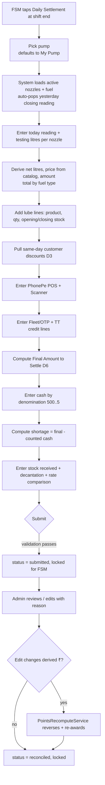

# Daily Settlement (D1–D10, Staff-1, Admin-12/13)

> **Build status (Phase 2, 2026-07-22):** 🚧 in progress. **Staff surface COMPLETE on
> all three surfaces** (D1–D8, D10 capture + D6/D7 math), tested: the `daily_settlements`
> parent + all 9 child/audit tables and models (nested attributes, `allow_destroy`,
> line-level derivation); the `Settlement::Builder` / `Settlement::Calculator` /
> `Settlement::Persister` / `Settlement::FormRows` services; the staff JSON API
> (`/api/v1/staff/settlements` + `/new`, `/:id`) with full/summary/draft serializers and
> `DailySettlementPolicy`; the Rails PWA `Staff::SettlementsController` + sectioned form
> with `settlement_form.js` live totals (browser-verified); and the Android
> `ui/settlement` area + home quick-action (compiles clean). The B2 source table is
> `visit_entries` (the spec's `customer_detail_entries`); `settlement_discount_lines.visit_entry_id`
> references it. **Admin D9 console (API + web) shipped — closes G1:** `Settlement::Differ`
> (field-level audit diffs), `PointsRecomputeService` (an admin discount-line edit linked to
> a B2 transaction re-derives that transaction's ₹ + earn points atomically), the `Persister`
> admin_edit path, the admin API (`/api/v1/admin/settlements` + `/:id`, `/reconcile`, `/summary`
> with cross-pump totals), and the `Admin::SettlementsController` console (cross-pump list/totals,
> audit-trail panel, Reconcile, edit-with-reason). ✅ **Android admin settlement view shipped**
> (`ui/admin/settlements` master-detail: cross-pump list + totals card, detail with the D6/D7
> totals, nozzle readings, audit trail + Reconcile). **➡️ Daily Settlement (D1–D10) COMPLETE
> on all three surfaces, tested (467 Rails runs green, brakeman clean, Android compiles).**
> Web-first deferrals: native **decantation** (D8 tank dips) inputs and native admin
> **line-item editing** (the native admin console covers view + reconcile).

> **Opening-reading update (2026-08-25):** the auto-popped opening reading was
> rendered read-only whenever a prior settlement existed, which is wrong the
> moment a day goes unsettled — the pump keeps selling, so the last recorded
> closing falls behind the meter and there was no way to correct it. The field
> is now **editable on both staff surfaces**, still defaulting to the prior
> closing, and each row shows the figure it was auto-filled from, the date that
> sheet was settled, and how many days went unsettled in between (with an Undo
> that restores the auto-filled figure). The offered figure and its date are
> snapshotted onto the row (`prior_closing_reading`, `prior_closing_date`) and
> `opening_source` is derived server-side — `corrected` when the FSM typed over
> the offer — so the read-only sheet's **edited** marker cannot be spoofed by a
> client. See business rule 1.

Daily Settlement is the shift-end reconciliation ledger for a fuel outlet. At the end of a shift the FSM (pump operator) picks their pump, and the system shows that pump's nozzles and their fuel. The FSM enters today's meter readings; the app auto-populates the opening reading from the last settled sheet (a default the FSM can type over when days went unsettled), subtracts testing litres, derives net litres sold, prices each nozzle from the product catalog's selling price, and totals fuel by type. The FSM then records lubricant sales (with opening/closing stock), pulls same-day customer discounts, enters PhonePe POS and Scanner receipts, Fleet/OTP and tank-truck credit lines, and finally reconciles cash by denomination against the computed **Final Amount to Settle**, capturing shortage. Stock received, tank decantation, and a JIO-BP-vs-own rate comparison round out the record. Admins can view and edit any settlement — current or past, per pump or across pumps — with a full audit trail, and any edit that changes derived ₹ recomputes loyalty points. This is the single largest module and the source of truth for litres sold (per LOCKED Q1: readings/litres are canonical; ₹ is derived from catalog selling price).

## Requirements covered

| ID | One-line |
|----|----------|
| D1 | Per-nozzle today/yesterday readings, testing litres, net litres, auto price, amount |
| D2 | Lube lines sold in the settlement with opening/closing stock |
| D3 | Discounts pulled from same-day customer detail entries |
| D4 | PhonePe POS (machine) and PhonePe Scanner amounts |
| D5 | Fleet/OTP and TT (tank-truck) credit lines (litres + discount + reference) |
| D6 | Final-Amount-to-Settle formula |
| D7 | Cash denomination breakdown and per-pump shortage |
| D8 | Stock received (MS/HSD) and decantation (tank KL readings) |
| D9 | Admin view/edit per pump and across pumps, incl. past days, with audit trail |
| D10 | Rate comparison (JIO-BP vs own selling price) |
| Staff-1 | FSM records Daily Settlement at shift end; yesterday reading auto-populated; admin can view |
| Admin-12 | Visualize data per pump anytime and edit current/past days |
| Admin-13 | View/edit Daily Settlement per pump and across pumps |

## Current state

**Nothing settlement-like exists.** `grep -ri settlement` over `app/` returns zero Ruby/Kotlin hits; there is no settlements table, controller, model, service, or Android screen. There is likewise no readings, litres, testing, denomination, shortage, decantation, PhonePe, opening/closing-stock, or product-price concept anywhere in the schema.

What exists today and what is missing:

- **Transactions store rupees only, no litres or readings.** `app/models/transaction.rb:1-15` has `fuel_amount` (₹) and `payment_mode`, no litres/reading fields. `db/schema.rb:276-291` confirms `transactions` columns are `fuel_amount decimal(10,2)`, `fuel_pump_id`, `fuel_pump_nozzle_id`, `payment_mode`, plus FKs — no `litres`, no `reading`, no `discount`. So there is no per-transaction litre figure to aggregate into a settlement.
- **No product catalog and no prices.** `db/schema.rb:124-131` (`fuel_types`) has `code, name, active` — no price/MRP. `db/schema.rb:94-104` (`fuel_pump_nozzles`) has `fuel_type_code, sequence_number, active` — no price. There is nothing to price a nozzle's net litres or a lube line against. **This module cannot compute amounts until the catalog (A5) exists.**
- **Rupees are entered by hand, not derived.** `app/services/transaction_creator.rb:26-44` creates a transaction from a raw `fuel_amount` and immediately awards points via `PointsCalculator`. `app/services/points_calculator.rb` floors `fuel_amount / rupees_per_reward_unit` × `points_per_100`. Nothing derives ₹ from litres × catalog price.
- **Pumps expose nozzles but no reading history.** `app/models/fuel_pump.rb:2-12` gives `has_many :nozzles` (ordered) and `has_many :transactions`; there is no notion of a pump's prior-day closing reading to auto-populate.
- **No customer-detail-entry table to pull discounts from.** The B2 "Customer Details Entry" (litres, discount, transport, fleet/OTP, manager/owner) does not exist yet; there is no source for D3's discount lines.
- **An audit/edit pattern already exists and should be reused.** `app/models/attendance_entry_change.rb:1-6` (`change_reason` required, `changed_by` User) plus `AttendanceRun`'s snapshot/stale mechanics (`app/models/attendance_run.rb`) are the house pattern for "edit a recorded operational document with a reason." The settlement audit trail should mirror it.
- **API shape to mirror.** Staff endpoints live under `namespace :staff` in `config/routes.rb:29-49`; admin under `namespace :admin` at `config/routes.rb:51-86`. Android areas each carry `Api/Dtos/Repository/Screen/ViewModel` (e.g. `android/.../ui/admin/attendance/`).

Net: the entire module is greenfield and is blocked on the catalog (A5) and litre/customer-capture (B2/D1) work.

## Target design

### New tables

One parent (`daily_settlements`) plus child line-item tables and an audit table. All monetary columns are `decimal(12,2)`; litres are `decimal(12,3)`; meter readings are `decimal(12,3)` (litres, cumulative). Prices are **snapshotted** onto each line at capture time so a later catalog price change never silently rewrites a submitted settlement.

**`daily_settlements`** — one row per pump per business date per shift.

| Column | Type | Rationale |
|---|---|---|
| `fuel_pump_id` | bigint FK | Which pump this settles |
| `business_date` | date, null:false | The trading day (not `created_at`; a 6PM–6AM shift spans midnight) |
| `shift_template_id` | bigint FK, null | Which shift (6-6 / 12h / 8h); optional if outlet runs one shift |
| `recorded_by_id` | bigint FK→users | FSM who submitted (Staff-1) |
| `fsm_name_snapshot` | string | "Name of FSM" printed on the sheet, snapshotted |
| `status` | integer enum `draft/submitted/reconciled` default draft | Lifecycle |
| `phonepe_pos_amount` | decimal(12,2) default 0 | D4 machine |
| `phonepe_scanner_amount` | decimal(12,2) default 0 | D4 scanner |
| `total_fuel_amount` | decimal(12,2) default 0 | Σ nozzle amounts (derived, stored for reporting) |
| `total_lube_amount` | decimal(12,2) default 0 | Σ lube amounts |
| `total_discount_amount` | decimal(12,2) default 0 | Σ discount lines |
| `total_credit_amount` | decimal(12,2) default 0 | Σ credit-line values (OTP/TT) |
| `final_amount_to_settle` | decimal(12,2) default 0 | D6 formula result (stored) |
| `counted_cash_amount` | decimal(12,2) default 0 | Σ denomination lines |
| `shortage_amount` | decimal(12,2) default 0 | D7: counted vs expected cash |
| `notes` | text, null | Free notes |
| `submitted_at` | datetime, null | When FSM submitted |
| `locked` | boolean default false | Set on `reconciled`; blocks FSM re-edit |
| timestamps | | |

Unique index `(fuel_pump_id, business_date, shift_template_id)` so one FSM cannot double-file a shift (mirrors `AttendanceRun`'s `shift_window_must_be_unique`).

**`settlement_nozzle_readings`** (D1) — child, one per active nozzle on the pump.

| Column | Type | Rationale |
|---|---|---|
| `daily_settlement_id` | bigint FK | |
| `fuel_pump_nozzle_id` | bigint FK | The nozzle |
| `fuel_type_code_snapshot` | string | Fuel at capture time |
| `opening_reading` | decimal(12,3) | Opening meter reading. **Auto-popped** from the prior settlement's `closing_reading`, and editable — the FSM types over it when days went unsettled |
| `opening_source` | string default `manual` | `prior_settlement` \| `manual` \| `corrected`. Derived server-side, never accepted from the client |
| `prior_closing_reading` | decimal(12,3) | The figure that was auto-popped, snapshotted so a correction is visible against it |
| `prior_closing_date` | date | The business date that figure was settled on — how a gap of unsettled days becomes visible |
| `closing_reading` | decimal(12,3) | Today's reading (FSM enters) |
| `testing_litres` | decimal(12,3) default 0 | Subtracted (calibration draws) |
| `net_litres_sold` | decimal(12,3) | Derived `= closing − opening − testing` |
| `unit_price` | decimal(12,2) | Snapshot of catalog selling price for the fuel |
| `amount` | decimal(12,2) | Derived `= net_litres_sold × unit_price` |

**`settlement_lube_lines`** (D2) — child, one per lube product sold.

| Column | Type | Rationale |
|---|---|---|
| `daily_settlement_id` | bigint FK | |
| `product_id` | bigint FK→products (A5) | Which lube/oil/AdBlue |
| `product_name_snapshot` | string | Printed name |
| `quantity` | integer default 0 | Units sold |
| `unit_price` | decimal(12,2) | Snapshot of selling price |
| `amount` | decimal(12,2) | Derived `= quantity × unit_price` |
| `opening_stock` | integer, null | Shift-start stock |
| `closing_stock` | integer, null | Shift-end stock |

**`settlement_discount_lines`** (D3) — child, pulled from same-day customer detail entries (B2). Editable copies (snapshots) so a later B2 edit is auditable.

| Column | Type | Rationale |
|---|---|---|
| `daily_settlement_id` | bigint FK | |
| `customer_detail_entry_id` | bigint FK→customer_detail_entries (B2), null | Provenance |
| `transport_name` | string, null | |
| `litres` | decimal(12,3) default 0 | |
| `discount_amount` | decimal(12,2) default 0 | Reduces amount to settle |
| `driver_name` / `driver_mobile` | string, null | Snapshot |
| `manager_name` / `manager_mobile` | string, null | Snapshot |
| `owner_name` / `owner_mobile` | string, null | Snapshot |

**`settlement_credit_lines`** (D5) — Fleet/OTP and tank-truck credit.

| Column | Type | Rationale |
|---|---|---|
| `daily_settlement_id` | bigint FK | |
| `credit_type` | integer enum `fleet_otp:0 / drive_in:2 / credit:3` | Mirrors the three Customer account types (staff feedback item 9). The retired `tank_truck:1` was migrated to `credit`. |
| `litres` | decimal(12,3) default 0 | e.g. "OTP 136 Lts" |
| `discount_amount` | decimal(12,2) default 0 | Per-line discount |
| `amount` | decimal(12,2) default 0 | ₹ value of the credit line, reduces cash to settle |
| `reference` | string, null | Vehicle/reference e.g. "NL-01/AE-2471" |
| `note` | string, null | |

**`settlement_digital_receipts`** (D6) — one row per digital-payment means.

| Column | Type | Notes |
|---|---|---|
| `daily_settlement_id` | references | |
| `label` | string, null:false | "PhonePe POS", "PhonePe Scanner", "PAYTM", … Unique per settlement, case-insensitive. |
| `amount` | decimal(12,2) default 0 | |

Replaces the retired `phonepe_pos_amount` / `phonepe_scanner_amount` columns;
the two PhonePe labels are seeded on every draft. The staff API still accepts
and emits the two old keys, derived from the matching rows, so installed app
builds keep working.

**`settlement_expense_lines`** (D6) — cash taken out before settling.

| Column | Type | Notes |
|---|---|---|
| `daily_settlement_id` | references | |
| `description` | string, null:false | "Salary advance — Ravi" |
| `amount` | decimal(12,2) default 0 | |

**`settlement_cash_denominations`** (D7) — one row per denomination present.

| Column | Type | Rationale |
|---|---|---|
| `daily_settlement_id` | bigint FK | |
| `denomination` | integer | 500/200/100/50/20/10/5/2/1 |
| `quantity` | integer default 0 | |
| `amount` | decimal(12,2) | Derived `= denomination × quantity` |

**`settlement_stock_receipts`** (D8) — fuel stock received during the shift.

| Column | Type | Rationale |
|---|---|---|
| `daily_settlement_id` | bigint FK | |
| `fuel_type_code` | string | MS/HSD |
| `litres_received` | decimal(12,3) default 0 | |

**`settlement_decantations`** (D8) — tank KL readings after a tanker drop.

| Column | Type | Rationale |
|---|---|---|
| `daily_settlement_id` | bigint FK | |
| `fuel_type_code` | string | Tank's product |
| `tank_label` | string, null | Tank id |
| `opening_kl` | decimal(12,3) | Before decantation |
| `closing_kl` | decimal(12,3) | After |

**`settlement_rate_comparisons`** (D10) — competitor vs own.

| Column | Type | Rationale |
|---|---|---|
| `daily_settlement_id` | bigint FK | |
| `fuel_type_code` | string | |
| `competitor_name` | string default "JIO-BP" | |
| `competitor_price` | decimal(12,2) | |
| `own_price` | decimal(12,2) | Snapshot of catalog selling price |

**`settlement_changes`** (D9 audit) — mirrors `attendance_entry_change`.

| Column | Type | Rationale |
|---|---|---|
| `daily_settlement_id` | bigint FK | |
| `changed_by_id` | bigint FK→users | Admin who edited |
| `change_reason` | string, null:false | Required, as in `AttendanceEntryChange` |
| `field_diffs` | jsonb | `{ "col": [old, new], ... }` across parent + children |
| `recomputed_points` | boolean default false | Whether this edit triggered points recompute |
| `created_at` | datetime | |

### Business rules

1. **Opening auto-pop, always correctable.** For each active nozzle, `opening_reading` defaults to the most recent prior settlement's `closing_reading` for that nozzle (`WHERE fuel_pump_nozzle_id = ? AND business_date < ? AND closing_reading IS NOT NULL ORDER BY business_date DESC LIMIT 1`, submitted/reconciled only). If none exists (first ever settlement), opening is blank and the FSM enters it once.
   It is a **default, not a fact**: days can pass with nobody filing a sheet while the pump keeps selling, and the last recorded closing is then behind the meter. The field is editable on every surface (web form and Android), and both surfaces show the figure that was offered and the date it was settled on, plus how many days went unsettled in between.
   The offered figure and its date are snapshotted onto the row (`prior_closing_reading`, `prior_closing_date`) when it is first saved, so a settlement filed later for an earlier date never rewrites what an existing sheet was shown. `opening_source` is then **derived server-side** by comparing what came back against what was offered — `prior_settlement` when they match, `corrected` when the FSM typed over it, `manual` when there was nothing to offer. It is not in either staff surface's permitted params: a client that names its own source could pass every correction off as an inheritance, and the read-only sheet's "edited" marker is only worth anything if it cannot be spoofed.
2. **Derived quantities are recomputed server-side on every save** (never trusted from the client): `net_litres_sold = closing − opening − testing`; `amount = net × unit_price`; lube `amount = qty × price`; denomination `amount = denom × qty`.
3. **Pricing is snapshot-at-capture** from the catalog selling price (A5). Admin edits may re-snapshot only if the admin explicitly re-prices.
4. **Final Amount to Settle (D6):**
   `final_amount_to_settle = (total_fuel_amount + total_lube_amount) − (total_discount_amount + total_credit_amount + total_digital_receipt_amount + total_expense_amount)`.
   Digital receipts and expense lines are line items rather than fixed columns
   (staff feedback items 10 and 12): any payment means can be recorded, and cash
   taken out during the day — a salary advance — reduces what the FSM hands over.
5. **Shortage (D7):** `shortage_amount = final_amount_to_settle − counted_cash_amount`. Positive = cash short; negative = excess. `counted_cash_amount = Σ denomination amounts`.
6. **Status lifecycle:** `draft` (FSM editing) → `submitted` (FSM done; admin can view) → `reconciled` (admin confirmed; sets `locked=true`). Only admins move to `reconciled`. Only admins edit a `submitted`/`reconciled` settlement; every such edit requires a `change_reason` and writes a `settlement_changes` row.
7. **Points recompute on edit (D9 ⇄ C5).** Loyalty points accrue from per-customer visits (B2 entries → litres × catalog price → ₹ → `PointsCalculator`). When an admin edit changes a figure that feeds a customer's derived ₹ (a linked discount line's litres/discount, or a re-priced nozzle whose price is the source for that day's B2 entries), `PointsRecomputeService` reverses the affected `points_ledgers` `earn` rows and re-awards using the new derived ₹, inside one DB transaction. The `settlement_changes.recomputed_points` flag records that this happened. Settlements that touch no customer-linked figure skip recompute.
8. **Business date defaults to yesterday.** Staff record a day's transactions as they happen and settle the next morning, so a draft opened with no date is yesterday's sheet (`Settlement::Builder.default_business_date`). The FSM can still pick any date in the chooser.
9. **Keyed children are unique per settlement.** One row per nozzle, lube,
   denomination, digital means, stock line and (fuel type, competitor) pair,
   enforced by a model validation and a matching unique index. This is what
   stops a client re-posting saved rows without their ids from doubling a
   settlement (staff feedback item 6). Credit and discount lines are exempt —
   they have no natural key, so a second row may be genuine.
10. **Staff read their pump, edit their own; an admin edits only in the audited
   console.** An FSM sees any settlement for a pump they're posted to, including a
   colleague's shift, but may only edit one they recorded. Admins **read**
   everything through the same flow. They **edit** nothing through it: the FSM flow
   persists without `admin_edit:`, so it writes no `settlement_changes` row, and an
   admin editing there would rewrite an FSM's figures with no audit row and no
   change reason — the very thing the D9 console exists to prevent. So an admin has
   no editable settlement in the FSM flow at all. The web hands them the same sheet
   in the console (`edit_admin_settlement_path`) rather than dropping them on a bare
   index — from the Edit control on the list and the sheet, from the staff edit URL
   directly, and from the "a settlement already exists for that pump and date"
   hand-off on the new-settlement form — and the staff API answers `403`, the same
   refusal it gives for a colleague's sheet. Admin **create** on an FSM's behalf
   (rule 13) is untouched.
11. **Cross-pump view (D9/Admin-13):** admin can list/aggregate settlements for a `business_date` across all pumps, summing fuel/lube/discount/credit/cash/shortage.
12. **Per-FSM view (Admin-12).** The same list also rolls up **per staff member** — one row per `recorded_by`, carrying that FSM's settlement count, the pumps they covered and the same money columns, with a filter to narrow the list to one FSM. Grouping is on `recorded_by_id`, never on `fsm_name_snapshot`: the snapshot is frozen at create, so two users sharing a display name would merge and a renamed user would split. Only `submitted`/`reconciled` rows carry money, so the rollup counts only those and reports any drafts separately — a count that included drafts would contradict its own totals.
13. **An admin never enters a settlement as himself (Admin-12).** A settlement belongs to the FSM who worked the shift. An admin may still enter one *for* an FSM who cannot — that is the only case where an admin enters anything:
    - **Creating:** the admin must name the staff member; `recorded_by` becomes that FSM (so `fsm_name_snapshot` is theirs) and `daily_settlements.entered_by` records the admin who keyed it in. `entered_by` is stamped **once, at creation** — never back-stamped by a later edit or reconcile, which would falsely claim the editing admin keyed in every settlement predating the column. A staff member may never set `recorded_by`; their settlement is always their own.
    - **Editing:** the admin must name the staff member the edit is for; `settlement_changes.on_behalf_of` records them alongside `changed_by` (the admin). The two are never conflated. This happens **only** in the admin console — the FSM flow, which records no reason and no diff, refuses an admin edit outright (rule 10).
    - Neither may name the acting admin — naming yourself is exactly what this rule forbids. Ownership is decided once at creation and can never be re-pointed afterwards, which would move money between people with no audit row.
    - **Reconcile is exempt:** approving a settlement is an act of the admin's own authority, not data entry.
14. **A back-dated draft resolves the pump for its business date.** `Settlement::Builder` picks the pump from the daily override recorded for that date, falling back to the caller's standing default — never the caller's pump *today*. The resolved pump decides both the auto-popped opening readings (rule 1) and which `visit_entries` the discount lines are pulled from (D3), so filing a settlement late against today's pump would pre-fill another pump's meter readings and another pump's discounts. An explicitly chosen `fuel_pump_id` always wins.
15. **An operator with no pump for that day must still be able to file the sheet.** Rule 14 deliberately refuses to guess which pump a back-dated sheet belongs to, and that is the right call — but it leaves a case somebody has to handle. An operator whose pump is set one day at a time (a *dated posting*, with no *standing pump* recorded on their account) opens the sheet for a day they were not posted to; the server finds no pump for that date; and the sheet arrives with an empty **Nozzle readings** section. There is nothing to type a meter reading into and nothing to submit, while that day's cash sits unreconciled. This has been hit in production.
    - **Terms, plainly.** A **nozzle** is one dispenser hose; its meter reading is the figure the entire settlement is computed from, so no nozzles means no sheet. A **standing pump** is the pump an operator is normally posted to — recorded once on their account and used for *any* date. A **dated posting** is a one-day override that applies to the single day it names and no other.
    - **Why the section comes up empty at all.** Nozzle rows are built from the pump, so no pump resolved means no rows. Everything that does *not* depend on a pump — the lubricant list, the cash-denomination grid — still renders normally. The screen therefore looks half-working rather than obviously broken, which is exactly why the empty section has to say something.
    - **Both apps carry a pump and business-date chooser.** The web form has had one since D1; the Android sheet carries the same one. It reloads the draft for the pump and date the operator names, which is how they get to the right sheet without waiting on an admin. On Android the choice is applied only when they tap **Load draft**, never on selection alone, so a reload can never silently discard readings already typed in.
    - **An empty nozzle list must name its cause — silence is a dead end.** There are exactly two causes and the remedy differs: (a) *no pump is assigned to you for this date*, which the operator fixes themselves with the chooser; (b) *this pump has no active nozzles*, which is a setup job only a manager can do. An unexplained blank section is indistinguishable from a broken screen and gives the operator nothing to act on.
    - **The standing pump is the durable operational fix.** Admin → Staff members → Assign pump, mode **Default**, records a standing pump on the account. Because the resolver falls back to it for *any* date, that one setting repairs every sheet, past and future; a dated posting only repairs the single day it names, and the API refuses to backdate one.
16. **The admin reads the sheet, not a digest of it.** The console's settlement view reprints every section of the entry form — nozzle readings, lubes, discounts, digital receipts, credit lines, cash taken out, the final-amount banner, the cash count, stock/decantation/rate comparison and the notes — in the entry order, with the same column headings, rendered as text rather than inputs. A review is a comparison against the paper the FSM worked from, and a summary of totals cannot be compared to anything; a reviewer who has to open the *edit* form to see a figure is one slip away from changing it. A section with nothing in it stays on the page and says so ("No lubricants sold."), because a section silently omitted reads as "nothing to see" when it may mean "nothing was entered". Both surfaces render the same sheet, and the staff view renders it too, so a question about a figure is a conversation about one document. Editing stays where the audit trail is: the console's Edit action (rule 13).
17. **A past settlement is found by range and by free text, not only by exact date.** The console filters on a `from`/`to` business-date range — either end may stand alone, so "everything since the 1st" and "everything up to the 1st" both answer, and an explicit range overrides `business_date` on both surfaces rather than being AND-ed onto it — alongside pump, FSM, status, and a free-text `q` matched against `fsm_name_snapshot`, the recorder's name/username/phone, the notes, the **transporter, vehicle, driver and driver's mobile on the sheet's discount lines**, and the pump's sequence number — the last only when the number is the *whole* query (`3`, `pump 3`), since a pump has no name of its own beyond "Pump N" but reading the first digit run out of any query turns a reference like `NL-01/AE-2471` into "everything Pump 1 ever filed". One implementation (`DailySettlement.matching_text`) serves both surfaces, merged into the filtered scope so it narrows rather than escapes.
    - **The discount line is where a settlement question usually starts.** Nobody rings up about a shift; they ring up about a load — a transporter disputing a rate, a plate on a complaint. Filed under the FSM who happened to be on duty, that sheet is unfindable from what the caller actually said. Names are matched as typed; the plate and the mobile are put through the same normalizers `visit_entries` uses (A-Z0-9 and digits only) before they are matched, so `KA-05 MJ 4455` and `+91 98000 11122` — which is how both are actually written down — find what was captured. Two queries are refused an identifier clause rather than answered badly: one with no letters or digits at all (`---`), which normalizes to nothing and would match as `ILIKE '%%'` — every line that has a plate; and a bare pump number (`3`, `pump 3`), which means the pump and nothing else, since nearly every plate and every mobile contains a given digit and reading a 1-4 digit query as a fragment of one would answer "Pump 3" with the whole table. The name clauses survive both: a digit inside a transporter's name is a genuine substring hit.
    - **The plate is stamped server-side from the visit the line was pulled from, once, at creation** (`Settlement::Persister`), exactly like `unit_price` and the offered opening. No client posts it — the native app's discount payload is transporter, litres and money — so deriving it is the only way a sheet filed on a phone is findable at all; and a plate the client could set is a plate that can disagree with the capture it claims to snapshot. A later B2 correction does not rewrite a stamped line; that is what the audit trail is for. A line the FSM adds at settlement was never a capture and keeps no plate.
    - **What is searched has to be readable on the sheet**, or a hit cannot be explained: the discount table carries a Vehicle column and prints the driver's mobile under their name — on the reprint, on the entry form and on the native sheet. Named ranges (today, yesterday, last 7/30 days, this/last month) are one tap. The cross-pump and per-FSM rollups follow the whole filter — they total the rows on screen, over whatever period is in force, so a rollup can never contradict the list beneath it.




### Services

- `Settlement::Builder` — given `fuel_pump_id`, `business_date`, `shift_template_id`, returns a pre-filled draft: active nozzles with auto-popped opening readings, catalog prices, same-day discount lines from B2, and a blank denomination grid.
- `Settlement::Calculator` — pure recompute of all derived fields and the D6/D7 totals; called on every create/update.
- `Settlement::Persister` — atomic upsert of parent + all children (nested attributes with `allow_destroy`), writes a `settlement_changes` row on admin edits, and invokes `PointsRecomputeService` when a customer-linked figure changed.

## API changes

All under `namespace :api, :v1`. Staff routes added to the `staff` block (`config/routes.rb:29-49`), admin to the `admin` block (`config/routes.rb:51-86`). Auth: existing token auth; staff scoped to their own pump/shift, admin unrestricted.

### Staff (FSM)

**GET `/api/v1/staff/settlements/new`** — build the pre-filled draft.
Request query: `fuel_pump_id` (optional; defaults to the pump the caller was assigned **on `business_date`**, then their standing default — see business rule 11), `business_date` (optional; defaults today), `shift_template_id` (optional).
Response `200`:
```json
{
  "business_date": "2026-07-21",
  "fuel_pump": { "id": 3, "display_name": "Pump 3" },
  "fsm_name": "R. Kumar",
  "existing_settlement_id": null,
  "nozzle_readings": [
    { "fuel_pump_nozzle_id": 5, "display_name": "Nozzle 5", "fuel_type_code": "hsd",
      "fuel_type": "HSD", "opening_reading": "84210.500", "opening_source": "prior_settlement",
      "prior_closing_reading": "84210.500", "prior_closing_date": "2026-07-20",
      "unit_price": "98.95" }
  ],
  "discount_lines": [
    { "customer_detail_entry_id": 88, "transport_name": "NL Roadways", "litres": "136.000",
      "discount_amount": "340.00", "driver_name": "S. Rao", "driver_mobile": "98xxxxxx" }
  ],
  "lube_products": [ { "product_id": 12, "name": "AdBlue 10L", "unit_price": "1080.00" } ],
  "denominations": [500,200,100,50,20,10,5]
}
```

**POST `/api/v1/staff/settlements`** — create/submit.
Request:
```json
{ "settlement": {
  "fuel_pump_id": 3, "business_date": "2026-07-21", "shift_template_id": 2, "status": "submitted",
  "phonepe_pos_amount": "12500.00", "phonepe_scanner_amount": "8400.00", "notes": "",
  "nozzle_readings_attributes": [
    { "fuel_pump_nozzle_id": 5, "opening_reading": "84210.500", "closing_reading": "85990.000", "testing_litres": "5.000" }
  ],
  "lube_lines_attributes": [ { "product_id": 12, "quantity": 3, "opening_stock": 20, "closing_stock": 17 } ],
  "discount_lines_attributes": [ { "customer_detail_entry_id": 88, "transport_name": "NL Roadways", "litres": "136.000", "discount_amount": "340.00" } ],
  "credit_lines_attributes": [ { "credit_type": "fleet_otp", "litres": "136.000", "discount_amount": "0.00", "amount": "13457.20", "reference": "NL-01/AE-2471" } ],
  "cash_denominations_attributes": [ { "denomination": 500, "quantity": 40 } ],
  "stock_receipts_attributes": [ { "fuel_type_code": "hsd", "litres_received": "5000.000" } ],
  "decantations_attributes": [ { "fuel_type_code": "hsd", "tank_label": "T1", "opening_kl": "12.400", "closing_kl": "17.400" } ],
  "rate_comparisons_attributes": [ { "fuel_type_code": "hsd", "competitor_name": "JIO-BP", "competitor_price": "99.10", "own_price": "98.95" } ]
} }
```
Response `201`: the full persisted settlement with all derived fields, `final_amount_to_settle`, `counted_cash_amount`, `shortage_amount`, and per-fuel totals. `422` on validation with `details`.

When the caller is an **admin**, `settlement.recorded_by_id` is additionally accepted and **required**: it names the staff member the settlement belongs to, and `422 on_behalf_of_required` is returned without it, or when it names anyone but a current staff member other than the caller (business rule 10). The acting admin is stored as `entered_by`. The field is ignored for staff callers and on `PATCH` for everyone — ownership is set once, at creation.

**GET `/api/v1/staff/settlements`** — list the FSM's own settlements (query `business_date`, `fuel_pump_id`). Returns summary rows.
**GET `/api/v1/staff/settlements/:id`** — full read (FSM's own; blocked once `locked`/reconciled except read-only).
**PATCH `/api/v1/staff/settlements/:id`** — update while still `draft`; `409` if `locked`; `403` for a sheet the caller did not record — including **every** admin caller, who edits via `PATCH /api/v1/admin/settlements/:id` instead (rule 10).

### Admin

**GET `/api/v1/admin/settlements`** — list/filter across pumps. Query: `business_date` (or `from`/`to`, either end alone), `fuel_pump_id` (optional; omit = all pumps), `user_id` (optional; the FSM who recorded it), `status`, `q` (free text over FSM, pump number and notes — rule 17). Response includes per-settlement summary, a `per_user_totals` array (one entry per FSM: `user_id`, `name`, `count`, `pumps[]`, `totals{}` — Admin-12), plus, when the rows are cut to a date or range and no pump filter is applied, a `cross_pump_totals` block (Admin-13).
**GET `/api/v1/admin/settlements/:id`** — full settlement + `changes` audit array (each change carries `changed_by`, `on_behalf_of`, `on_behalf_of_id`).
**PATCH `/api/v1/admin/settlements/:id`** — edit any field/child; **`change_reason` required** (`422 change_reason_required` without it) and **`on_behalf_of_id` required** (`422 on_behalf_of_required` without it, or when it names anyone but a current staff member other than the acting admin). Same nested-attributes body as staff create plus both fields. Response returns updated settlement, a new `settlement_changes` entry, and `points_recomputed: true|false`.
**PATCH `/api/v1/admin/settlements/:id/reconcile`** — set `reconciled`, `locked=true`. No `on_behalf_of_id`: reconciling is the admin's own act, not data entry.
**GET `/api/v1/admin/settlements/summary`** — Admin-12 "visualize per pump anytime": query `fuel_pump_id`, `from`, `to`; returns time series of litres/₹/shortage.

Routes to add:
```ruby
# staff block
resources :settlements, only: %i[index show create update] do
  get :new, on: :collection
end
# admin block
resources :settlements, only: %i[index show update] do
  patch :reconcile, on: :member
  get :summary, on: :collection
end
```

## UI

### Rails PWA

- **Staff — new area `staff/settlements`** (route added under `namespace :staff`, sibling of `resources :transactions` at `config/routes.rb:106`). A single long "Shift-End Settlement" form, sectioned to match the sheet:
  1. **Header** — pump selector (defaults to My Pump), business date, shift, FSM name (prefilled).
  2. **Nozzle readings table** — one row per active nozzle: fuel (read-only), Opening (auto-filled from the last settled sheet and always editable, captioned "Last settled <figure> on <date>" and, across a gap, "<n> days not settled — read the meter", with an Undo that puts the auto-filled figure back), Closing (input), Testing (input), Net Litres (computed, read-only), Price (read-only from catalog), Amount (computed). A per-fuel subtotal row.
  3. **Lubes** — checkbox list of catalog lube products; ticking reveals Qty, Opening Stock, Closing Stock, Amount (computed).
  4. **Discounts (pulled)** — read-mostly table of same-day customer entries (transport, litres, discount, driver/manager/owner); FSM may add a manual line.
  5. **Digital receipts** — PhonePe POS, PhonePe Scanner inputs.
  6. **Credit lines** — repeatable rows: type (Fleet/OTP or TT), litres, discount, amount, reference.
  7. **Final Amount to Settle** — live-computed banner (D6 formula shown).
  8. **Cash** — denomination grid (500/200/100/50/20/10/5 × qty → amount), counted-cash total, live **Shortage** readout (D7).
  9. **Stock received / Decantation / Rate comparison** — three compact repeatable sections.
  10. Sticky **Submit** button. All computed fields recalc client-side via Stimulus for feedback; server recomputes on submit.
- **Admin — extend `admin/transactions`** area (currently index-only, `config/routes.rb:147`) or add sibling **`admin/settlements`**: an index filterable by **date range** (`from`/`to`, with one-tap named ranges)/pump/**staff (FSM)**/status/**free-text search** (rule 17) with a **cross-pump totals** header and a **per-staff-member** rollup card (count, pumps covered, fuel/discount/final/cash/shortage; drafts noted separately, each row linking through to that FSM's own settlements), a per-settlement detail page that reprints the entry sheet read-only (`shared/_settlement_sheet`, rule 16 — the same partial the staff view renders) with an **Edit** action onto the staff form in editable mode with a mandatory **"Entering on behalf of"** selector and **"Reason for change"** field, an **Audit trail** panel listing `settlement_changes` (who/on-whose-behalf/when/reason/diffs, mirroring the attendance-changes UI), and a **Reconcile** action. The detail header shows `FSM: <name> · entered by <admin>` when the two differ. Admin-12 "visualize per pump" is a small chart (litres/₹/shortage over a date range) on the pump detail.
- **Admin does not get a settlement-entry entry point.** The admin sidebar has no "Daily Settlement" link; an admin who must file for an FSM uses the staff flow, where the form asks who it is **Recorded for**. That flow is for *filing* only: every Edit control an admin sees on the staff list or sheet points at the audited console, and the staff edit URL redirects there for the same settlement (rule 10). The Android home hides its Daily Settlement tile from admins for the same reason — its request body carries no FSM field, so offering it would only produce an unsatisfiable error.

### Android (Compose)

- **New staff area `ui/settlement/`** with the house layout `SettlementApi.kt`, `SettlementDtos.kt`, `SettlementRepository.kt`, `SettlementScreen.kt`, `SettlementViewModel.kt` (same shape as `ui/admin/attendance/`). Entry point: a "Daily Settlement" tile on the FSM home (`ui/home`), enabled at shift end. `SettlementScreen` is a scrollable multi-section form mirroring the PWA sections, headed by the same pump and business-date chooser the PWA has, so an operator with no assignment for that date can name the pump they worked and reload rather than sitting on an empty sheet (pump list from `GET /api/v1/my_pump`; applied only on an explicit **Load draft** tap, so a reload cannot discard readings already typed — business rule 15); nozzle rows and denomination grid use editable rows with live-computed read-only fields; a pinned bottom bar shows Final Amount, Counted Cash, and Shortage. `SettlementViewModel` calls `GET new` on open to hydrate the draft (auto-popped readings, catalog prices, pulled discounts) and posts on submit; offline-safe drafts held in the ViewModel until submit.
- **New admin area `ui/admin/settlements/`** (`Api/Dtos/Repository/Screen/ViewModel`) added to `AdminShell.kt` nav next to `transactions`. List screen with a `from`/`to` range (one-tap named ranges), status chips and a debounced free-text search (rule 17), plus a cross-pump totals card; detail screen reprints the whole entry sheet read-only in the entry order (rule 16 — the phone renders each line as a label/value pair rather than a nine-column table, but drops no section and no figure; an opening the FSM corrected carries an **edited** chip and a caption naming the figure it was auto-filled from and the date that sheet was settled), an **Edit** toggle that requires a reason before save (still web-only), an **Audit** tab (each entry showing `<admin> on behalf of <FSM>` where recorded), and a **Reconcile** button. Reuse `ui/designsystem` components and `Nayara*` theme.

## Validation & edge cases

- `closing_reading ≥ opening_reading`; `testing_litres ≥ 0` and `≤ (closing − opening)`; reject a net that would be negative.
- First-ever settlement for a nozzle: `opening_source = "manual"`, opening is required input, no auto-pop.
- An opening the FSM typed over is stored as `opening_source = "corrected"` and marked **edited** on the read-only sheet — on the web (badge, with the provenance in its title) and on the native admin detail (chip, with the provenance spelled out underneath, since a phone has no tooltip to hide it in). Admin edits of an opening are diffed into `settlement_changes` like any other figure.
- Meter rollover (mechanical counter wraps past its max): allow an explicit `rollover` flag on the reading row so `net = (max − opening) + closing`; otherwise a smaller closing than opening is a hard error.
- Duplicate settlement: unique `(fuel_pump_id, business_date, shift_template_id)` returns `422` "already recorded for this pump/shift" (mirrors `AttendanceRun`).
- Nothing to show in **Nozzle readings** (rule 15): name which of the two causes it is, and never render the empty section in silence. A draft that came back with no pump at all (`fuel_pump: null`) means the operator has no pump assignment for that business date — the pump chooser is the fix and they can apply it themselves. A draft that *names* a pump but still has no rows means that pump has no active nozzles — a manager has to add them. Either way the operator is looking at a sheet with nothing to type into and nothing to submit, and an unexplained blank section is indistinguishable from a broken screen.
- Nozzle set changed since draft was built (nozzle deactivated/added): rebuild reconciles — drop readings for now-inactive nozzles (keep them if they already have data, flagged), add zero rows for new nozzles.
- Catalog price missing for a fuel/lube at capture time: block submit with a clear "no active price for HSD — set catalog price first" (hard dependency on A5).
- Denomination qty and lube qty must be non-negative integers; a `0` qty row is ignored, not stored.
- `final_amount_to_settle` may be negative (heavy credit/PhonePe day); allowed, shortage still computed.
- Editing a `reconciled` (locked) settlement: only admin, only via the reason-required PATCH; FSM PATCH returns `409`.
- Points recompute must be idempotent and atomic: reverse-then-reaward inside one DB transaction; if recompute fails the whole edit rolls back.
- Cross-pump totals only sum settlements in the same `business_date`; drafts excluded from financial totals (only submitted/reconciled count).
- Timezone: `business_date` is the outlet's local trading day, not UTC `created_at`; a shift crossing midnight keeps one `business_date`.
- PII: driver/manager/owner mobiles snapshotted into discount lines inherit the same handling as B2 customer PII.

## Dependencies & sequencing

**Must exist first:**
- **A5 Product Catalog + selling price** — hard blocker; nozzle and lube amounts cannot be priced without it. `fuel_types`/`fuel_pump_nozzles` have no price today (`db/schema.rb:94-104,124-131`).
- **D1 / B2 litres + readings** — the meter-reading and litre concepts; today transactions carry only ₹ (`transaction.rb:1-15`, `db/schema.rb:276-291`).
- **B2 Customer Details Entry** — source of the same-day discount lines (D3) and the litre-based per-visit ₹ used for points recompute.
- **A1–A3 pumps/nozzles** (present) and **A8 shifts** (present) — pump→nozzle graph and shift templates the settlement keys off.
- **E4 customer type (OTP/TT/Drive-in/Credit)** — classifies credit lines (D5); assumed taxonomy flagged "to confirm."

**This unblocks:**
- **E1 Reports** (daily/weekly/monthly/yearly litres/discount/gifts) read from settlements + line items.
- **Admin-12/13 dashboards** (per-pump visualize, cross-pump settlement view) consume the summary endpoints.
- **D9 audit** pattern and **C5 points recompute** wiring are established here for reuse.

Suggested order: A5 → B2/D1 → **this module (D1–D10 capture + D6/D7 math)** → D3/D5 pull-through → D9 admin edit + audit + recompute → E1 reports.

## Acceptance criteria

- [ ] An FSM can open Daily Settlement, and their pump's active nozzles with the correct fuel appear automatically.
- [ ] Each nozzle's opening reading is auto-populated from the prior settlement's closing reading; the first-ever settlement asks for it once.
- [ ] The auto-populated opening is editable on both surfaces, shows what it was auto-filled from and how many days went unsettled, and a typed-over value is recorded as `corrected` and shown as **edited** on the sheet.
- [ ] Entering today's reading and testing litres yields net litres = closing − opening − testing, priced from the catalog selling price, with amount = net × price, and per-fuel subtotals.
- [ ] Lube products can be checkbox-selected; entering qty computes amount from the catalog price and captures opening/closing stock.
- [ ] Same-day customer discount lines (transport, litres, discount, driver/manager/owner) are pulled in from customer detail entries.
- [ ] PhonePe POS and PhonePe Scanner amounts are captured.
- [ ] Fleet/OTP and TT credit lines capture litres, discount, amount, and a reference like "NL-01/AE-2471".
- [ ] Final Amount to Settle = (Fuel + Lubes) − (Discounts + Credit + PhonePe POS + PhonePe Scanner), shown live and stored.
- [ ] Cash is entered by denomination (500…5) × qty; counted cash totals correctly and Shortage = Final − Counted is displayed.
- [ ] Stock received (per fuel), decantation (tank KL opening/closing), and JIO-BP-vs-own rate comparison are captured.
- [ ] Submitting sets status `submitted`, locks FSM edits, and is visible to admins.
- [ ] Admin can list settlements filtered by date/pump/status, and view cross-pump totals for a date.
- [ ] Admin can edit any current or past settlement only with a mandatory change reason; every edit writes a `settlement_changes` audit row with who/when/reason/diffs.
- [ ] An admin edit that changes a customer-linked derived ₹ reverses and re-awards the affected loyalty points atomically, and the audit row records that recompute occurred.
- [ ] A second settlement for the same pump/date/shift is rejected with a clear message.
- [ ] Negative net litres are rejected (unless an explicit meter-rollover flag is set).
- [ ] All amounts and totals are recomputed server-side; client-supplied derived values are never trusted.
- [ ] Every capability above works on the Rails PWA, the native Android app, and the JSON API that backs Android (LOCKED Q2).
