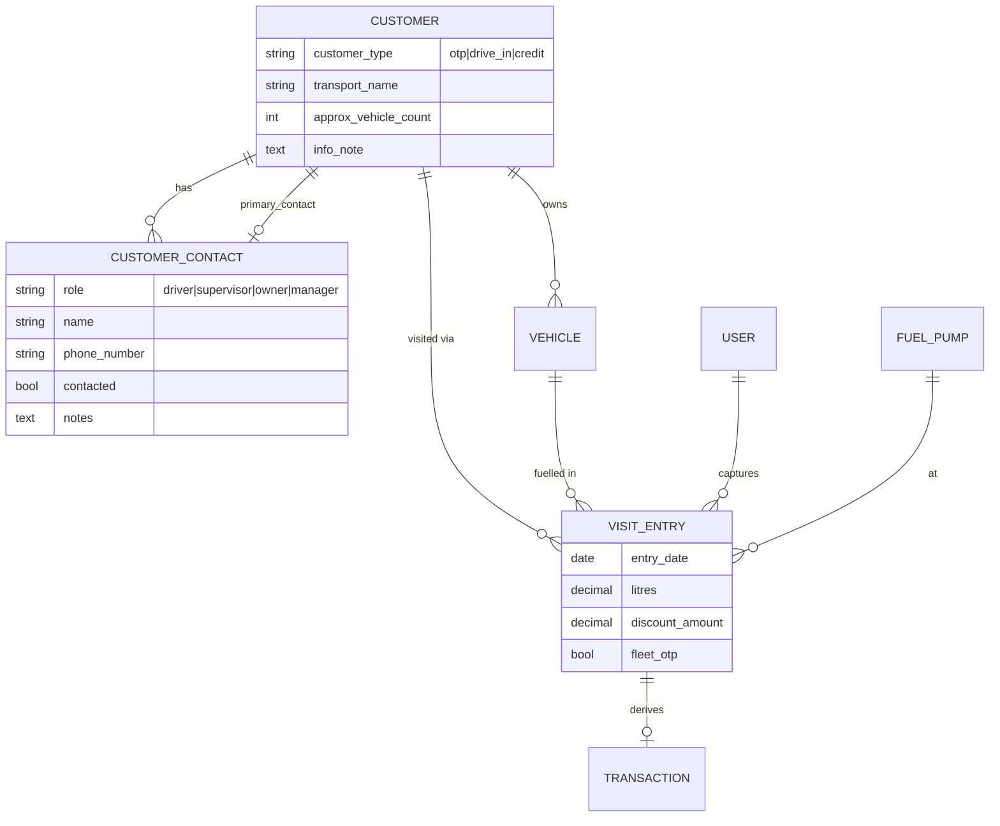
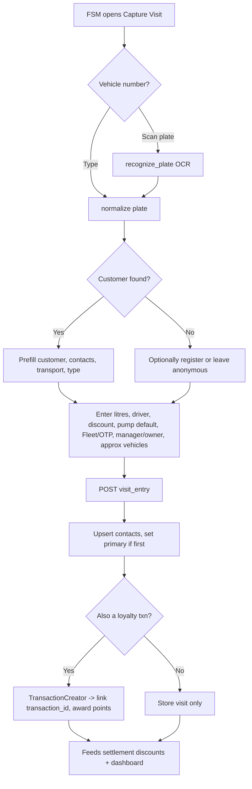

# Customer Master, FSM Per-Visit Capture & Customer Taxonomy

Fuel-station customers today are a thin record (name + one phone + a plate). The requirement is a fleet-aware customer master (driver / supervisor / owner contacts, a "contacted-by" marker, an OTP/Drive-in/Credit taxonomy, transport name and approximate fleet size) plus a high-frequency FSM (Field Sales/Station Manager) per-visit capture form that records litres, discount, pump, and Fleet/OTP status for every fuelling — the data that later feeds daily-settlement discounts, the reward engine, and the CRM dashboard. This spec covers **B1** (customer master expansion), **B2** (CustomerDetailsEntry per-visit capture), and the **E4** customer-type foundation, on both the Rails PWA and the native Android app plus the JSON API behind Android. Per the locked decisions, **litres/readings are the source of truth and ₹ is derived from the product-catalog selling price** — this spec captures litres and stops short of pricing (that arrives with A5 product catalog and D1 readings).

> **Implementation status (2026-07-22):** ✅ **B1 + E4 shipped on both surfaces, tested.** `customers` gained `customer_type` (drive_in/otp/credit enum, backfilled), `transport_name`, `approx_vehicle_count`, `info_note`, `primary_contact_id`; new `customer_contacts` table + `CustomerContact` model (driver/supervisor/owner/manager roles + `contacted`/`contacted_at` marker + notes) with `accepts_nested_attributes_for`.
> - **Web:** account-type select + transport/approx fields on the shared customer form; a **contacts editor** (nested `customer_contacts_attributes` rows — role/name/phone/contacted, add & remove) folded into the customer edit modal; the customer page shows an account-type chip and a **Contacts** list. A `?type=` segmentation filter on the admin customers index.
> - **Android:** a type badge on the customers list, account-type **filter chips** (all/drive-in/otp/credit, server-side `?type=`), and the account type + **contacts** rendered on the customer profile.
> - **API:** `GET /api/v1/staff/customers` accepts `type=`; `CustomerSummarySerializer` exposes `customer_type`/`transport_name`; `CustomerProfileSerializer` exposes `customer_type`, `customer_type_label`, `transport_name`, `approx_vehicle_count`, `info_note`, and a `contacts` array.
> - **Remaining (B1):** native **contact-editing** (write) UI — the per-visit capture below upserts contacts, but a standalone native contacts editor is still a refinement.
>
> **B2 status (2026-07-22):** ✅ **Per-visit capture shipped on both surfaces, tested.** New `visit_entries` table (litres = source of truth, discount, `fleet_otp`, pump defaulting to My Pump + overridable, driver/manager/owner, transport, approx vehicles, nullable customer/vehicle for anonymous plates, `transaction_id` link). `VisitEntryRecorder` resolves the customer/vehicle from the plate, upserts the driver/manager/owner `customer_contacts` (business rule 2, first contact → primary), and optionally links a loyalty transaction via the unchanged `TransactionCreator` litres path. Web: a staff **Capture Visit** form + a per-pump/day captures list (top-bar action). Android: a **Capture Visit** screen (My-Pump default + override, Fleet/OTP switch, driver/manager/owner). API: `POST/GET /api/v1/staff/visit_entries` + `VisitEntrySerializer` + `VisitEntryPolicy`. **Remaining refinements:** plate-scanner prefill on the capture form, the `create_transaction` toggle on the UIs (the API supports it), an Android day-list, and admin past-day editing (lands with D9/G1 settlement editing).

## Requirements covered

| ID | One-line |
|----|----------|
| B1 | Customer master: vehicle reg#, driver name+mobile, supervisor name+mobile, owner name+mobile, contacted-by (owner/supervisor/driver) marker + info note. |
| B2 | FSM per-visit CustomerDetailsEntry: date, vehicle#, driver name/mobile, litres, pump (default+override), discount, Fleet/OTP flag, transport/manager/owner, approx vehicle count. |
| E4 (foundation) | `customer_type` enum — OTP (Fleet), Drive-in, Credit — stored and surfaced so the dashboard can segment by type. |

Out of scope here (own specs): A5 product catalog + price, D1 per-nozzle readings, D6/D9 settlement computation, C rewards math changes, E5 contact-tracking analytics, F targeting. This spec produces the *data* those consume.

## Current state

### Customer / vehicle model is single-contact and untyped

- `app/models/customer.rb:12-14` — a customer is only `name` + unique 10-digit `phone_number`. There is no driver/supervisor/owner split, no `customer_type`, no transport name, no fleet-size. Schema confirms: `db/schema.rb:83-92` (`active`, `name`, `phone_number`, `rewards_paused`, a legacy `vehicle_number` string, timestamps).
- `app/models/vehicle.rb:4-11,64-90` — commercial vehicles (`lcv/mcv/hcv`) carry exactly **one** contact block: `commercial_company_name`, `commercial_contact_name`, `commercial_contact_phone_number`, `commercial_address`, `commercial_notes` (`db/schema.rb:360-374`). This is a single owner/manager contact, not the driver+supervisor+owner triple, and it is cleared for non-commercial kinds (`vehicle.rb:114-122`). There is no "contacted-by" marker and no per-customer info note.

### There is no per-visit capture form — only a ₹ transaction

- `app/services/transaction_creator.rb:26-33` — the only visit artifact is a `Transaction` storing `fuel_amount` (₹), `payment_mode` (cash/credit), pump, and nozzle. No litres, no discount, no Fleet/OTP flag, no driver-of-the-day, no transport/manager/owner, no approx-vehicles. `db/schema.rb:276-291` confirms the `transactions` columns.
- The staff "record a transaction" flow (`app/controllers/staff/transactions_controller.rb`) does plate lookup (`lookup`, L11-47), plate OCR (`recognize_plate`, L74-89), inline customer registration (`register_customer`, L91-270), and create (L49-72). Registration permits only `name, phone_number, vehicle_number, fuel_type, vehicle_kind, commercial_*` (L179-192) — the same narrow set. Pump defaults come from the FSM's "My Pump" nozzle assignment (`resolve_fuel_pump_and_nozzle!` in `transaction_creator.rb:140-172`) but there is **no per-visit override of pump** and no discount/litres fields.

### API and Android mirror the same narrow shape

- `app/controllers/api/v1/staff/customers_controller.rb:62-146` — `POST /customers` creates a customer + one vehicle from `name, phone_number, vehicle_number, fuel_type, vehicle_kind, commercial_*`; `update` (L79-91) touches only `name`/`phone_number`. No contact triple, no type.
- Android `Dtos.kt`: `StaffVehicleDto` (L118-133) and `RegisterCustomerRequest` (L268-280) carry only the single `commercial_*` block. `CustomerProfileDto` (L152-174) has no contacts/type/transport. The `ui/transaction` and `ui/customers` screens render exactly these fields.

**Missing, in one sentence:** driver/supervisor/owner contacts, a contacted-by marker + info note, a customer_type enum, transport name + approx fleet size, and an entire per-visit capture entity (litres/discount/pump-override/Fleet-OTP/manager/owner) on every surface.

## Target design

### Data model

Two design questions to settle first.

**Q: `customer_contacts` table vs flat columns for the driver/supervisor/owner triple?** — Use a **`customer_contacts` child table**, not nine flat columns on `customers`. Rationale: (1) fleets have *many* drivers and often more than one supervisor — a fixed driver/supervisor/owner column triple cannot represent that and would force overwriting yesterday's driver; (2) the per-visit form captures "who was driving today" and "who is the manager/owner for this load" — these are contact *observations* that should accrete as rows, and a normalized table lets a visit reference an existing contact or mint a new one; (3) the "contacted-by (owner/supervisor/driver)" marker is naturally a `role` + `contacted` flag on the row, and the "info button/note" is a `notes` column on the row; (4) it keeps `customers` lean and avoids sparse nulls for the overwhelming majority of drive-in customers who have exactly one contact. We keep **one denormalized convenience**: a `customers.primary_contact_id` pointer so list/profile screens render a headline contact without a join-and-sort.

**Q: where does `customer_type` live?** — On `customers` as a Postgres-backed string enum with a DB default. It is a property of the account relationship (how they are billed / how we treat them), not of a single vehicle or visit.

#### New table: `customer_contacts`

| Column | Type | Notes |
|--------|------|-------|
| `id` | bigint pk | |
| `customer_id` | bigint fk not null | `belongs_to :customer` |
| `role` | string not null | enum: `driver`, `supervisor`, `owner`, `manager` (manager added for B2 "Manager Name/Mobile") |
| `name` | string | |
| `phone_number` | string | normalized 10-digit; reuse `Customer.normalize_phone_number` / format validation |
| `contacted` | boolean default false not null | the "contacted-by" checkbox — true means *we have reached this person* |
| `contacted_at` | datetime | set when `contacted` flips to true (feeds E5 later) |
| `notes` | text | the "info button" free text |
| `active` | boolean default true not null | soft-hide stale contacts |
| `created_at`/`updated_at` | datetime | |

Indexes: `[customer_id, role]`, `[customer_id]`, partial unique on `[customer_id, phone_number]` where phone present (dedupe). FK `customer_contacts.customer_id → customers` on delete cascade.

#### Altered table: `customers`

| Column | Type | Rationale |
|--------|------|-----------|
| `customer_type` | string not null default `'drive_in'` | enum `otp` (Fleet), `drive_in`, `credit`. Backfill existing rows to `drive_in`. Drives E4 segmentation. |
| `transport_name` | string | B2 "Transport Name" / fleet operator name; also groups the settlement discount lines. |
| `approx_vehicle_count` | integer | B2 "Approx Number of Vehicles" — fleet-size hint for prioritization. |
| `primary_contact_id` | bigint fk → customer_contacts | Nullable; headline contact for lists. Set on first contact create. |
| `info_note` | text | Optional account-level note (distinct from per-contact notes). |

`customer_type` as a string+CHECK (or Rails `enum`) rather than a DB enum type keeps migrations reversible and Android JSON simple.

> **To confirm with stakeholders (flagged, do not hard-code semantics):** OTP = fleet/credit account billed by litres (**not** one-time-password); TT = tank-truck credit (a settlement line, not a customer_type); Drive-in = walk-in cash; Credit = credit account. This spec treats `otp/drive_in/credit` as the three account types; TT is handled in the settlement spec.

#### New table: `visit_entries` (the CustomerDetailsEntry per-visit capture, B2)

This is the FSM's high-frequency form. It is **distinct from `transactions`**: a visit entry is the operator's field observation (litres, who was driving, discount promised), captured many times per shift, and it is what the daily-settlement "Discounts" section pulls from. A `transaction` (the loyalty/₹ record) may be derived from it, but a visit entry can exist before pricing is known.

| Column | Type | Notes |
|--------|------|-------|
| `id` | bigint pk | |
| `customer_id` | bigint fk | nullable until customer resolved; set once matched/registered |
| `vehicle_id` | bigint fk | nullable; resolved from plate when known |
| `user_id` | bigint fk not null | the FSM who captured it |
| `fuel_pump_id` | bigint fk not null | defaults to the FSM's My Pump, **overridable** per entry |
| `entry_date` | date not null | autopopulated to today (shift date), editable by admin |
| `vehicle_number` | string not null | captured even if `vehicle_id` unresolved (denormalized snapshot) |
| `driver_name` | string | this visit's driver |
| `driver_phone_number` | string | normalized 10-digit |
| `litres` | decimal(10,3) not null | **source of truth**; ₹ derived later from catalog price |
| `fuel_type_code` | string | which product, for later pricing |
| `discount_amount` | decimal(10,2) default 0 | ₹ discount promised at the pump; feeds settlement |
| `fleet_otp` | boolean default false not null | the "Fleet/OTP (Yes/No, default No)" flag |
| `transport_name` | string | snapshot; may differ from customer's |
| `manager_name` / `manager_phone_number` | string | |
| `owner_name` / `owner_phone_number` | string | |
| `approx_vehicle_count` | integer | |
| `transaction_id` | bigint fk | nullable link to the loyalty transaction, once created |
| `created_at`/`updated_at` | datetime | |

Indexes: `[fuel_pump_id, entry_date]` (settlement pulls a pump's day), `[customer_id]`, `[vehicle_id]`, `[entry_date]`, `[transaction_id]`.

Rationale for a separate table vs bolting columns onto `transactions`: the requirement explicitly lists CustomerDetailsEntry and DailySettlement as FSM artifacts separate from the reward transaction; litres/discount/fleet-otp are captured **before** the ₹ is settled; and a visit can be logged for an unregistered plate (customer_id null) which a `transaction` (which requires an active customer) cannot represent.

#### Relationships



### Business rules

1. **Customer type default:** new customers default to `drive_in`. Setting `fleet_otp = true` on a visit entry, or supplying `transport_name`/`approx_vehicle_count`, prompts (does not force) the admin to promote the customer to `otp`. Promotion is an explicit admin/API action, never silent.
2. **Contact upsert on capture:** when a visit entry supplies a driver/manager/owner name+phone, the backend upserts a matching `customer_contacts` row (match on `customer_id` + normalized phone, else create) with the given `role`. If the customer had no `primary_contact_id`, set it to the first contact created.
3. **Contacted-by marker:** `contacted=true` + `contacted_at` is set only via an explicit admin/staff toggle, not by mere data entry (a captured driver name is not proof we contacted them). Exactly the role(s) with `contacted=true` answer the "contacted-by owner/supervisor/driver" question.
4. **Pump default + override (B2):** `fuel_pump_id` defaults to the FSM's My Pump (from `user.transaction_fuel_pump`); the FSM may override to any active pump. When nozzle feature is off, default is blank and the FSM picks from active pumps (mirror `resolve_selected_pump!`).
5. **Litres is mandatory; ₹ is not captured here.** Discount is a ₹ figure the FSM promised at the pump and is stored as-is; it flows to the settlement "Discounts" section (D-series) filtered by `fuel_pump_id` + `entry_date`.
6. **Rewards linkage:** if the visit is also a loyalty transaction, the existing `TransactionCreator` runs and `visit_entries.transaction_id` is linked. Reward points continue to be computed by `PointsCalculator`; once A5/D1 land, litres × catalog price will supply `fuel_amount` instead of a hand-typed ₹. This spec does not change the points math — it makes litres available so the derivation can be introduced without re-capturing.
7. **Plate scanner reuse:** the visit form's vehicle-number field reuses the existing OCR path (`recognize_plate`) so scanning a plate prefills `vehicle_number` and, on a hit, `customer_id`/`vehicle_id` and the customer's known contacts.
8. **One definition of a customer's commercial footprint (`Admin::Crm::CustomerMetrics`).** How often a customer came, how much they filled, what we discounted them, how often we reached out and the ₹ value of the gifts they redeemed is computed by **one** piece of SQL, used both to filter the admin customer list and to render a single customer's profile — so the number on the list and the number on the profile can never disagree. The counting rules:
    - **A visit is a DAY served, not a row.** Distinct dates across both sources, matching the `visit_count` `Cadence` already reports, so a customer whose profile reads "4 visits" matches a "visited at least 4 times" filter. `transactions.created_at` is converted to the local day (`AT TIME ZONE`) before truncating — a naive UTC cast mis-buckets every fill after 18:30 IST.
    - **Litres and discount come from every transaction, plus only those `visit_entries` with no linked transaction.** `VisitEntryRecorder` copies the capture's litres and discount onto the transaction it creates and back-links via `visit_entries.transaction_id`, so counting both sides of a linked pair doubles every figure. Residual, accepted: a capture and a transaction recorded separately for one physical fill-up, with no link between them, still double-counts — there is no key to detect that, and day-grained visit counting absorbs it for the visit metric.
    - **Anonymous captures** (`customer_id IS NULL`) belong to nobody and are excluded.
    - **Gifts** are the ₹ `cash_reward_amount` of `points_ledgers` rows with `entry_type = redeem` — the same definition E1's reports use.
    - **Flows are period-scoped; the points balance is not.** Litres, discount, contacts and gifts follow the selected period. The points balance is a *stock*, not a flow: it stays lifetime, because that is the number the row displays and the redemption rules act on. Filtering on a period-scoped balance while showing the lifetime one would return rows that visibly contradict the filter.
9. **"Active in a period" means served in it.** The admin customer list's period filter uses the same union as the metrics above, so a fleet/OTP customer with visit captures but no loyalty transaction is no longer dropped from a period-filtered list.

### Workflow: FSM captures a visit



## API changes

All under `/api/v1/staff` (token auth, existing `BaseController`). Envelope conventions match the current controllers (`{ customer: {...} }`, `{ visit_entry: {...} }`).

### Extended: `POST /api/v1/staff/customers` and `PATCH /api/v1/staff/customers/:id`

Add permitted params to `resource_params(:customer)` (extend `app/controllers/api/v1/staff/customers_controller.rb:79-91,118-146`):

```
customer_type, transport_name, approx_vehicle_count, info_note,
contacts_attributes: [ id, role, name, phone_number, contacted, notes, _destroy ]
```

Request (create):
```json
{ "customer": {
  "name": "Ravi", "phone_number": "9812345678",
  "vehicle_number": "KA01AB1234", "fuel_type": "hsd", "vehicle_kind": "hcv",
  "customer_type": "otp", "transport_name": "Sri Balaji Logistics", "approx_vehicle_count": 12,
  "contacts": [
    { "role": "driver", "name": "Manoj", "phone_number": "9800011111", "contacted": false },
    { "role": "owner", "name": "K. Reddy", "phone_number": "9800022222", "contacted": true, "notes": "Prefers WhatsApp" }
  ]
} }
```
Response `201`: `CustomerProfileSerializer` extended with `customer_type`, `transport_name`, `approx_vehicle_count`, `info_note`, and a `contacts: [...]` array.

### New: `GET/POST/PATCH/DELETE /api/v1/staff/customers/:id/contacts`

Standalone contact management so a profile screen can add a supervisor without re-posting the whole customer.

| Method | Path | Body | Response |
|--------|------|------|----------|
| GET | `/customers/:id/contacts` | — | `{ contacts: [ {id, role, name, phone_number, contacted, contacted_at, notes, active} ] }` |
| POST | `/customers/:id/contacts` | `{ contact: {role, name, phone_number, notes} }` | `201` contact |
| PATCH | `/customers/:id/contacts/:cid` | `{ contact: {contacted, notes, ...} }` | `200` contact |
| DELETE | `/customers/:id/contacts/:cid` | — | `204` |

### New: `POST /api/v1/staff/visit_entries` (B2 capture)

```json
{ "visit_entry": {
  "vehicle_number": "KA01AB1234", "customer_id": 42, "vehicle_id": 88,
  "entry_date": "2026-07-21", "fuel_pump_id": 3,
  "driver_name": "Manoj", "driver_phone_number": "9800011111",
  "litres": 136.0, "fuel_type_code": "hsd", "discount_amount": 250.0,
  "fleet_otp": true, "transport_name": "Sri Balaji Logistics",
  "manager_name": "Suresh", "manager_phone_number": "9800033333",
  "owner_name": "K. Reddy", "owner_phone_number": "9800022222",
  "approx_vehicle_count": 12,
  "create_transaction": false
} }
```
- `entry_date` defaults to today if omitted; `fuel_pump_id` defaults to the caller's My Pump if omitted.
- On success `201`: the created visit entry plus any contacts upserted; if `create_transaction=true` and a customer is resolved, also runs `TransactionCreator` and returns `transaction` + `points_earned`.
- Errors mirror the existing `render_validation_error` shape (422, `code`, `message`, `details`).

### New: `GET /api/v1/staff/visit_entries?date=&fuel_pump_id=`

Lists a pump's captures for a date (drives the FSM review list and the settlement discount pull). Defaults to caller's pump + today. Response: `{ visit_entries: [ ... ], total, date, fuel_pump_id }`.

### Extended catalog / lookup

- `GET /api/v1/staff/catalog` (existing `CatalogResponse`, `Dtos.kt:251-266`): add `customer_types: [ {code, label} ]` and `contact_roles: [ {code, label} ]` so the client renders enums from the server.
- `GET /api/v1/staff/customers/lookup` and `transactions/lookup`: extend `customer_payload` (`staff/transactions_controller.rb:309-331`) and the serializers to include `customer_type`, `transport_name`, `approx_vehicle_count`, and `contacts`.

## UI

### Rails PWA

- **Extend inline registration** (`app/controllers/staff/transactions_controller.rb:179-192` + its `_register_customer` partial): add a **Customer type** segmented control (Drive-in / OTP-Fleet / Credit, default Drive-in), **Transport name** and **Approx vehicles** fields (shown when type = OTP), and a repeatable **Contacts** fieldset (role select · name · mobile · "contacted" checkbox · notes) using `accepts_nested_attributes_for :contacts`. Reuse the existing plate-scanner shell (`app/views/staff/transactions/_vehicle_plate_field.html.erb:2-4`) unchanged.
- **New "Capture Visit" screen** under `staff/visit_entries` (new controller + `new`/`create`/`index`): a form with plate field (reusing `_vehicle_plate_field`, `data-recognize-url` → `recognize_plate`), litres (numeric, required), driver name/mobile, **pump select defaulted to My Pump and overridable**, discount, **Fleet/OTP toggle**, transport/manager/owner blocks, approx vehicles. On plate hit, AJAX-prefill customer + known contacts (extend the existing `lookup` JSON to return contacts). A day list of the FSM's captures with edit links.
- **Admin customer master** (`admin/customers` — `app/controllers/admin/customers_controller.rb`, routes `config/routes.rb:143-147`): add customer_type / transport / approx-vehicles / info-note to the form and show page; render the contacts table with the contacted-by marker and an "info" popover for `notes`; allow admin edit of any visit entry's `entry_date` and fields.
- **Customer show page** (`resources :customers ... show`, `config/routes.rb:151`): a "Contacts" card (role, name, phone, contacted badge, note popover) and a "Visits" tab listing `visit_entries` with litres/discount/pump/Fleet-OTP.

### Android (Compose)

- **`ui/transaction/TransactionScreen.kt` + registration sheet** (backed by `RegisterCustomerRequest`, `Dtos.kt:268-280`): extend `RegisterCustomerRequest` with `customerType`, `transportName`, `approxVehicleCount`, and a `contacts: List<CustomerContactDto>`. Add a customer-type `SegmentedButton` (reuse the pattern from commit `df14f28`), transport/approx fields (visible for OTP), and an add/remove **Contacts** section. Keep the existing plate-scan entry point.
- **New `ui/visitentry/` package** (`VisitEntryScreen.kt`, `VisitEntryViewModel.kt`, `VisitEntryApi.kt`, `VisitEntryRepository.kt`, `VisitEntryDtos.kt`): a capture form mirroring the web one — plate field wired to the existing scanner (`ui/scanner`), litres `TextField` (numeric, required), driver name/mobile, a **pump dropdown pre-selected to My Pump and overridable**, discount, a **Fleet/OTP `Switch`**, transport/manager/owner groups, approx-vehicles. Submits to `POST /visit_entries`. Add a "Capture Visit" action to `ui/home`.
- **`ui/customers/CustomerProfileScreen.kt` (455 lines) + `CustomerProfileDto` (`Dtos.kt:152-174`):** add fields `customerType`, `transportName`, `approxVehicleCount`, `infoNote`, `contacts`. Render a **Contacts** section (role chip, name, tap-to-call phone, a contacted checkmark, a note info icon) and a **Visits** list from `visit_entries`. `CustomerSummaryDto` (`Dtos.kt:141-150`) gains `customerType` for a type badge in `CustomersScreen.kt`.
- New DTO `CustomerContactDto(role, name, phoneNumber, contacted, contactedAt, notes)` and `VisitEntryDto` added to `Dtos.kt`; extend `CatalogResponse` (`Dtos.kt:251-266`) with `customerTypes` and `contactRoles`.

## Validation & edge cases

- **Phone numbers:** every contact/driver/manager/owner phone reuses `Customer::PHONE_NUMBER_FORMAT` (10 digits) and is normalized before save; blank is allowed (name-only contacts), malformed 422s.
- **customer_type:** must be one of `otp/drive_in/credit`; unknown values 422. Legacy rows backfilled to `drive_in` in the migration.
- **Litres:** required, `> 0`, decimal(10,3); reject zero/negative. Discount ≥ 0 and (soft rule) not greater than the derived fuel value once pricing exists — warn, don't block, until D-series lands.
- **Pump override:** overridden `fuel_pump_id` must be an active pump; when nozzle feature is on, prefer My Pump but permit any active pump for cross-pump captures.
- **Anonymous visit:** a visit entry may be saved with `customer_id`/`vehicle_id` null (unregistered plate); it still requires `vehicle_number`, `litres`, `fuel_pump_id`. It cannot be turned into a loyalty transaction until a customer is resolved (`create_transaction` ignored with a 200 note).
- **Contact dedupe:** upsert matches on `customer_id` + normalized phone; same phone with a different role updates the existing row's role only if explicitly changed, otherwise creates a second row (a person can be both owner and manager — allow, but the unique index is on phone so guard: index is *partial* and the upsert path checks role too — treat `[customer_id, phone, role]` as the natural key at the app layer).
- **contacted_at:** set on the `false→true` transition only; never cleared backward silently.
- **Primary contact:** deleting the `primary_contact_id` contact repoints to the next active contact or null.
- **Timezone:** `entry_date` uses the station's local shift date, not UTC `created_at`, so late-night captures land on the correct settlement day.
- **Concurrency:** two FSMs capturing the same plate create two visit entries (correct — two fuellings); contact upsert is idempotent per phone+role.

## Dependencies & sequencing

**Must exist first:**
- A6 vehicle types (present) — `vehicle_kind` drives commercial-field visibility and reward mapping.
- A9/A10 pump + My Pump assignment (present) — supplies the visit-entry pump default (`user.transaction_fuel_pump`).
- Existing plate scanner (`recognize_plate`, `vehicle_plate_scanner.js`) — reused, no change.

**This unblocks:**
- **D3/D9** daily-settlement Discounts pull — reads `visit_entries` by `fuel_pump_id` + `entry_date`.
- **D5** Fleet/OTP + TT credit lines — the `fleet_otp` flag and litres feed the settlement credit section.
- **E4** dashboard customer-type segmentation — reads `customers.customer_type`.
- **E5** contact-tracking & conversion — reads `customer_contacts.contacted/contacted_at`.
- **A5/D1 pricing derivation** — once catalog price + readings exist, `visit_entries.litres × price` derives ₹, replacing hand-typed `fuel_amount` without re-capture.
- **F2** targeting by customer type / transport.

## Acceptance criteria

- [ ] Migration adds `customer_contacts`, `visit_entries`, and the new `customers` columns; existing customers backfill to `customer_type = 'drive_in'`; migration is reversible.
- [ ] `Customer has_many :customer_contacts` and `has_many :visit_entries`; `customer_type` enum validates `otp/drive_in/credit`; contact phone validates 10 digits.
- [ ] `POST /api/v1/staff/customers` accepts `customer_type`, `transport_name`, `approx_vehicle_count`, `info_note`, and nested `contacts`, and the profile response echoes them.
- [ ] Contacts CRUD endpoints create/update/delete contacts; toggling `contacted` sets `contacted_at`; deleting the primary contact repoints `primary_contact_id`.
- [ ] `POST /api/v1/staff/visit_entries` stores litres (required, >0), discount, Fleet/OTP, pump (defaulting to My Pump, overridable), and driver/manager/owner, upserts contacts, and (when `create_transaction=true` with a resolved customer) links a `transaction_id` and awards points via the unchanged `TransactionCreator`.
- [ ] `GET /api/v1/staff/visit_entries?date=&fuel_pump_id=` returns a pump's captures for a day.
- [ ] A visit entry can be saved for an unregistered plate (customer/vehicle null) with vehicle_number + litres + pump.
- [ ] Rails PWA: registration form has a customer-type control, transport/approx fields, and a repeatable contacts fieldset; a Capture Visit screen submits litres/discount/pump-override/Fleet-OTP; the plate scanner prefills both.
- [ ] Android: registration/profile screens render customer_type, transport, approx vehicles, info note, and a contacts section with the contacted marker and note info; a new Visit Entry screen captures the B2 fields with My-Pump default + override and a Fleet/OTP switch.
- [ ] `CustomerProfileDto`, `CustomerSummaryDto`, `RegisterCustomerRequest`, `CatalogResponse` extended with the new fields and compile; JSON keys match the serializers.
- [ ] Litres, not ₹, is the persisted source of truth on `visit_entries`; no pricing is computed in this spec.
- [ ] A comment/TODO in the code flags the OTP/TT/Drive-in/Credit taxonomy as "to confirm" with stakeholders.

---

Sources verified: `app/models/customer.rb:1-100`, `app/models/vehicle.rb:1-175`, `app/controllers/staff/transactions_controller.rb:1-333`, `app/controllers/api/v1/staff/customers_controller.rb:1-189`, `app/services/transaction_creator.rb:1-202`, `db/schema.rb:83-92,276-291,360-374`, `android/.../core/network/dto/Dtos.kt:100-289`, `config/routes.rb:24-151`, `app/views/staff/transactions/_vehicle_plate_field.html.erb`.
