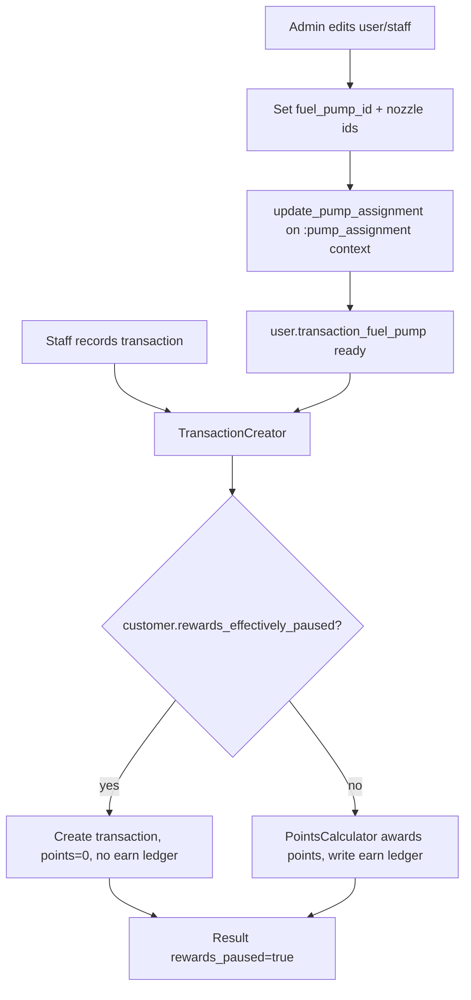

# Rewards completion & staff-login corrections (C4 global pause, A10 admin pump assignment, S-MYPUMP, S-PAUSE)

Four small, tightly-coupled changes that finish the rewards subsystem and correct the staff-login permission model. Today rewards can only be paused per-customer, pump/nozzle assignment is a staff self-service screen ("My Pump"), and staff can both open "My Pump" and pause/resume rewards — the last two contradict the requirement. This spec adds a **global pause** switch that composes with the per-customer flag, **moves pump/nozzle assignment to an admin action** on the user/staff form, then **hides "My Pump" from staff** and **removes "Pause Rewards" from staff**. These are coupled: the moment staff self-service assignment disappears, admin must own pump assignment or the staff transaction flow's pump resolution (`resolve_fuel_pump_and_nozzle!`) has no pump to read and every staff transaction fails. Effort: **low / small** across the board — no new tables, one boolean column, policy + params + route + nav edits, one Compose visibility gate.

> **Implementation status (2026-07-21):** ✅ **C4 shipped** — `reward_settings.rewards_paused` boolean; honored in `TransactionCreator` alongside the per-customer flag; global "Pause All Rewards" switch on the web reward-settings form and the Android reward-rates screen; exposed via `GET/PATCH /api/v1/admin/reward_rates`. Covered by model, service, and controller tests. ✅ **S-PAUSE shipped** — `CustomerPolicy#pause_rewards?`/`#resume_rewards?` gated admin-only; staff lose the web buttons (view gate) and are 403'd on the action, and the Pause/Resume control is hidden in the Android customer profile; admin retains it. ✅ **S-MYPUMP shipped** — `UserPolicy#manage_pump?` gated admin-only, so staff can't open/change "My Pump"; the nav link, the staff transaction "Change My Pump" control and the Android account tile are hidden from staff. ✅ **A10 shipped (web + API + Android)** — an admin "Assign Pump" flow + `GET/PATCH /api/v1/admin/staff_members/:id/pump` (reusing `User#update_pump_assignment` and the shared pump-picker partial on web; on Android a "Pump" action on the staff list reuses the My-Pump picker against the admin endpoint), covered by web + API tests and an Android compile. **All four Phase-0 corrections + the rename are done; only E2 (dashboard drill-through) remains.**

> **S-MYPUMP restored, with same-day pinning kept (2026-08-19):** commit `2142f53` had widened `UserPolicy#manage_pump?` to `admin? && record == user || staff? && record == user`, re-opening My Pump writes to staff — the exact inversion this spec exists to prevent. Write capability is admin-self-only again. The same-day pinning added alongside that regression is *kept*, because it is orthogonal to who may write:
>
> - `UserPolicy#manage_pump?` is `user&.admin? && record == user` — the write capability, and what the web screen and nav link are gated on, so staff no longer see or reach My Pump on the web.
> - New `UserPolicy#read_pump?` (owner: admin **or** staff) gates `GET /api/v1/my_pump` only. The split is deliberate: the native `TransactionViewModel` and `VisitEntryViewModel` both fetch that endpoint on init to learn which nozzles to offer, so a blanket 403 on read would stop staff recording anything on Android. Reading your own assignment is not the capability S-MYPUMP forbids; writing it is.
> - The assignment is **always for today**. The web date field is gone and a non-today date is **refused**, not silently accepted: the web redirects back with `MyPumpsController::TODAY_ONLY_MESSAGE`, and the API returns `422 daily_assignment_only` on write. A read serves today regardless, because the payload echoes `assignment_date` so a client holding a stale date can correct itself.
> - Rationale for pinning: transactions and visit entries snapshot their pump at capture time, so a back-dated override cannot move anything already recorded — it only looks as though it did. Forward-dating is roster planning, which belongs to the admin's Assign Pump screen (A10), which still plans ahead but refuses past dates (`422 past_assignment_date`).

## Requirements covered

- **C4** — Global "pause rewards" switch on reward settings, honored across the points pipeline in addition to the existing per-customer pause.
- **A10** — Assign operator to a pump (and its nozzles) as an **admin** action on the user/staff record, replacing staff self-service.
- **S-MYPUMP** — "My Pump" is **not** available in staff login (currently it is — inverted requirement).
- **S-PAUSE** — "Pause rewards" is **not** available in staff login (currently it is — inverted requirement).

## Current state

### C4 — no global pause exists
- `reward_settings` has no global-pause column: `cash_value_per_point`, `minimum_redeemable_points`, `nozzle_feature_enabled`, `rupees_per_reward_unit` only — `db/schema.rb:175-182`.
- Pause is per-customer only via `customers.rewards_paused` (`db/schema.rb:88`).
- Earn path checks only the customer flag: `TransactionCreator#call` — `app/services/transaction_creator.rb:35` (`if customer.rewards_paused?` → `points = 0`, no ledger row).
- `PointsCalculator` (`app/services/points_calculator.rb`) never consults pause state.
- Redeem path checks only the customer flag: `PointsRedeemer` — `app/services/points_redeemer.rb:34-35`; `Customer#max_redeemable_points` returns 0 only when `rewards_paused?` — `app/models/customer.rb:47-48`; `Customer#rewards_enabled?` = `active? && !rewards_paused?` — `app/models/customer.rb:32-34`.
- **Missing:** any global switch and any place it is read.

### A10 — assignment is staff self-service, not admin
- Web self-service controller `MyPumpsController#show/#update` calls `current_user.update_pump_assignment(...)` — `app/controllers/my_pumps_controller.rb:8-20`; API mirror `Api::V1::MyPumpController` — `app/controllers/api/v1/my_pump_controller.rb`.
- Both authorize `manage_pump?`, which is deliberately **self-only**: `record == user && (user.admin? || user.staff?)` — `app/policies/user_policy.rb:22-24`.
- The assignment model plumbing already exists on `User`: `belongs_to :assigned_fuel_pump` (FK `fuel_pump_id`) — `app/models/user.rb:13`; `has_many :assigned_fuel_pump_nozzles, through:` — `app/models/user.rb:15`; validations run on the `:pump_assignment` context — `app/models/user.rb:48-51`; atomic writer `update_pump_assignment` — `app/models/user.rb:201-211`; `transaction_fuel_pump` / `transaction_fuel_pump_nozzles` — `app/models/user.rb:173-186`.
- The staff transaction flow **depends on that assignment**: `resolve_fuel_pump_and_nozzle!` reads `user.transaction_fuel_pump` and `user.transaction_fuel_pump_nozzles` when the nozzle feature is on, and errors `"Set up My Pump ... before recording a transaction"` if unset — `app/services/transaction_creator.rb:135-170`.
- Admin forms do **not** touch pump assignment: `Admin::UsersController#user_params` permits `name, username, phone_number, email, active, password, password_confirmation` — `app/controllers/admin/users_controller.rb:56-58`; `Admin::StaffMembersController#staff_member_params` permits `name, active, employee_code, subtitle` — `app/controllers/admin/staff_members_controller.rb:57`. Neither passes `fuel_pump_id` / `assigned_fuel_pump_nozzle_ids`, so admins cannot assign pumps at all.
- **Missing:** an admin path to set a user's pump + nozzles.

### S-MYPUMP — My Pump is exposed to staff
- Web routes: `resource :my_pump` at both root (`config/routes.rb:13`) and API (`config/routes.rb:26`).
- Web nav link renders for everyone who reaches the layout — `app/views/layouts/application.html.erb:180`.
- Android account row "My Pump" is shown to all users (no role gate) — `AccountScreen.kt:123-131`, wired in `AppRoot.kt:302` (`onMyPump → Routes.MY_PUMP`). The transaction screen also deep-links to it via `onSetupPump → Routes.MY_PUMP` — `AppRoot.kt` transaction block.
- **Wrong per S-MYPUMP:** staff can open and edit My Pump.

### S-PAUSE — Pause Rewards is exposed to staff
- `CustomerPolicy#pause_rewards?` / `#resume_rewards?` both return `staff_access?` (admin **or** staff) — `app/policies/customer_policy.rb:38-44`.
- Staff routes expose the actions: `patch :pause_rewards` / `:resume_rewards` under `namespace :staff` (`config/routes.rb:39-40` API, `config/routes.rb:102-103`… actually the staff web member routes) and the API staff customers member routes (`config/routes.rb:39-40`).
- Android `CustomerProfileScreen` renders a "Pause Rewards / Resume Rewards" button unconditionally — `CustomerProfileScreen.kt:288-296`, `togglePaused()` in `CustomerProfileViewModel.kt:135-140`.
- **Wrong per S-PAUSE:** staff can pause/resume rewards.

## Target design

### Data model

| Table | Column | Type | Default | Rationale |
|---|---|---|---|---|
| `reward_settings` | `rewards_paused` | boolean, `null: false` | `false` | Single global kill-switch. `RewardSetting` is already a singleton (`RewardSetting.current` → `first_or_initialize`), so one row holds outlet-wide state. Boolean mirrors the existing `nozzle_feature_enabled` pattern. |

No other schema changes. Per-customer `customers.rewards_paused` stays; pump assignment already has all columns/joins (`users.fuel_pump_id`, `user_pump_nozzle_assignments`).

Migration:
```ruby
add_column :reward_settings, :rewards_paused, :boolean, null: false, default: false
```

### Business rules — pause precedence

Rewards are suspended for a customer when **either** switch is on. Global wins outrightly; per-customer is an additional narrowing.

| Global `reward_settings.rewards_paused` | Per-customer `customers.rewards_paused` | Earn | Redeem |
|---|---|---|---|
| false | false | ✅ accrue | ✅ allowed |
| false | true | ⛔ 0 pts, no ledger | ⛔ blocked (per-customer msg) |
| true | false | ⛔ 0 pts, no ledger | ⛔ blocked (global msg) |
| true | true | ⛔ 0 pts, no ledger | ⛔ blocked (global msg takes precedence) |

Effective predicate, added to `RewardSetting`:
```ruby
def rewards_globally_paused? = self[:rewards_paused] == true
```
And a composite helper on `Customer`:
```ruby
def rewards_effectively_paused?
  rewards_paused? || RewardSetting.current.rewards_globally_paused?
end
```
Replace the pause reads in the pipeline with the composite:
- `TransactionCreator#call` (`:35`) → branch on `customer.rewards_effectively_paused?`. When paused: create the transaction (source-of-truth capture is unaffected), set `points = 0`, skip the `points_ledgers` earn row, and surface `rewards_paused: true` in the `Result` (already a field).
- `Customer#max_redeemable_points` (`:47`), `#rewards_enabled?` (`:32`) → use `rewards_effectively_paused?`.
- `PointsRedeemer#call` (`:34`) → when globally paused, raise `invalid_redemption!` with message `"cannot be redeemed while rewards are globally paused"`; keep the existing per-customer message when only the customer flag is set (check global first).

Global pause is **display-and-earn/redeem only** — it never mutates `customers.rewards_paused`, so unpausing globally restores each customer's own state.

### Admin pump assignment (A10)

Reuse the existing `:pump_assignment` validation context and `update_pump_assignment` writer — do **not** re-implement. Admin edit/create submits `user[fuel_pump_id]` and `user[assigned_fuel_pump_nozzle_ids][]`; the controller runs the atomic writer so a rejected assignment rolls back the join rows (`app/models/user.rb:201-211`).

Controller changes:
- `Admin::UsersController` and `Admin::StaffMembersController`: permit `:fuel_pump_id` and `assigned_fuel_pump_nozzle_ids: []`. After the main `save`, call `user.update_pump_assignment(pump_params)` (or fold pump params into a single transaction) so the `:pump_assignment`-context validations fire and errors render on the same form. On `create`, assign after the user persists (nozzle join rows need an id).
- Clearing the pump: blank `fuel_pump_id` ⇒ `clear_assigned_nozzles_without_pump` already nils the nozzles (`app/models/user.rb:273`) — assignment becomes empty, staff transaction flow will then error until re-assigned (intended; admin owns it).

### Policy changes

| Policy method | Before | After |
|---|---|---|
| `UserPolicy#manage_pump?` | self + (admin or staff) | `user&.admin?` only (admin assigns any user's pump) |
| `CustomerPolicy#pause_rewards?` | `staff_access?` | `user&.admin?` |
| `CustomerPolicy#resume_rewards?` | `staff_access?` | `user&.admin?` |

`RewardSettingPolicy#update?` already admin-gated — the global-pause toggle rides the existing `feature_settings` admin path.

### Workflows



Global pause toggle: Admin → Pump settings (existing `feature_settings` form) → flip "Pause all rewards" → `Admin::FuelPumpsController#feature_settings` updates `reward_settings.rewards_paused` → next transaction/redeem reads it.

## API changes

All under `api/v1`. Token auth unchanged.

### Removed / restricted
- `GET/PATCH /api/v1/my_pump` (`Api::V1::MyPumpController`) — **remove the route** (`config/routes.rb:26`) so staff cannot self-assign; the Android account entry point disappears with it. (Alternative if keeping the endpoint for admins is desired: leave the route but change `manage_pump?` to admin-only — spec assumes removal since only staff used it.)

### Changed — admin user assignment
`POST /api/v1/admin/users` and `PATCH /api/v1/admin/users/:id` accept two new fields:

Request (additional keys):
```json
{ "user": { "fuel_pump_id": 3, "assigned_fuel_pump_nozzle_ids": [5, 6] } }
```
Response `200/201` (add to the existing user payload):
```json
{ "user": { "id": 12, "fuel_pump_id": 3, "assigned_fuel_pump_nozzle_ids": [5,6],
            "pump_ready": true } }
422 { "code": "validation_failed",
      "message": "Assigned fuel pump nozzles must include at least one nozzle",
      "details": { "assigned_fuel_pump_nozzle_ids": ["..."] } }
```
The admin users index/show serializer must include `fuel_pump_id`, `assigned_fuel_pump_nozzle_ids`, and the assignable pumps/nozzles catalog (reuse `MyPumpSerializer`'s shape for the picker, or embed under `assignable_pumps`).

### Changed — global pause in reward/feature settings
- `GET /api/v1/admin/reward_rates` (or the pump feature-settings read) response gains `rewards_paused: <bool>`.
- `PATCH /api/v1/admin/fuel_pumps/feature_settings` accepts `reward_setting[rewards_paused]`.
- Staff-facing lookup serializers (`CustomerLookupSerializer`, `CustomerProfileSerializer`, `LoyaltySerializer`) should expose an effective flag, e.g. `rewards_effectively_paused: <bool>`, so the app can show "Rewards paused" without staff being able to change it.

### Changed — staff customer pause endpoints
- `PATCH /api/v1/staff/customers/:id/pause_rewards` and `/resume_rewards` now authorize admin-only ⇒ return `403` for staff tokens. Keep the routes (admins call them), but the app must not offer the control to staff.

## UI

### Rails PWA

- **Global pause (C4):** in the admin pump/feature-settings form rendered by `Admin::FuelPumpsController#index` (the `feature_settings` toggle group that today holds `nozzle_feature_enabled`), add a switch **"Pause all rewards"** bound to `reward_setting[rewards_paused]`, with helper text "No customer earns or redeems while this is on. Per-customer pauses are unaffected." Show a persistent banner across staff + admin screens when on (reuse the existing rewards-status chip styling).
- **Admin pump assignment (A10):** in `app/views/admin/users/_form.html.erb` (and the staff-member edit form) add a **"Pump assignment"** section after Role (`_form.html.erb:36`): a pump `select` (`fuel_pump_id`, active pumps) and a checkbox group for that pump's active nozzles (`assigned_fuel_pump_nozzle_ids[]`), mirroring the controls already in `app/views/my_pumps/show.html.erb`. Reuse that partial's markup. Include a "None" option to clear.
- **S-MYPUMP:** remove the "My Pump" nav link (`app/views/layouts/application.html.erb:180`) and the `resource :my_pump` root route (`config/routes.rb:13`); delete/retire `MyPumpsController` + `app/views/my_pumps/`. In `staff/transactions/_pump_selection_fields.html.erb`, the "change" link points at `my_pump_path` (`:37`) — replace with read-only text ("Assigned by your manager") since staff can no longer edit; nozzle selection **within** a transaction stays (that's per-transaction, not assignment).
- **S-PAUSE:** the pause/resume control lives on the admin/staff customer views; ensure staff-facing customer pages (`staff/customers`, and the shared `customers/show`) do not render pause/resume buttons for staff. With `CustomerPolicy#pause_rewards?` now admin-only, gate the button on `policy(customer).pause_rewards?`.

### Android (Compose)

- **S-MYPUMP:** gate the "My Pump" row in `AccountScreen.kt` behind `isAdmin` (the flag already exists). **As shipped:** staff still get a *read-only* row that names the pump their manager assigned, falling back to "No pump assigned — ask your manager" when there is none. The transaction screen's `onSetupPump → Routes.MY_PUMP` affordance is still wired for staff (that file is a shared surface), so `MyPumpScreen` takes a `canEdit` flag and renders a read-only summary — pump + assigned nozzles, no picker, no save button — for non-admins rather than a form the server would 403. `MyPumpScreen` also hides the assignment-date field entirely; only the A10 admin route (`staffMemberId != null`) can pick a date.
- **A10:** in the admin users editor (`AdminUsersScreen.kt` + `UsersViewModel/UsersDtos/UsersApi`) add a pump dropdown + nozzle multi-select, posting `fuel_pump_id` and `assigned_fuel_pump_nozzle_ids`. Reuse the pump/nozzle picker composables from `mypump/MyPumpScreen.kt`. Do the same on the staff editor if it exposes a form (`admin/staff`).
- **S-PAUSE:** in `CustomerProfileScreen.kt`, gate the pause/resume button (`:288-296`) behind admin role; for staff render only the read-only `InfoChip("Rewards Paused")` status (`:268`). `CustomerProfileViewModel.togglePaused()` should never be invoked from a staff session; if the API returns 403, surface a benign error.
- **Global pause (C4):** in `admin/rewardrates` (`RewardRatesScreen.kt`) or the pump feature-settings screen, add a "Pause all rewards" switch bound to the new field. On staff transaction/customer screens, when `rewards_effectively_paused` is true, show the existing "Rewards Paused" chip so operators understand why 0 points accrued.

## Validation & edge cases

- **Precedence:** global-paused message must take priority over per-customer message in `PointsRedeemer` (check global first). Earn path treats both identically (0 points, no ledger).
- **Transaction still recorded when paused:** capture is source-of-truth; pausing must not block recording the transaction — only the earn ledger row is skipped. `Result.rewards_paused` reflects the effective state.
- **Unpausing global** restores per-customer state exactly (no data was mutated).
- **Admin assignment atomicity:** invalid nozzle set (empty, wrong pump, inactive) must roll back join rows via `update_pump_assignment`; the four `:pump_assignment` validations (`app/models/user.rb:289-316`) already cover active-pump, ≥1 nozzle, nozzle-belongs-to-pump, nozzle-active.
- **Clearing a pump** while `nozzle_feature_enabled?` leaves staff unable to transact — surface the existing `"Set up My Pump…"`-style error, reworded to `"No pump assigned — contact your manager"`, so it doesn't reference a screen staff can't open.
- **Assigning a nozzle whose fuel type mismatches the vehicle** is still caught per-transaction in `resolve_fuel_pump_and_nozzle!` (`app/services/transaction_creator.rb:157`) — unchanged.
- **Staff hitting removed/restricted endpoints** (`my_pump`, `pause_rewards`) must get 403/404, not a 500; the app must not show controls that only 403.
- **Reassigning the same pump/nozzles** is idempotent.
- **`RewardSetting.current` before DB exists** already rescues (`reward_setting.rb:37`) — default new column to `false` there too.

## Dependencies & sequencing

- **Must exist first:** A1 pumps, A2 nozzles, A3 assign-nozzle-to-pump (all PRESENT) — the pump/nozzle catalog the admin picker reads. `RewardSetting` singleton and its `feature_settings` admin path (PRESENT).
- **Internal ordering (coupling):** ship A10 (admin assignment) **before or with** S-MYPUMP. Hiding My Pump without giving admins the assignment path breaks `resolve_fuel_pump_and_nozzle!` for every staff transaction. C4 and S-PAUSE are independent of the pump work and can land in parallel.
- **Unblocks:** D1/D9 daily-settlement pump ownership (admin-assigned pump identity), E-series per-operator dashboards, and any future audit that "who owns which pump" is an admin fact rather than staff self-declared.

## Acceptance criteria

- [ ] `reward_settings.rewards_paused` column exists (boolean, not-null, default false) and `RewardSetting.current.rewards_globally_paused?` returns it.
- [ ] Admin can toggle "Pause all rewards" on the pump/feature-settings form (PWA) and the reward-rates/settings screen (Android); the value persists.
- [ ] With global pause **on**, recording a staff transaction creates the transaction, awards **0** points, and writes **no** earn `points_ledger` row.
- [ ] With global pause **on**, `PointsRedeemer` rejects redemption with a global-pause message; with only per-customer pause on, it rejects with the per-customer message.
- [ ] Unsetting global pause restores each customer's own earn/redeem eligibility exactly as before (no per-customer data changed).
- [ ] Admin can set a user's `fuel_pump_id` + `assigned_fuel_pump_nozzle_ids` from the users form (PWA) and admin users screen (Android); invalid sets are rejected atomically with field errors and no orphaned join rows.
- [ ] After admin assigns a pump, that staff member's `transaction_fuel_pump`/`transaction_fuel_pump_nozzles` resolve and a staff transaction succeeds without visiting any self-service screen.
- [x] `UserPolicy#manage_pump?` returns false for staff; the web `my_pump` route and `PATCH /api/v1/my_pump` are 403 for staff. `GET /api/v1/my_pump` deliberately stays readable by the owner (`read_pump?`) — the native transaction/visit-entry screens depend on it.
- [x] "My Pump" no longer appears in the web nav for staff (the link lives in the **Admin** nav section); the Android account row is read-only for staff and the transaction form shows "Assigned by your manager" instead of the edit link.
- [x] The assignment always lands on **today** — no date picker on web or Android, and a supplied `assignment_date` is ignored rather than rejected on both `GET` and `PATCH`.
- [ ] `CustomerPolicy#pause_rewards?`/`resume_rewards?` return false for staff; staff PWA customer pages and Android `CustomerProfileScreen` show rewards-paused status read-only with no pause/resume control; staff API calls to those endpoints return 403.
- [ ] Staff still select a nozzle **within** a transaction; only pump/nozzle **assignment** and rewards **pause** are removed from staff.
