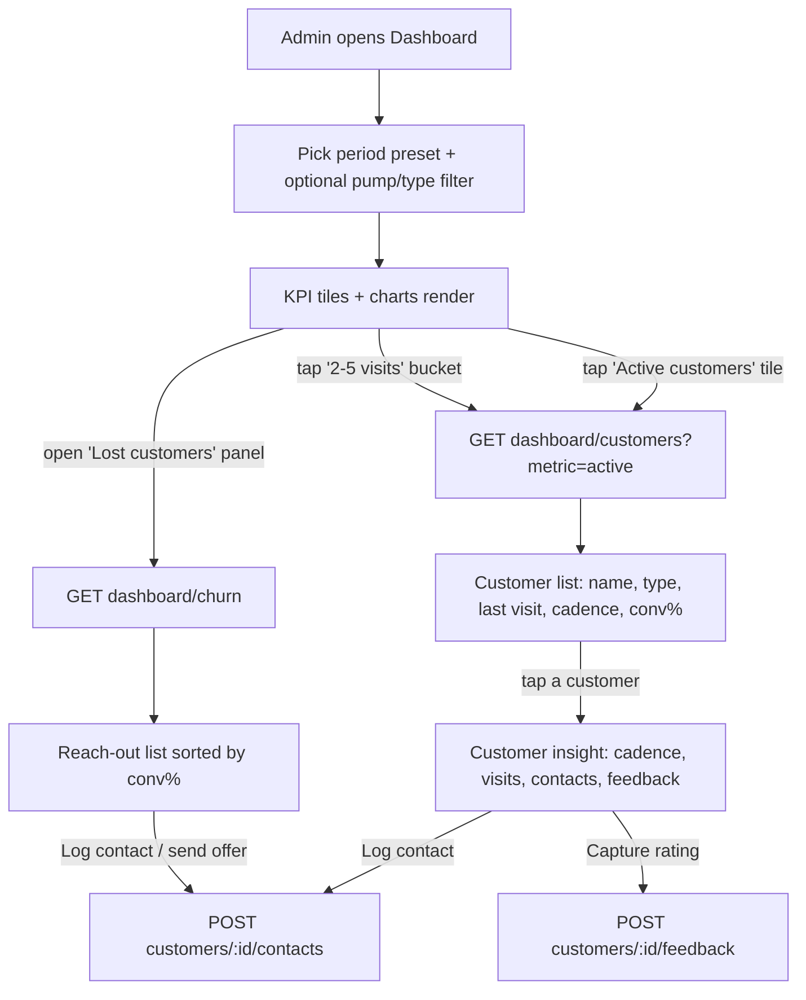
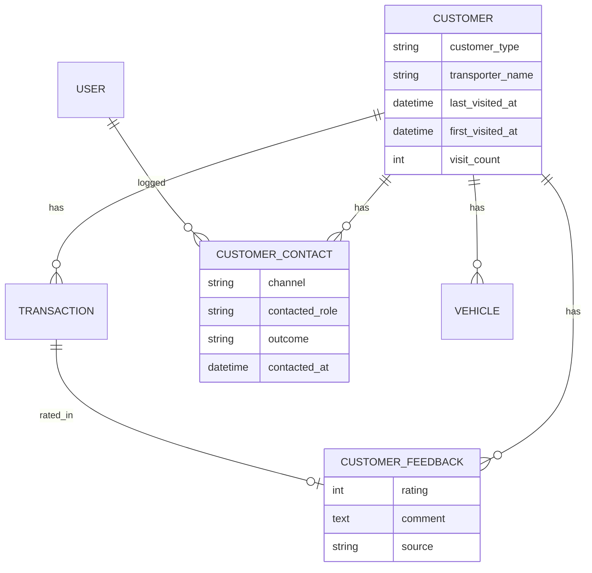

# Dashboard CRM Intelligence & Reporting

Turn the dashboard from a purely *descriptive* analytics surface (aggregate KPIs, trend charts, top-N leaderboards) into an *actionable CRM* over individual customers. This spec adds: clickable period tiles that drill through to a customer **list** (E2); a per-customer last-visit + visit-cadence profile (E3); a customer-type (OTP-Fleet / Drive-in / Credit / TT) segmentation view (E4); contact-tracking with a conversion-probability score (E5); "came last week, not this week" churn detection with a reach-out surface (E6); customer feedback/rating capture (E7); a real reporting subsystem (daily/weekly/monthly/**yearly** per vehicle / transporter / driver, with litres, discount and gifts, **exportable**) (E1); and a per-pump filter plus editable past-day transactions (G1). Every feature ships on the Rails PWA, the native Android app, and the JSON API that backs Android (Locked Decision Q2). All money figures are **derived** from litres × catalog selling price; litres/readings are the source of truth (Locked Decision Q1).

> **Implementation status (2026-07-21):** ✅ **E2 shipped** — a "View customers" drill-through on the dashboard (web toolbar link kept in sync via `renderCustomersLink` on AJAX filter change; Android "View customers for this period" button on the quick-range row) opens a customer list scoped to the active period. Backed by a `Customer.transacted_between(range)` scope + a shared `OverviewReport.period_range(preset:, start_date:, end_date:)` resolver applied on both the admin web customers index and the `GET /api/v1/staff/customers` endpoint (the list Android uses). Covered by model + web + API tests. ✅ **E1 Reports shipped (Phase 2, 2026-07-22) on all three surfaces:** `Admin::Reports::LedgerReport` aggregates the B2 `visit_entries` (litres/discount/driver/transporter/vehicle) by dimension (vehicle/transporter/driver/customer) and grain (day/week/month/year), derives ₹ from litres × catalog selling price (Q1; blank when no price, never ₹0), and attributes rewards per customer; `GET /api/v1/admin/reports` returns JSON or a streamed UTF-8-BOM CSV; web `Admin::ReportsController` + a filterable table with a totals row and a real Download-CSV export; Android `ui/admin/reports` chip-filtered card table. Tested. **Reward columns split (client feedback, 2026-08):** the ₹ column (`gifts`) is now labelled **"Reward ₹"** and a separate **`gift_count`** column counts physical campaign gifts (F1 `reward_kind: gift`) on the customer dimension; a `customer_id` filter pulls a single customer's report on all three surfaces; and an unconfigured cash-value-per-point now renders **`—`** instead of a misleading `₹0.00` (`reward_value_configured` in the payload). **Gift attribution fixed (2026-08):** `gift_count` is billed on `period_start` for calendar campaigns but on `period_end` for `rolling_days` ones — whose `period_start` is the campaign anchor rather than a window start, so rolling gifts (the form's default period) were being billed outside the report range and silently dropped — and a granted gift with no visit-entry capture behind it (the drive-in customer `Campaigns::Evaluator` qualified off `transactions`) now materialises its own zero-visit row instead of being counted nowhere. **Free-text lookups added (client feedback, 2026-08-25):** the reports page only ever offered pick-from-a-list filters, so an operator could not ask "what did NL Roadways / driver Rao / mobile 98765 43210 / KA01AA0001 do" at all. `transporter`, `driver_name`, `driver_phone` and `vehicle_number` are now typed lookups on all three surfaces — case-insensitive substring, AND-combined, normalized through the same normalizer that wrote the column (so a spaced plate or a `+91` mobile still matches) and echoed back normalized in a new `filters` block; Android gained the date range it never had, behind a filter bottom sheet. The same pass closed Android's lockstep gap on the 2026-08 reward split: its DTOs now carry `gift_count` and `reward_value_configured`, so it renders **Reward ₹** and **Gifts** as the two distinct units web has had since August instead of one mislabelled "Gifts ₹" stat that asserted `₹0` whenever no cash-per-point rate was set.
>
> **Phase 4 status (2026-07-22):** ✅ **E3 / E5 / E6 / E7 shipped on all three surfaces, tested** (branch `acefuels-phase4-crm`; 612 Rails runs green, brakeman clean, Android `assembleDebug` SUCCESSFUL). Reconciled against what Phases 1–3 actually shipped (this spec predates them), with these deviations from the original target design above:
> - **Visit source is a UNION of `transactions` + `visit_entries`** (`Customer.visited_between`), not transactions alone — a fleet/OTP/credit customer may have visit_entries but no loyalty transaction, and a drive-in customer the reverse; using one source alone would silently drop a whole segment from cadence/churn.
> - **No denormalized `last_visited_at`/`first_visited_at`/`visit_count` columns** — single-station scale makes compute-on-read (indexed, set-based) correct and avoids a dual-write hazard across `TransactionCreator`/`VisitEntryRecorder`/edits/reconcile.
> - **E5's outreach log is a NEW `contact_logs` table**, not `customer_contacts` — the latter was already created by B1 as a *people* roster (driver/supervisor/owner). `contact_logs` records outreach *events* (channel/outcome/who/when); a reached/converted/callback outcome flips the linked B1 contact's `contacted` marker, tying E5 back to "derives from B1."
> - **`customer_type` is 3 values** (`drive_in`/`otp`/`credit`) — no `tt` (TT is a settlement credit line, not an account type, per B1).
> - **E4 segments panel + G1 transaction-edit are out of Phase 4 scope** (E4 taxonomy shipped in Phase 1; the settlement-side of G1 shipped with D9 in Phase 2; the per-pump transaction filter + past-day transaction edit remain a follow-up).
>
> **Shipped:** `contact_logs` + `customer_feedbacks` tables; `Admin::Crm::{Cadence,ConversionScore,CustomerInsight,ChurnReport,ContactLogRecorder}`; API `GET customers/:id/insight`, `GET/POST customers/:id/contact_logs`, `GET/POST customers/:id/feedbacks` (admin + staff), `GET dashboard/churn`; web CRM Insight/Outreach/Feedback cards + a Reach-out page; Android `ui/admin/crm` + profile CRM sections + a Reach-out screen. 73 new tests.

## Requirements covered

| ID | One-line |
|----|----------|
| E1 | Reports daily/weekly/monthly/yearly per vehicle/transporter/driver with litres, discount, gifts; exportable (CSV). |
| E2 | Dashboard period tiles are clickable and drill through to a filtered customer list. |
| E3 | Per-customer last-visit timestamp + daily/weekly/biweekly visit cadence. |
| E4 | Customer-type view: OTP(Fleet) / Drive-in / Credit / TT segmentation and counts. |
| E5 | Contact tracking (who/when/how/outcome) + conversion-probability score. |
| E6 | Intelligent lost-customer detection ("visited previous period, not current") with a reach-out list. |
| E7 | Customer feedback / rating capture and rollup. |
| G1 | Per-pump filter on the transaction stream + edit current/past-day transactions (ties to daily-settlement audit). |
| Admin-12 | Visualize data per pump anytime + edit current/past days. |
| Admin-14 | Reports per vehicle/transporter/driver at daily/weekly/monthly/yearly grain. |
| Admin-17 | Dashboard: customer counts by period, per-customer cadence, customer-type, contacted count + last-contact + conversion probability, lost-customer feedback, feedback/rating. |

## Current state

### What exists (descriptive analytics only)

- **Overview report service** `app/services/admin/dashboard/overview_report.rb` produces the entire dashboard payload: filters, 8 summary KPI cards (`summary_cards`, L293-325), trend/insight charts (`chart_payload`, L362-376), and a rewards rollup. Period presets are defined in `QUICK_RANGES` (L5-10: today / this_week / this_month / last_month) and resolved in `dates_for_preset` (L108-124).
- **Repeat-vs-new mix** (`repeat_vs_new_payload`, L421-435) and **visits distribution** (`visits_distribution_payload`, L437-448) are computed as *aggregate bucket counts only* — `.group(:customer_id).count.values` throws away the customer identities, so there is no way to drill from a bucket to the people in it.
- **Top-customer leaderboards** (`top_customers_for`, L484-506) return the top 5 by visits/revenue with `customer_id`, but these are chart rows, not a navigable list, and are capped at 5.
- **Web dashboard** `app/views/admin/dashboard/show.html.erb`: KPI cards (L142-147), chart panels, and a client-side "Download PDF" button (L31-34) wired to `admin_dashboard.js` — this is a **screenshot of the current charts**, not a data export. Nothing on this page is clickable-through to a record.
- **Dashboard JSON**: web `Admin::DashboardController#data` (`app/controllers/admin/dashboard_controller.rb` L10-14) and API `Api::V1::Admin::DashboardController#data` both render `OverviewReport#as_json` verbatim with identical filters (preset, start_date, end_date, segment, fuel_type).
- **Android** consumes only a subset: `DashboardDtos.kt` decodes just four `{labels, values}` bar series (`DashboardChartsDto`, L72-78) and the KPI cards; trend lines and leaderboards are dropped on decode (comment at L67-71).
- **Transactions stream**: `Admin::TransactionsController#index` (`app/controllers/admin/transactions_controller.rb`) and its API twin (`app/controllers/api/v1/admin/transactions_controller.rb`) are **view-only**, paginated 10/page, with `range=all|today`, `start_date`/`end_date`, and `sort`. The web view `app/views/admin/transactions/index.html.erb` renders a read-only detail modal (L119-191) — no edit control, no pump filter.

### What is missing

- **No customer-type column** anywhere — `grep` for `customer_type` across `app/` returns nothing; `customers` table has only `name, phone_number, vehicle_number, active, rewards_paused` (schema). E4 has no data to segment on.
- **No last-visit / cadence** — no `last_visited_at`, no inter-visit computation (`grep last_visit|cadence` → nothing). E3 absent.
- **No contact log, no conversion score** — no `customer_contacts` table, no scoring service. E5 absent.
- **No churn/lost detection** — no period-over-period customer-set diff. E6 absent.
- **No feedback/rating** — no `customer_feedbacks` table (`grep feedback|rating` hits only CSS/ERB copy). E7 absent.
- **No reporting subsystem** — no per-dimension (vehicle/transporter/driver) report, no yearly grain, no CSV/data export. "Download PDF" is a chart screenshot. Litres and discount don't exist on `transactions` yet (only `fuel_amount`), and "transporter"/"gifts" have no source columns. E1 absent.
- **No per-pump dashboard filter** — `OverviewReport#initialize` accepts fuel_type/segment/dates only, never a pump. G1's "visualize per pump" absent.
- **No transaction edit** — routes expose transactions as index-only (`config/routes.rb` L147, and API L54); no update action, no correction of past days.

## Target design

### Data model changes

#### 1. Customer taxonomy & lifecycle (E4, E3, E6)

`customers` table — new columns:

| Column | Type | Rationale |
|--------|------|-----------|
| `customer_type` | `string` (enum, default `"drivein"`) | E4 segmentation: `drivein`, `otp_fleet`, `credit`, `tt`. Assumed taxonomy flagged **to confirm**: OTP = fleet/credit billed by litres, TT = tank-truck credit, Drive-in = walk-in cash, Credit = credit account. |
| `transporter_name` | `string`, null | E1 "per transporter" reporting dimension; distinct from the per-vehicle commercial contact. Backfilled from `vehicles.commercial_company_name` where present. |
| `last_visited_at` | `datetime`, null, indexed | E3/E6 cache of most-recent transaction time. Maintained by `TransactionCreator` and a nightly reconcile; avoids a correlated `MAX(created_at)` per row on churn/list queries. |
| `first_visited_at` | `datetime`, null | E3 "customer since"; also removes the correlated-subquery in `new_customer_ids_for` (currently L182-187). |
| `visit_count` | `integer`, default 0 | Denormalized visit tally for cadence/conversion scoring without a per-request aggregate. |

Add index `index_customers_on_customer_type`. Enum lives on the model:

```ruby
enum :customer_type, { drivein: "drivein", otp_fleet: "otp_fleet", credit: "credit", tt: "tt" }, prefix: true
```

#### 2. Contact tracking (E5)

New table `customer_contacts`:

| Column | Type | Notes |
|--------|------|-------|
| `id` | bigint PK | |
| `customer_id` | bigint FK → customers, null:false, indexed | |
| `user_id` | bigint FK → users, null:false | Staff/admin who made contact. |
| `channel` | string enum | `call`, `whatsapp`, `sms`, `in_person`. |
| `contacted_role` | string enum, null | Who was reached: `driver`, `supervisor`, `owner` (mirrors Admin-10 contacted-by). |
| `outcome` | string enum | `reached`, `no_answer`, `converted`, `declined`, `callback_requested`. |
| `notes` | text, null | Free text. |
| `contacted_at` | datetime, null:false, indexed | |
| `created_at/updated_at` | | |

`customers has_many :customer_contacts`. Derived, not stored: `contacted_count`, `last_contacted_at`, `conversion_probability` (see business rules).

#### 3. Feedback / rating (E7)

New table `customer_feedbacks`:

| Column | Type | Notes |
|--------|------|-------|
| `customer_id` | bigint FK, null:false, indexed | |
| `transaction_id` | bigint FK → transactions, null | Optional link to the visit rated. |
| `rating` | integer, null:false | 1–5, validated inclusion 1..5. |
| `comment` | text, null | |
| `source` | string enum, default `staff` | `staff` (FSM captured), `admin`, `sms_reply` (future F4). |
| `recorded_by_user_id` | bigint FK → users, null | Null when self-reported. |
| `created_at/updated_at` | | |

#### 4. Reporting source data (E1) — depends on B2/D1

E1 needs **litres, discount, gifts, per-driver, per-transporter**. Those columns do **not** exist on `transactions` today (only `fuel_amount`). This spec **consumes** fields delivered by the B2 (CustomerDetailsEntry) and D-series (settlement) specs rather than redefining them:

- `transactions.litres` (decimal 10,3), `transactions.discount_amount` (decimal 10,2), `transactions.reading_*` — owned by D1/B2.
- `transactions.driver_name`, `transactions.driver_phone`, `transactions.fleet_otp` (bool) — owned by B2.
- `transporter_name` resolved via `customers.transporter_name`.
- "Gifts" = reward redemptions valued in ₹, read from `points_ledgers` (`cash_reward_amount`).

If E1 ships before B2/D1, the report degrades gracefully: litres/discount columns render `—` and only ₹ `fuel_amount` + gift-value are populated. **This dependency must be called out at build time.**

No new table is required for reports; a `Admin::Reports::LedgerReport` service aggregates on demand and streams CSV. An optional `report_exports` table (async, emailed CSV) is out of scope for v1 — v1 is synchronous CSV download.

#### 5. Churn / lost-customer (E6) & cadence (E3) — derived

No table. A `Admin::Crm::CustomerInsight` service computes per customer:

- **cadence_class** from the median gap between consecutive visits over the trailing 90 days: `daily` (≤2 days), `weekly` (3–10), `biweekly` (11–21), `monthly` (22–45), `occasional` (>45 or <3 visits).
- **expected_next_visit_at** = `last_visited_at` + median_gap.
- **lost** = `expected_next_visit_at < today` AND visited in the *previous* comparable period but **not** the current one (the "came last week, not this week" rule, generalized to the selected period length).
- **conversion_probability** (E5): heuristic 0–100 = weighted blend of recency (days since last visit vs cadence), frequency (visit_count percentile), contact outcomes (a `converted`/`reached` outcome lifts it, `declined` drops it). Documented as a transparent rule, not ML.

### Business rules

1. **Drill-through** (E2): every period tile and distribution/repeat-vs-new bucket carries a `drill` descriptor (`{ metric, bucket }`) that the client turns into a customer-list query. The list endpoint recomputes the *same* filtered set the tile counted — single source of truth in `OverviewReport`.
2. **Cadence** requires ≥3 visits; below that, `cadence_class = "new"`.
3. **Lost** is period-relative: for a 7-day current window the comparison window is the preceding 7 days; reuses `OverviewReport#previous_range` semantics (L130-135).
4. **Conversion probability** is recomputed on read, never stored; contact rows are immutable audit records.
5. **Report money** is derived: `amount = litres × catalog_selling_price` when litres exist, else stored `fuel_amount`. Never trust a standalone ₹ if litres+price are present (Q1).
6. **Transaction edit** (G1) writes an `audit` trail and **re-runs point accrual** (reverse old ledger entry, re-award) so rewards stay consistent; edits to settled days flag the settlement as `needs_review` (D9 hook).
7. **Customer thresholds ("show me customers who…").** The admin customer list filters on *at least* N visits, litres filled, times contacted, ₹ discount given, and reward points, and shows each of those numbers on the row it filtered on. The figures come from `Admin::Crm::CustomerMetrics` — the single definition described in `13-spec-customer-crm-capture.md` business rule 8 — so a customer's row and their profile always agree. Blank, non-numeric, negative and implausibly large values are ignored rather than erroring the page, and every filter chip and clear-link carries the active thresholds forward so none is silently dropped.
8. **E1 reports and the per-customer figures are deliberately different populations.** `LedgerReport` is the per-visit *capture* ledger: it reads `visit_entries` only, so a drive-in loyalty customer who only has transactions does not appear in it. `CustomerMetrics` unions both sources. Neither is wrong; the report answers "what did we capture at the pump", the customer page answers "what has this customer cost and earned". Both surfaces state which they are.

### Workflow: dashboard tile → customer list → contact/reach-out



### Entity changes



## API changes

All under `/api/v1/admin` (token auth, admin-authorized), mirrored by web HTML routes. Filters reuse the existing dashboard params (`preset, start_date, end_date, segment, fuel_type`) plus new `fuel_pump_id`.

### E2 — Drill-through customer list

`GET /api/v1/admin/dashboard/customers`

Request (query): `metric` (`total|active|new|repeat|churn`), or `bucket` (`visits_1|visits_2_5|visits_6plus`), plus standard filters + `page`.

```json
{
  "metric": "active",
  "page": 1, "per_page": 20, "total": 137, "has_more": true,
  "customers": [
    { "id": 42, "name": "Ravi Kumar", "phone_number": "98XXXXXX21",
      "customer_type": "otp_fleet", "customer_type_label": "OTP (Fleet)",
      "visit_count": 12, "last_visited_at": "2026-07-19T08:14:00+05:30",
      "cadence_class": "weekly", "cadence_label": "Weekly",
      "conversion_probability": 82, "total_spend_display": "₹18,400" }
  ]
}
```

### E3 — Per-customer insight

`GET /api/v1/admin/customers/:id/insight` — optional `preset` / `start_date` / `end_date` narrow the commercial `metrics` to a period and add `lifetime_metrics` beside them; without a period every figure is lifetime and `lifetime_metrics` is omitted.

```json
{ "customer_id": 42, "first_visited_at": "2026-01-04T...", "last_visited_at": "2026-07-19T...",
  "days_since_last_visit": 2, "visit_count": 12,
  "cadence_class": "weekly", "median_gap_days": 6, "expected_next_visit_at": "2026-07-25T...",
  "is_lost": false, "conversion_probability": 82,
  "metrics": { "visits": 12, "litres": 1840.5, "discount": 3200.0, "gifts": 450.0,
               "contacts": 3, "points": 1260 },
  "contacts": { "count": 3, "last_contacted_at": "2026-07-10T...", "last_outcome": "reached" },
  "feedback": { "count": 2, "avg_rating": 4.5, "latest_comment": "Quick service" } }
```

`metrics` answers "what has this customer filled, cost us in discount, and taken in gifts" — the ₹ value of their redemptions. All values are plain numbers (never decimal-as-string). See `13-spec-customer-crm-capture.md` business rule 8 for the counting rules; the admin customer **list** filters on these same figures.

### E4 — Customer-type segmentation

`GET /api/v1/admin/dashboard/segments` (respects period + filters)

```json
{ "segments": [
  { "type": "drivein", "label": "Drive-in", "customers": 210, "visits": 540, "revenue_display": "₹6,80,000" },
  { "type": "otp_fleet", "label": "OTP (Fleet)", "customers": 34, "visits": 610, "revenue_display": "₹14,20,000" },
  { "type": "credit", "label": "Credit", "customers": 12, "visits": 88, "revenue_display": "₹2,10,000" },
  { "type": "tt", "label": "TT", "customers": 5, "visits": 30, "revenue_display": "₹90,000" } ] }
```

### E5 — Contact tracking

- `POST /api/v1/admin/customers/:id/contacts` — body `{ channel, contacted_role, outcome, notes, contacted_at }` → `201` with the created contact.
- `GET /api/v1/admin/customers/:id/contacts` — paginated history.

### E6 — Churn / reach-out

`GET /api/v1/admin/dashboard/churn` (period filters) → same customer shape as E2 with added `days_overdue`, sorted by `conversion_probability desc`.

### E7 — Feedback

- `POST /api/v1/admin/customers/:id/feedback` — `{ rating (1..5), comment, transaction_id? }` → `201`. Also exposed under `/api/v1/staff/...` so an FSM can capture it at the pump.
- `GET /api/v1/admin/customers/:id/feedback` — history + `avg_rating`.

### E1 — Reports (exportable)

`GET /api/v1/admin/reports`

Request: `dimension` (`vehicle|transporter|driver|customer`), `grain` (`day|week|month|year`), `start_date`, `end_date` (or `preset`), `fuel_type`, `fuel_pump_id`, `customer_id` (narrows the report to one customer), `transporter`, `driver_name`, `driver_phone`, `vehicle_number` (free-text lookups, see below), `format` (`json|csv`).

```json
{ "dimension": "transporter", "grain": "month",
  "range": { "from": "2026-07-01", "to": "2026-07-31" },
  "filters": { "transporter": "NL Roadways", "driver_name": null,
               "driver_phone": null, "vehicle_number": "KA01AA0001",
               "fuel_type": null, "fuel_pump_id": null, "customer_id": null },
  "columns": ["key","label","period","litres","amount","discount","gifts","gift_count","visits"],
  "reward_value_configured": true,
  "rows": [
    { "key": "ABC Logistics", "label": "ABC Logistics", "period": "2026-07",
      "litres": 12400.5, "amount": 1226000.0, "discount": 18400.0,
      "gifts": 4200.0, "gift_count": 2, "visits": 96 } ],
  "totals": { "litres": 12400.5, "amount": 1226000.0, "discount": 18400.0,
              "gifts": 4200.0, "gift_count": 2, "visits": 96 } }
```

**The two reward columns are different units.** `gifts` is ₹ — the cash value of points redemptions — and is labelled **"Reward ₹"** on every surface; the key stays `gifts` so existing clients don't break. `gift_count` is a **count** of physical campaign gifts handed over (F1 `reward_kind: gift`, traced through `campaign_qualifications.reward_granted_at`, which is the only record a gift grant leaves — no ledger row, no ₹). A qualification is per-customer and carries no vehicle/driver/transporter, so `gift_count` is populated on the **customer** dimension only and reads `0` on the others.

**Which period a gift is billed to** depends on the campaign's `period`, because `campaign_qualifications.period_start` means two different things (see `Campaign#qualification_period`):

- **Calendar periods** (`weekly` / `monthly` / `fixed_window`) — the stored `[period_start, period_end]` *is* the aggregation window, so the gift is billed to **`period_start`**, the window it was earned in. Not to `reward_granted_at`: `Campaigns::Runner` sweeps after the window closes, so a July gift is typically stamped in August and keying on the stamp would report it under August, or drop it.
- **`rolling_days`** (the default the new-campaign form ships: 30 days) — `period_start` is **not** a window start. It is `Campaign#rolling_anchor_date` (`starts_at || created_at`), a fixed idempotency key so a window that slides daily grants once per campaign rather than once per sweep. The aggregation window is `Campaign#window_for` = `(reference - (period_days - 1))..reference`, so the gift is billed to **`period_end`** — that reference, i.e. the sweep date, always the last day of a window the qualifying purchases fell inside. Billing a rolling gift to `period_start` charged it to the campaign's start date, which typically sits outside the report range entirely (the gift vanished from the report) or in a period the customer never filled in (it was dropped).

Either way the billing date is derived from the qualification alone, never from the report range, so one grant is billed to exactly one period and two adjacent reports can never both claim it.

**Gifts with no capture behind them.** `Campaigns::Evaluator` qualifies customers off `transactions`, while every row of this report is built from `visit_entries` — so a drive-in customer who qualified purely through transactions has no row to hang the gift on, and the same is true whenever the billed period holds no capture for that customer. Those gifts are **not** dropped: the report materialises a customer/period row with zero litres, zero visits and a blank amount, carrying the gift ("no capture here, but a gift went out"). The one exception is a report narrowed by **`fuel_type`, `fuel_pump_id`, or any of the four free-text lookups** — a qualification carries none of those, so a gift cannot be said to belong to that slice and no row is invented inside it; gifts for customers who do have captures in the slice are still counted. `customer_id` is *not* an exception: a qualification does carry a customer, so it is filtered on directly.

**The ₹0 trap.** `RewardSetting#cash_value_for_points` returns `nil` until an operator sets a cash value per point, so on a pump that never configured one *every* redemption stored `cash_reward_amount = NULL` and "Reward ₹" sums to zero for structural reasons. The payload therefore carries `reward_value_configured`; when it is `false` and the value is zero, web, CSV and Android all render **`—`** (plus a web hint pointing at reward settings) so an unconfigured rate is visibly distinct from a genuine ₹0.

**Free-text lookups.** The four dimensions an operator actually asks about by name — `transporter`, `driver_name`, `driver_phone`, `vehicle_number` — are typed rather than picked (a fleet has too many of each for a select), and they filter `visit_entries` directly. Each is a **case-insensitive substring** match and they **AND** together: a row must match every lookup supplied, because the operator is narrowing one report ("Rao driving for NL Roadways"), not OR-searching the way the single-box customer search in `Admin::Crm::CustomerMetrics#search` does. Blank and whitespace-only values are dropped rather than matching nothing, and LIKE wildcards typed into a box (`50% Logistics`) are escaped and matched literally.

Each lookup is put through **the same normalizer that wrote the column**, or it could never match: `VisitEntry#normalize_fields` stores plates as `A-Z0-9` only and phone numbers as digits only, so `ka-01 aa 0001` searches `KA01AA0001` and `+91 98765-43210` searches `9876543210` — a leading `91`/`0` is stripped only when the query is exactly that much longer than the validated 10-digit column, so a partial search for numbers merely *containing* `91` is left alone. The response echoes the **normalized** values back in `filters`, so both surfaces can show what was actually queried rather than what was typed.

A lookup-narrowed report is treated like a `fuel_type`/`fuel_pump_id` slice for the gift rule below: a qualification carries no transporter, driver or vehicle, so no gift row is materialised inside one.

`format=csv` streams `text/csv` (`Content-Disposition: attachment`, UTF-8 BOM) with the same columns under human headers — `Key,Label,Period,Litres,Amount ₹,Discount ₹,Reward ₹,Gifts,Visits` — plus a `TOTAL` line; litres/discount render blank when the underlying B2/D1 columns are absent.

### G1 — Per-pump filter + edit

- Dashboard/report/transaction endpoints accept `fuel_pump_id`. `OverviewReport#initialize` gains a `fuel_pump_id:` param; `filtered_transactions_for` (L145-150) adds `.where(fuel_pump_id:)` when present; point-entry scope joins through `fuel_transaction`.
- `PATCH /api/v1/admin/transactions/:id` — body `{ fuel_amount?, litres?, discount_amount?, fuel_pump_id?, fuel_pump_nozzle_id?, vehicle_id?, created_at? }` → recomputes ₹ from litres×price when litres sent, re-runs accrual, records audit, returns updated `TransactionSerializer`. Editing a date inside a settled day sets `settlement.needs_review = true` (D9).
- Add `GET /api/v1/admin/transactions` filter `fuel_pump_id`.

## UI

### Rails PWA

- **Dashboard** (`app/views/admin/dashboard/show.html.erb`):
  - Make KPI cards (L142-147) and the visits-distribution / repeat-vs-new panels **clickable**: each renders as a `link_to admin_dashboard_customers_path(metric:/bucket:, …current filters)`. Add a `data-drill` attribute so `admin_dashboard.js` can open the list without a full reload.
  - New **Customer List drill page** `admin/dashboard/customers#index` — reuses the existing customer-row styling from `app/views/admin/customers/index.html.erb`; columns: name, type badge, last visit, cadence chip, conversion %, spend. Row links to the customer show page.
  - New **"Customer Types" panel** (E4) in the "Customer Insights" section — a 4-way segmented bar + counts, each segment a drill link.
  - New **"Lost customers / Reach out" panel** (E6) below Customer Insights: table sorted by conversion %, each row with a "Log contact" button (opens the contact modal) and a "Send offer" link (F-series hook).
  - Add a **pump filter chip row** (G1) next to the existing fuel-type chips (L69-83), populated from `FuelPump.active`.
- **Customer show** (`app/views/customers/show.html.erb`, admin renders it): add an **Insight card** (last visit, cadence, conversion %, first-seen, plus **litres filled / discount given / gifts given / times contacted**), a **Contacts timeline** with an "Add contact" modal (E5), and a **Feedback** block with a star-rating form (E7). When the page is opened from a period-filtered list it carries that period through, shows the period figures, and states the lifetime ones beneath them.
- **Customer index** (`app/views/admin/customers/index.html.erb`): add a **"Show customers with at least"** filter group — visits, litres filled, times contacted, discount given (₹), reward points — and render those five figures on each row so the list shows what it filtered on (business rule 7).
- **Transactions** (`app/views/admin/transactions/index.html.erb`): add a **pump filter** to the filter card (L19-78); turn the read-only detail modal (L119-191) into an **Edit form** (litres, discount, pump, nozzle, amount, datetime) with a Save action posting to `PATCH admin_transaction_path`; add an "Edit" pencil beside the existing eye icon.
- **New Reports page** `admin/reports#index`: dimension selector (vehicle/transporter/driver/customer), grain selector (day/week/month/**year**), date range + pump + fuel + **customer** filters, four **free-text lookup boxes** (transporter / driver name / driver mobile / vehicle number) that echo the normalized value back after a run, a **Clear** link beside Run whenever anything is narrowing the report (keeping the grouping, grain and dates), a results table with totals row (Litres, Amount ₹, Discount ₹, **Reward ₹**, **Gifts**, Visits), and a **Download CSV** button (real data export — distinct from the dashboard's chart-screenshot "Download PDF") that exports the *filtered* report. The empty state distinguishes "no captures in this range" from "no captures match these filters". Add a nav entry in the admin sidebar.

### Android (Compose)

- **`AdminDashboardScreen.kt`**: extend `DashboardChartsDto` (`DashboardDtos.kt` L72-78) so drillable series carry an optional drill key; make KPI cards and buckets tappable → navigate to a new **`CustomerDrillScreen`** (list) backed by a `DashboardCustomersRepository`/`Api` calling `GET /admin/dashboard/customers`. Add a **pump filter** control alongside the existing fuel-type chips, and a **customer-type segment card** (E4) parsing the new `segments` payload.
- **New `admin/crm` package** (Api/Dtos/Repository/Screen/ViewModel, matching the established admin-area convention):
  - `CustomerInsightScreen` (E3): cadence chip, last-visit, conversion gauge, contacts timeline, feedback list.
  - `ContactSheet` (E5): bottom sheet with channel / role / outcome / notes → `POST contacts`.
  - `FeedbackSheet` (E7): star selector + comment → `POST feedback`. Also reachable from the staff-side customer screen so FSMs capture ratings.
  - `ReachOutScreen` (E6): churn list from `GET /admin/dashboard/churn`, sorted by conversion %, each row with Log-contact and Send-offer actions.
- **New `admin/reports` package** (E1): dimension + grain chips, a **filter bottom sheet** (`NayaraBottomSheet`) behind a top-bar filter icon holding the date range (`DateField` From/To plus an "Any date" reset, since a `DateField` can set but not unset a date) and the four free-text lookups, and a results table with totals. The sheet edits a **draft** and only refetches on **Apply** — a report request per keystroke of a transporter's name would be one request per letter — while the chips still reload on tap. Applied lookups render as dismissible `AssistChip`s built from the response's `filters` block, so each chip shows the *normalized* value the server matched on. `AdminReportsScreen` takes an optional `customerId` so a customer screen can deep-link into that customer's report (clearable chip); each row card — and a matching totals card, so the two line up stat-for-stat — carries Litres / Amount / Discount / **Reward ₹** / **Gifts** / Visits in a `FlowRow` (six stats never fit one phone-width `Row`, and a plain `Row` clips the last off-screen with no scroll to reveal it). **Reward ₹ and Gifts are separate stats in different units**, exactly as on web, and Reward renders `—` when `reward_value_configured` is false, with the same "set a cash value per point" hint under the table. The DTO defaults `reward_value_configured` to **false**, so a server old enough to omit the key degrades to the honest blank rather than to an asserted ₹0. Android export downloads the CSV (respect the download-permission rule) or renders the JSON table with a "Share CSV" intent.
- **`admin/transactions`** (`TransactionsScreen.kt`): add a pump filter to the filter row and an **edit sheet** (litres/discount/pump/nozzle/amount/datetime) posting `PATCH /admin/transactions/:id` via a new repository method.

## Validation & edge cases

- **customer_type** defaults to `drivein`; unknown/blank values coerce to `drivein`. Taxonomy is flagged **to confirm** — surface the label mapping in one place so a rename is a single change.
- **Cadence** with <3 visits → `"new"`, never divide-by-zero; single-visit customers have no median gap.
- **last_visited_at** must be maintained transactionally in `TransactionCreator` *and* on transaction edit/delete; a nightly reconcile job repairs drift. Cold start: backfill migration sets `first_visited_at/last_visited_at/visit_count` from existing rows.
- **Churn period**: if the current period has no prior comparable period (e.g. first week of data), return an empty lost-list rather than flagging everyone.
- **Conversion probability** clamps to 0–100; a customer with zero contacts still gets a recency/frequency-based score.
- **Feedback rating** must be 1–5 integer; reject others 422. One feedback per transaction max (uniqueness on `transaction_id` when present).
- **Contact** `contacted_at` cannot be in the future; `outcome`/`channel` must be in enum.
- **Report edge cases**: empty range → empty rows + zeroed totals; missing litres/discount (pre-B2/D1) render blank, not `0`, so "no data" ≠ "₹0". Yearly grain must bucket by fiscal-agnostic calendar year unless a fiscal-year setting is later added.
- **CSV**: escape commas/quotes/newlines; UTF-8 BOM for ₹ glyph in Excel; stream to avoid loading all rows in memory.
- **Transaction edit** must reverse the prior `points_ledger` earn entry and re-award atomically; block edits that would make litres/amount negative; editing across a settlement boundary flags `needs_review`.
- **Drill-through consistency**: the list count must equal the tile count for the same filters — cover with a request spec asserting `dashboard/customers` total == the corresponding KPI value.
- **Authorization**: all CRM/report endpoints admin-only; the feedback POST is the only one also allowed to staff/FSM.

## Dependencies & sequencing

**Must exist first:**
- **A6 vehicle types** (present) — used by report/segment grouping.
- **B1 customer master** (partial) — `customer_type`, `transporter_name` are added here but the fuller driver/supervisor/owner model belongs to B1; coordinate the migration so columns aren't duplicated.
- **B2 CustomerDetailsEntry** and **D1 per-nozzle readings** — supply `litres`, `discount_amount`, `driver_name/phone`, `fleet_otp`. E1 reporting (litres/discount/per-driver) and Q1-derived money are **blocked on these**; E2/E3/E4/E5/E6/E7 do **not** need them and can ship first on visit-count + ₹.
- **C5 loyalty accrual / points_ledgers** (present) — "gifts" ₹ value in reports.
- **D9 admin settlement view/edit** — G1 transaction edit sets settlement `needs_review`; if D9 isn't built, the flag is a no-op column.

**This unblocks:**
- **F1 campaigns / F2 targeting** — customer_type, cadence, churn list, and conversion score are the targeting inputs.
- **F3/F4 notifications** — the reach-out surface (E6) and feedback (E7) feed offer + loyalty-bonus pushes and WhatsApp/SMS.
- **Admin-13 daily-settlement audit** — per-pump transaction visualize/edit (G1) is the operator-facing half of settlement review.

Suggested order: (1) migrations + backfill (customer_type/last_visited_at/first_visited_at/visit_count, customer_contacts, customer_feedbacks); (2) E2 drill-through + E4 segments (pure re-slice of existing data); (3) E3 insight + E6 churn (`CustomerInsight` service); (4) E5 contacts + E7 feedback (write paths, both surfaces); (5) G1 pump filter + edit; (6) E1 reports (last, gated on B2/D1 for full columns).

## Acceptance criteria

- [ ] `customers` has `customer_type` (enum, default drivein), `transporter_name`, `first_visited_at`, `last_visited_at` (indexed), `visit_count`; a backfill migration populates them from existing transactions.
- [ ] `customer_contacts` and `customer_feedbacks` tables exist with the columns and FKs specified.
- [ ] Tapping any KPI tile or distribution bucket on web **and** Android opens a customer list whose total equals the tile's number for the identical filters.
- [ ] `GET /api/v1/admin/dashboard/customers?metric=…` returns a paginated list with type, last-visit, cadence, and conversion % for each customer.
- [ ] A customer's insight endpoint/screen shows last visit, visit count, cadence class (daily/weekly/biweekly/monthly/occasional/new), expected-next-visit, and conversion probability.
- [ ] `GET /api/v1/admin/dashboard/segments` returns the four customer-type buckets with customers/visits/revenue, rendered as a segment card on both surfaces.
- [ ] An admin can log a contact (channel/role/outcome/notes) from web and Android; the contact appears in the customer's timeline and updates contacted-count and last-contacted.
- [ ] The Lost-customers/Reach-out panel lists customers who visited the previous period but not the current one, sorted by conversion %, with a working "Log contact" action.
- [ ] Feedback (rating 1–5 + comment) can be captured by staff at the pump and by admin; the customer view shows average rating and history; invalid ratings are rejected 422.
- [ ] Reports page produces per-vehicle, per-transporter, and per-driver rows at day/week/month/**year** grain with litres, amount, discount, gifts, visits, and a totals row; **Download CSV** returns a well-formed, Excel-openable file (this is a data export, not a chart screenshot).
- [ ] When litres/discount source columns are absent (pre-B2/D1), report cells render blank rather than ₹0, and the report still returns amount from `fuel_amount` + gift value.
- [ ] `gift_count` bills a `rolling_days` gift to the sweep period (`period_end`) and a calendar gift to the earned period (`period_start`), and a gift earned purely on `transactions` still appears — on a materialised zero-visit row — so the totals never under-report gifts handed over.
- [ ] The transactions stream (web + Android + both APIs) accepts a `fuel_pump_id` filter and the dashboard accepts `fuel_pump_id`, restricting every KPI/chart to that pump.
- [ ] `PATCH /api/v1/admin/transactions/:id` edits a past-day transaction, re-derives ₹ from litres×price when litres are supplied, re-runs point accrual atomically, and (when D9 exists) flags the affected settlement `needs_review`.
- [ ] All new CRM/report endpoints are admin-authorized (feedback also allowed to staff); request specs cover authorization and the tile-vs-list count invariant.

Key source references verified while writing this spec: `app/services/admin/dashboard/overview_report.rb` (L5-10, L130-135, L145-150, L421-448, L484-506); `app/controllers/admin/dashboard_controller.rb` (L10-14); `app/controllers/admin/transactions_controller.rb`; `app/controllers/api/v1/admin/{dashboard,transactions}_controller.rb`; `app/views/admin/dashboard/show.html.erb` (L31-34, L69-83, L142-186); `app/views/admin/transactions/index.html.erb` (L119-191); `app/models/customer.rb`; `config/routes.rb` (L51-86, L113-149); `android/.../ui/admin/dashboard/DashboardDtos.kt` (L67-78); `db/schema.rb` (customers/transactions/vehicles). Confirmed absent via grep: `customer_type`, `last_visited_at`, `cadence`, `churn`, `feedback`, `rating`.
