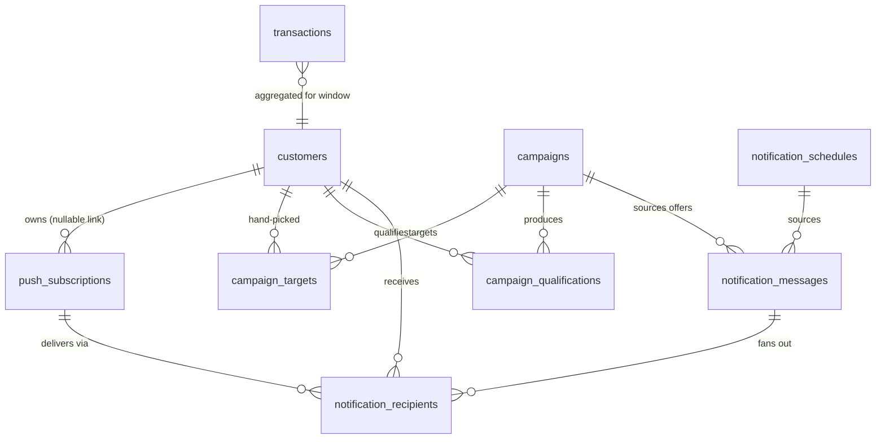
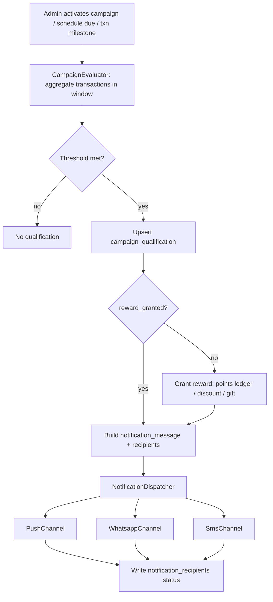

# Campaigns and Multi-Channel Notifications (F1–F4, Req 15/16)

Give the admin a campaign engine that rewards customers who cross a minimum-purchase threshold within a period window (with a discount or a gift), targets those rewards at an individual customer, a customer *type* (OTP/Credit/Drive-in), or a hand-picked set of customers, and delivers the resulting offer — plus automatic loyalty-bonus milestones — over **push, WhatsApp, and SMS**. This turns today's single, untargeted, push-only broadcast into a targeted, multi-channel, offer-aware notification system. The load-bearing prerequisite is a **push-token → customer linkage**: today `push_subscriptions` are anonymous, so no push can be aimed at one person.

> **Foundation status (2026-07-22):** ✅ **The push-token → identity linkage shipped, tested (Phase 1).** `push_subscriptions` gained nullable `customer_id` **and `user_id`** (FK nullify); `POST /push/subscriptions` links a signed-in staff `user` (session) and an identified `customer` (optional `phone_number`), staying anonymous otherwise, and a later anonymous re-register preserves a learned link. `PushSubscription.for_customer(customer)` plus the existing `subscriptions:` scope on `FirebasePushService` make a targeted send a filtered scope away. **✅ Update (Phase 3, 2026-07-22) — F2 targeting backbone + F3 auto-milestone shipped (backend + web + API), tested:** the delivery log (`notification_messages` + `notification_recipients`), the customer channel opt-ins (`whatsapp_opt_in`/`sms_opt_in`) + `consent_at`, the `Notifications::AudienceResolver` / `NotificationChannel` (Push live; WhatsApp/SMS record `skipped` until a provider is wired) / `Dispatcher` / `Broadcaster` engine (`FirebasePushService` gains `deliver_one` + an offer `data` block), the targeted multi-channel `POST /notifications/send` + history/recipients endpoints, the web send-form Audience/Channel controls + Delivery-history table, and **F3** `LoyaltyMilestoneNotifier` (one auto-bonus notification per `reward_settings.milestone_step` rung, idempotent via `last_milestone_points`). **Still to build:** the `Campaign`/`campaign_targets`/`campaign_qualifications` objects + `CampaignEvaluator` (F1), the customer opt-in **editing UI** + the public `/loyalty/result` claim card, Android for all of the above, and schedule channel/target extensions. **F4 update (2026-07-22): live WhatsApp shipped via `Notifications::Msg91WhatsappClient` + `WhatsappProvider`** — real MSG91 template sends that activate once the operator sets `WHATSAPP_PROVIDER=msg91` + `MSG91_AUTHKEY`/`MSG91_WHATSAPP_NUMBER`/`MSG91_WHATSAPP_TEMPLATE` (a pre-approved 1-body-variable template) in Secret Manager; injectable-transport unit tests. **F4 SMS adapter (MSG91 DLT) DEFERRED by decision (2026-07-22)** — the `SmsChannel` keeps recording `skipped` until built; it follows the same client/provider/channel pattern as WhatsApp. **Native delivery-history shipped (2026-07-22)** — `ui/admin/notifications` (list + per-recipient sheet), reached from the Notifications top bar. **Public `/loyalty/result` opt-in card shipped (2026-07-22)** — a "Get offers & bonus alerts" card: the reused push panel now passes the looked-up phone so `POST /push/subscriptions` links the token + stamps `consent_at`, plus WhatsApp/SMS opt-in checkboxes posting to a new CSRF-protected `loyalty#opt_in` (the phone is derived from the signed lookup token, never a client param). **Schedule channel/target extensions shipped (2026-07-22):** `notification_schedules` gained `channels`/`target_type`/`target_customer_type`/`campaign_id`; the runner **and** send-now now route through `Notifications::Broadcaster` (category `scheduled`) instead of the old push-only path, so scheduled sends are targeted + multi-channel + logged like ad-hoc sends. Web schedule form + Android editor gained the channel multi-select + audience selector (all/customer-type); serializers + DTOs carry the new fields. The rest of this spec is the forward design that builds on this foundation.

## Requirements covered

| ID | Requirement (one line) |
|----|------------------------|
| F1 | Campaigns: minimum purchase per period → discount or gift. |
| F2 | Targeting: individual customer, customer-type (OTP/Credit/Drive-in), or selected customers. |
| F3 | Auto loyalty-bonus notification on accumulated points milestones; offers wired into notifications. |
| F4 | Push **and** WhatsApp/SMS notification channels via a provider abstraction. |
| 15 | Campaigns with min-purchase-per-period → discounts/gifts, targeted at individual / customer-type / selected customers. |
| 16 | Push + WhatsApp/SMS notifications for offers and accumulated loyalty bonus. |

Depends on and extends: **C5** (loyalty accrual, for milestone triggers) and **E4** (customer-type taxonomy, for type targeting).

## Current state

What exists today is a single anonymous push broadcast plus a scheduler. There is **no campaign concept, no targeting, no offer object, no delivery log, and no channel besides FCM push.**

**Push is anonymous — the core gap.** `push_subscriptions` stores only `token, platform, last_used_at, active` (`db/schema.rb:162-173`) with **no `customer_id`** and no user FK. Registration is a public, unauthenticated endpoint that takes only a token and platform — `PushSubscriptionsController#create` (`app/controllers/push_subscriptions_controller.rb:8-30`) — and `PushSubscription.register!` (`app/models/push_subscription.rb:13-22`) never links a person. Consequently a push can only ever go to *everyone*.

**Broadcast is all-or-nothing.** `FirebasePushService#initialize` defaults its audience to `PushSubscription.active` (`app/services/firebase_push_service.rb:31`) and `#broadcast` iterates every active token (`:44`). Its payload (`build_payload`, `:124-164`) carries only `title`, `message`, and a static `link` — **no offer, campaign, or customer context**. Callers pass just `title:`/`message:`: `Admin::NotificationDeliveriesController#create` (`app/controllers/admin/notification_deliveries_controller.rb:6`, params limited to `:title, :message` at `:24-27`), `Api::V1::Admin::NotificationsController#deliver` (`app/controllers/api/v1/admin/notifications_controller.rb:13-22`), and both schedule controllers' `send_now` (`app/controllers/admin/schedules_controller.rb:64`, `app/controllers/api/v1/admin/schedules_controller.rb:53`).

**Scheduler is untargeted and single-channel.** `NotificationSchedule` has `title, message, frequency, scheduled_time, scheduled_date, day_of_week, day_of_month, last_sent_at, active` (`app/models/notification_schedule.rb`, schema `db/schema.rb:134-148`) — **no channel, no target, no campaign/offer FK.** `NotificationScheduleRunner#run` (`app/services/notification_schedule_runner.rb:86-109`) calls `@push_service.broadcast(title:, message:)` for every due schedule — push only, everyone.

**No delivery log.** Delivery results are the ephemeral `FirebasePushService::Result` struct (`app/services/firebase_push_service.rb:18-29`) — counts only, discarded after the response. There is no per-recipient record, so history, per-customer suppression, and conversion tracking are impossible.

**No campaigns, no channels, no milestones.** There is no `Campaign` model, no WhatsApp/SMS provider, no `NotificationChannel` abstraction, and no milestone hook. `TransactionCreator#call` (`app/services/transaction_creator.rb`) writes the `earn` ledger row (`:39-44`) but fires no notification. Customers have **no `customer_type`** column (`db/schema.rb:83-92`) and no opt-in flags.

**Android** mirrors the same limits: `AdminSchedulesScreen`/`Dtos`/`ViewModel` cover only title/message/frequency (`android/.../ui/admin/schedules/`), and `AdminOpsScreen` exposes a single "broadcast a notice" quick action (`android/.../ui/admin/ops/AdminOpsScreen.kt`). Push token registration (`android/.../core/push/Push.kt:20-34`) sends only `{token, platform}`.

## Target design

### Data model changes

**1. Link tokens to customers (foundation).**

`push_subscriptions` — new columns:

| Column | Type | Rationale |
|--------|------|-----------|
| `customer_id` | `bigint` FK → customers, nullable, indexed | Aim a push at one person. Nullable: web PWA tokens start anonymous until the visitor identifies via `/loyalty`. |
| `consent_at` | `datetime`, nullable | Timestamp of the customer's explicit push opt-in; null = anonymous/unconsented. |

A customer may have many active tokens (phone + tablet); a token belongs to at most one customer. Linking happens when a visitor completes the `/loyalty` lookup (phone verified against `customers.phone_number`) and taps "Notify me about offers", or when staff registers/looks up a customer on a device the customer controls. Re-registration keeps the existing `customer_id` unless a different customer claims the token.

**2. Customer taxonomy + channel opt-ins.**

`customers` — new columns:

| Column | Type | Rationale |
|--------|------|-----------|
| `customer_type` | `string`, default `"drivein"`, indexed | Targeting axis for F2/req 15. Values `drivein`/`credit`/`otp`/`fleet` — **taxonomy to confirm** (per locked assumption: OTP = fleet/credit billed by litres; Drive-in = walk-in cash; Credit = credit account). |
| `whatsapp_opt_in` | `boolean`, default `false`, null: false | Consent gate for WhatsApp (req 16, provider policy). |
| `sms_opt_in` | `boolean`, default `false`, null: false | Consent gate for SMS (DLT/TRAI). |
| `last_milestone_points` | `integer`, default `0`, null: false | Highest loyalty-points milestone already notified, so F3 auto-bonus fires once per crossing. |

**3. Campaigns.**

`campaigns`:

| Column | Type | Notes |
|--------|------|-------|
| `id` | bigint PK | |
| `name` | string, null: false | |
| `description` | text | |
| `reward_kind` | integer enum `discount`(0)/`gift`(1)/`bonus_points`(2), null: false | F1 discount **or** gift; bonus_points reuses loyalty ledger. |
| `discount_amount` | decimal(10,2), nullable | ₹ off, when `reward_kind = discount`. |
| `discount_percent` | decimal(5,2), nullable | Alternative to flat amount. |
| `gift_description` | string, nullable | Free-text gift, when `reward_kind = gift`. |
| `bonus_points` | integer, nullable | When `reward_kind = bonus_points`. |
| `min_purchase_amount` | decimal(10,2), nullable | ₹ threshold over the period. Available today. |
| `min_purchase_litres` | decimal(10,3), nullable | Litres threshold. **Depends on D1** (litres not yet captured; per LOCKED Q1 litres are source of truth). Nullable until D1 lands. |
| `period` | integer enum `rolling_days`(0)/`weekly`(1)/`monthly`(2)/`fixed_window`(3), null: false | Window over which purchases aggregate. |
| `period_days` | integer, nullable | For `rolling_days` (e.g. last 30). |
| `window_start` / `window_end` | date, nullable | For `fixed_window`. |
| `target_type` | integer enum `all`(0)/`customer_type`(1)/`individual`(2)/`selected`(3), null: false | F2/req 15. |
| `target_customer_type` | string, nullable | When `target_type = customer_type`. |
| `channels` | string, default `"push"` | Comma set of `push,whatsapp,sms` for the offer send. |
| `status` | integer enum `draft`(0)/`scheduled`(1)/`active`(2)/`paused`(3)/`completed`(4), null: false, default `draft` | |
| `starts_at` / `ends_at` | datetime, nullable | Campaign lifetime. |
| `created_by_id` | bigint FK → users | Admin audit. |
| `timestamps` | | |

`campaign_targets` (individual/selected): `campaign_id` FK, `customer_id` FK, unique `[campaign_id, customer_id]`.

`campaign_qualifications` (the period-window aggregation output, one per customer per evaluation):

| Column | Type | Notes |
|--------|------|-------|
| `campaign_id`, `customer_id` | FKs | unique `[campaign_id, customer_id, period_start]` |
| `period_start` / `period_end` | date | Window evaluated. |
| `aggregated_amount` | decimal(12,2) | Σ `transactions.fuel_amount` in window. |
| `aggregated_litres` | decimal(12,3), nullable | Σ litres (post-D1). |
| `qualified_at` | datetime | When threshold was met. |
| `reward_granted_at` | datetime, nullable | Idempotency: non-null = reward already given. |
| `reward_points_ledger_id` | bigint FK → points_ledgers, nullable | Set when `bonus_points`. |
| `notified_at` | datetime, nullable | Offer delivered. |

**4. Notification log + offers (replaces the ephemeral broadcast result).**

`notification_messages`:

| Column | Type | Notes |
|--------|------|-------|
| `campaign_id` | bigint FK, nullable | Offer source (F3 wiring). |
| `notification_schedule_id` | bigint FK, nullable | Scheduled source. |
| `title`, `body` | string/text | |
| `category` | integer enum `broadcast`/`offer`/`loyalty_milestone`/`scheduled` | |
| `offer_payload` | jsonb, default `{}` | Structured offer (kind, amount/percent/gift, expiry) rendered in the push `data` block and message body. |
| `target_type`, `target_customer_type` | | Snapshot of audience. |
| `channels` | string | `push,whatsapp,sms`. |
| `created_by_id` | bigint FK, nullable | |
| timestamps | | |

`notification_recipients` (per-person, per-channel delivery record):

| Column | Type | Notes |
|--------|------|-------|
| `notification_message_id` | FK, null: false | |
| `customer_id` | FK, nullable | Null for anonymous push. |
| `push_subscription_id` | FK, nullable | For push. |
| `channel` | integer enum `push`/`whatsapp`/`sms` | |
| `to_address` | string | token id / phone number (never logged in URL). |
| `status` | integer enum `pending`/`sent`/`failed`/`invalidated`/`skipped` | `skipped` = no opt-in / no token. |
| `provider_message_id` | string, nullable | Vendor id for delivery-receipt reconciliation. |
| `error` | string, nullable | |
| `sent_at` | datetime, nullable | |
| timestamps | | index `[customer_id, created_at]` for conversion/E5. |

**5. Extend `notification_schedules`** with `channels` (string, default `"push"`), `target_type`/`target_customer_type` (mirror campaign), and `campaign_id` (FK, nullable) — a schedule can now target a segment and carry a campaign offer, not just a global push.



### Business rules

- **Audience resolution** (shared by campaigns, schedules, ad-hoc sends): `all` → every consenting recipient per channel; `customer_type` → customers with matching `customer_type`; `individual`/`selected` → `campaign_targets`. Push additionally requires a linked, active `push_subscription`; WhatsApp requires `whatsapp_opt_in` + a phone; SMS requires `sms_opt_in` + a phone. A customer with no viable channel is logged `skipped`.
- **Period aggregation** (`CampaignEvaluator`): for each candidate customer, sum `transactions.fuel_amount` (and litres post-D1) where `created_at` is inside the resolved window (`rolling_days` → `now - period_days .. now`; `weekly`/`monthly` → calendar bucket; `fixed_window` → `window_start..window_end`). Qualify when the sum ≥ the set threshold(s). Upsert a `campaign_qualification` keyed on `[campaign_id, customer_id, period_start]` (idempotent re-runs).
- **Reward grant**: only for qualifications with `reward_granted_at IS NULL`. `bonus_points` writes a `points_ledgers` row (`entry_type: :adjust`, positive) and stamps `reward_points_ledger_id`; `discount`/`gift` record the offer in the qualification + notification (redemption is out of scope here — the settlement discount pull is D3). Respect `customer.rewards_paused?` for `bonus_points` (skip, like `TransactionCreator` at `app/services/transaction_creator.rb:37-45`).
- **Notify**: build one `notification_message` (`category: offer`, `offer_payload` from the campaign), fan out to `notification_recipients` over the campaign `channels`, dispatch, stamp `notified_at`.
- **Auto loyalty milestone (F3)**: after `TransactionCreator` writes the `earn` ledger row, `LoyaltyMilestoneNotifier` compares the customer's new `total_points` against a configurable ladder (`RewardSetting.milestone_step`, e.g. every 500 pts). If a new rung is crossed above `customers.last_milestone_points`, enqueue a `loyalty_milestone` notification ("You've earned N points…") over the customer's opted-in channels and advance `last_milestone_points`. Idempotent: one notification per rung.

### Provider abstraction (F4)

A `NotificationChannel` interface decouples audience/offer logic from vendors:

```
NotificationChannel (interface): #deliver(recipient:) -> DeliveryOutcome
  ├─ PushChannel     — wraps FirebasePushService per-token; requires push_subscription
  ├─ WhatsappChannel — vendor API; requires whatsapp_opt_in + approved template
  └─ SmsChannel      — vendor API; requires sms_opt_in + DLT-registered template
NotificationDispatcher — resolves channels per recipient, calls each channel,
                         writes notification_recipients rows, handles retry/backoff.
```

- **`PushChannel`** reuses `FirebasePushService` but is refactored so a single-token send is callable (extract `deliver_to_subscription` at `app/services/firebase_push_service.rb:88` into a public `deliver_one(subscription:, message:)`), and `build_payload` gains the `offer_payload` in its `data` block.
- **Provider choice**: **MSG91** (single India-focused vendor covering both WhatsApp Business API and DLT-compliant transactional SMS) as the recommended default; Twilio as the documented alternative. Config via `WHATSAPP_PROVIDER`, `SMS_PROVIDER`, and `*_API_KEY` in Secret Manager (same pattern as Firebase creds).
- **Opt-in & templates**: WhatsApp requires pre-approved message templates and prior opt-in (`whatsapp_opt_in`); SMS requires DLT template + entity registration and `sms_opt_in`. Offers/loyalty messages map to a small set of parameterized templates (`offer_generic`, `loyalty_milestone`). Unconsented recipients are `skipped`, never sent.



## API changes

All under the existing admin JSON namespace (`config/routes.rb:78-86`), authorized by `Api::V1::Admin::BaseController`. Requests accept the nested-or-flat envelope via `resource_params` like `Api::V1::Admin::SchedulesController` (`app/controllers/api/v1/admin/schedules_controller.rb:67-71`).

**Campaigns**

| Method | Path | Request | Response |
|--------|------|---------|----------|
| GET | `/api/v1/admin/campaigns` | `?status=` | `{ campaigns: [CampaignDto] }` |
| POST | `/api/v1/admin/campaigns` | `campaign[name, description, reward_kind, discount_amount|discount_percent|gift_description|bonus_points, min_purchase_amount, min_purchase_litres, period, period_days, window_start, window_end, target_type, target_customer_type, channels, starts_at, ends_at]` (+ `target_customer_ids[]` for individual/selected) | `201 CampaignDto` |
| PATCH | `/api/v1/admin/campaigns/:id` | subset | `200 CampaignDto` |
| DELETE | `/api/v1/admin/campaigns/:id` | — | `204` |
| POST | `/api/v1/admin/campaigns/:id/preview` | — | `{ qualifying_count, sample: [{customer_id, name, aggregated_amount}], reachable: {push, whatsapp, sms} }` — dry run, no grant/send. |
| POST | `/api/v1/admin/campaigns/:id/run` | `{ notify: true }` | `{ qualified, rewarded, notification_message_id, delivery: {push, whatsapp, sms: {sent, failed, skipped}} }` |
| POST | `/api/v1/admin/campaigns/:id/activate` \| `/pause` | — | `200 CampaignDto` |

**Notifications (targeted + multi-channel) — extends today's send**

| Method | Path | Request | Response |
|--------|------|---------|----------|
| POST | `/api/v1/admin/notifications/send` | `notification[title, message, channels[], target_type, target_customer_type, customer_ids[], campaign_id]` (superset of today's `title, message` at `app/controllers/api/v1/admin/notifications_controller.rb:14`) | `{ notification_message_id, delivery: {per-channel counts} }` |
| GET | `/api/v1/admin/notifications` | `?category=&page=` | `{ notifications: [NotificationMessageDto with per-channel counts] }` — history from `notification_recipients`. |
| GET | `/api/v1/admin/notifications/:id/recipients` | — | `{ recipients: [{customer_id, channel, status, error, sent_at}] }` |

**Schedules** — `schedule_params` (`app/controllers/api/v1/admin/schedules_controller.rb:67-71`) gains `channels[], target_type, target_customer_type, campaign_id`; `ScheduleDto` (`android/.../AdminSchedulesDtos.kt:22-33`) gains the same.

**Customer type + opt-ins** — the admin customer endpoints and `staff/customers` gain `customer_type` in params/serializers; add:

| Method | Path | Request | Response |
|--------|------|---------|----------|
| PATCH | `/api/v1/admin/customers/:id` | `customer[customer_type, whatsapp_opt_in, sms_opt_in]` | `200 CustomerDto` |

**Token → customer linkage (foundation)**

| Method | Path | Request | Response |
|--------|------|---------|----------|
| POST | `/api/v1/loyalty/push_subscriptions/claim` | `{ token, phone_number }` (public; phone matched against `customers`) | `{ linked: true, customer_id }` — sets `customer_id` + `consent_at` on the subscription. |
| POST | `/push/subscriptions` (existing, `app/controllers/push_subscriptions_controller.rb:8`) | add optional `customer_id`/`phone_number` | unchanged shape + `customer_id`. |

Never place phone numbers in query strings (privacy rule) — claim is POST body only.

## UI

### Rails PWA

- **`admin/notifications` page** (rendered by `Admin::NotificationsController#show`, the redirect target throughout `admin/schedules_controller.rb`): add a **Channel** selector (Push / WhatsApp / SMS checkboxes) and a **Target** control (All / Customer type dropdown / Pick customers) to the ad-hoc send form and to the schedule create/edit form. Add a **Delivery history** table below (from `GET /admin/notifications`) showing category, audience, and per-channel sent/failed/skipped — the first persistent record of what went out.
- **New `admin/campaigns`** (new controller + route under the `admin` namespace at `config/routes.rb:112`): index (name, reward, target, status, qualifying count), a create/edit form (reward kind → conditional discount/gift/points fields; period + threshold; target type → type dropdown or customer multi-select; channels), a **Preview** button (calls `/preview`, shows qualifying count + reachability), and **Activate / Pause / Run now** actions. Reuse the existing admin form styling used by schedules.
- **Public `/loyalty/result`** (`loyalty#show`): after showing points, add an opt-in card "Get offers and bonus alerts" that (a) requests the browser push token and (b) calls `/api/v1/loyalty/push_subscriptions/claim` with the looked-up phone, plus WhatsApp/SMS opt-in checkboxes writing `whatsapp_opt_in`/`sms_opt_in`.

### Android (Compose)

- **`AdminOpsScreen`** (`android/.../ui/admin/ops/AdminOpsScreen.kt`): the existing "broadcast a notice" quick action expands into a **Campaigns** entry (new `admin/campaigns` screen set: `Api/Dtos/Repository/Screen/ViewModel`, following the schedules module layout) and a **Notifications history** entry.
- **`AdminSchedulesScreen`/`ViewModel`/`Dtos`** (`android/.../ui/admin/schedules/`): extend the schedule editor with a channel multi-select and a target selector; add `channels`, `targetType`, `targetCustomerType`, `campaignId` to `ScheduleDto` and the request envelope (matching the API change). The ad-hoc send sheet gains the same channel/target controls.
- **New `admin/campaigns` screen**: list + editor mirroring the web (reward kind, period + threshold, target, channels, Preview/Activate/Pause/Run). `DeliveryResultDto` (`android/.../AdminSchedulesDtos.kt:42-49`) is extended to per-channel counts (`push`, `whatsapp`, `sms` sub-objects).
- **Customer detail screen** (`android/.../ui/customers`): add a **Customer type** dropdown and WhatsApp/SMS opt-in toggles bound to the customer PATCH.
- **Push registration** (`android/.../core/push/Push.kt:20-38`): `PushSubscriptionRequest` unchanged for anonymous registration; when a staff member has just identified a customer on a customer-facing flow, call the claim endpoint. (Staff/admin app tokens remain staff-linked, not customer-linked.)

## Validation & edge cases

- Exactly one reward field must match `reward_kind` (discount ⇒ amount **xor** percent present; gift ⇒ `gift_description`; bonus_points ⇒ `bonus_points > 0`). Reject otherwise.
- At least one threshold (`min_purchase_amount` or `min_purchase_litres`) required. `min_purchase_litres` rejected with a clear message until **D1** ships (litres not captured yet — LOCKED Q1).
- `target_type = customer_type` requires a known `target_customer_type`; `individual` requires exactly one target; `selected` requires ≥1. Empty selection ⇒ 422.
- `fixed_window` requires `window_start ≤ window_end`; `rolling_days` requires `period_days > 0`.
- Channel gating: sending a channel with no opted-in recipients yields `skipped` rows, not errors; a message with **zero** reachable recipients returns `200` with all-zero counts and a warning (mirrors `schedule_send_now_flash_for` at `app/controllers/admin/schedules_controller.rb:148-151`).
- **Idempotency**: re-running a campaign in the same window never double-grants (`reward_granted_at` guard) and never double-notifies (`notified_at`); the loyalty milestone fires once per rung via `last_milestone_points`.
- Invalid/expired push tokens are deactivated exactly as today (`INVALID_TOKEN_CODES`, `app/services/firebase_push_service.rb:105-108`) and recorded `invalidated`.
- Concurrency: campaign `run` and the scheduler must share the lease pattern (`SchedulerLease`, `app/services/notification_schedule_runner.rb:118-138`) so a cron sweep and a manual run don't double-send.
- A paused customer (`rewards_paused?`) is skipped for `bonus_points` grants but may still receive informational offers.
- WhatsApp/SMS provider outage: mark recipients `failed` with the vendor error, don't roll back the reward grant; support a `resend` of `failed` recipients only.
- Deleting a customer with `campaign_targets`/`qualifications`: `dependent: :destroy` on the join rows; keep `notification_recipients` (nullify `customer_id`) for audit.

## Dependencies & sequencing

**Must exist first**
- **Token→customer linkage** (`push_subscriptions.customer_id` + claim endpoint) — hard prerequisite for any targeted push (F2/F3). Build this first.
- **E4 customer taxonomy** (`customers.customer_type`) — prerequisite for type targeting.
- **C5 loyalty accrual** (already present) — feeds the F3 milestone trigger.

**Softens / partially blocked by**
- **D1 per-nozzle readings / litres** — required only for litre-based `min_purchase_amount`; ₹-based campaigns ship immediately (LOCKED Q1: derive ₹ today, add litres when D1 lands).
- **D3 discount pull** — campaign *discount* offers are recorded here; their redemption at settlement is D3's job.

**This unblocks**
- **E5** contact-tracking & conversion (uses `notification_recipients` history).
- **E6** churn/lost-customer re-engagement campaigns (a `rolling_days` non-purchase segment).
- **G1**-adjacent per-pump promo targeting once pump-scoped segments exist.

**Internal order**: (1) token linkage + customer_type migrations → (2) `notification_messages`/`recipients` log + `NotificationChannel`/`Dispatcher` refactor of `FirebasePushService` → (3) targeted ad-hoc + scheduled sends → (4) `Campaign` model + `CampaignEvaluator` + grant/notify → (5) WhatsApp/SMS channel adapters → (6) F3 milestone hook.

## Acceptance criteria

- [ ] `push_subscriptions.customer_id` and `consent_at` exist; the claim endpoint links an anonymous token to a customer matched by phone and sets `consent_at`.
- [ ] `customers.customer_type`, `whatsapp_opt_in`, `sms_opt_in`, `last_milestone_points` exist and are editable from both surfaces.
- [ ] A campaign with a ₹ min-purchase over a period can be created, previewed (qualifying count + per-channel reachability), and run; qualifiers are computed by aggregating `transactions.fuel_amount` in the window.
- [ ] Targeting works for `all`, `customer_type` (OTP/Credit/Drive-in), `individual`, and `selected`; only intended recipients get the message.
- [ ] Running a campaign grants the reward (points ledger row for `bonus_points`; recorded offer for discount/gift) and re-running the same window neither double-grants nor double-notifies.
- [ ] A send fans out over push, WhatsApp, and SMS per the campaign/schedule `channels`, respecting each recipient's opt-in; unreachable recipients are recorded `skipped`.
- [ ] Every send writes one `notification_message` and per-recipient `notification_recipients` rows with `status` and `provider_message_id`; the admin history and recipient endpoints return them.
- [ ] Crossing a loyalty-points milestone on a transaction triggers exactly one `loyalty_milestone` notification over the customer's opted-in channels; no duplicate on the next transaction below the next rung.
- [ ] Push payload carries the structured `offer_payload` so the client can render the offer.
- [ ] WhatsApp/SMS use approved/DLT-registered templates and are never sent without the matching opt-in; a provider failure marks recipients `failed` without rolling back the reward, and `failed` recipients can be resent.
- [x] `notification_schedules` supports channel + target + `campaign_id`; the runner sends targeted, multi-channel messages, still lease-guarded and idempotent.
- [ ] Android admin exposes campaign CRUD + preview/activate/pause/run, channel/target controls on schedules and ad-hoc sends, and customer type/opt-in editing; DTOs carry per-channel delivery counts.
- [ ] Litre-based thresholds are rejected with a clear "requires D1" message until per-nozzle readings ship; ₹-based campaigns work today.
