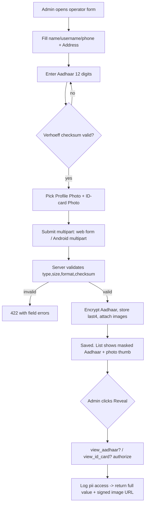

# A7 — Operator Profile / KYC Fields (Photo, Address, Aadhaar, ID-card Photo)

> **Build status (Phase 3, 2026-07-22):** ✅ **Backend + API + web + Android shipped, tested.**
> ActiveStorage installed; `User` has `profile_photo`/`id_card_photo` attachments
> (type+size validated); `users` += `address` + Aadhaar (**Active Record Encryption**
> at rest, **Verhoeff** checksum, masked `XXXX-XXXX-1234` via `aadhaar_last4`). PII:
> masked-by-default serializer, an admin-only **audited** reveal (`GET /api/v1/admin/users/:id/kyc_reveal`
> + web `reveal_aadhaar`, both writing a `pii_access_logs` row), an authenticated
> ID-card view/redirect, a Purge-KYC action, and Aadhaar/image log-filtering. Multipart
> create/update on web + API; a blank Aadhaar on edit keeps the stored value. Login is
> unchanged (Q3 — no OTP). The **Android** admin Users sheet now captures Address +
> Aadhaar (12-digit, checksum server-verified) and adds Profile/ID-card photos via a
> **Take photo** (camera, runtime-permission-gated + FileProvider) **or Choose from
> gallery** chooser, uploading over multipart (no-image edits stay on JSON); the
> audited reveal shows the full Aadhaar transiently + opens the signed ID-card URL, and
> Purge-KYC is wired. Thumbnails render via Coil on the shared authed OkHttp client.
> **Production prerequisites — code + pipeline now wired; operator runs two one-time
> scripts** (see [`docs/a7-prod-provisioning.md`](../a7-prod-provisioning.md)):
> `google-cloud-storage` gem + a `:google` ActiveStorage service (Cloud Run ADC, no
> keyfile) + an `ACTIVE_STORAGE_SERVICE`-driven `production.rb`, and `cloudbuild.yaml`
> mounting the `AR_ENCRYPTION_*` secrets + `GCS_*` env into the migrate job and service.
> The operator runs `scripts/setup-encryption-keys.sh` (**mandatory before the Phase-3
> deploy — the app won't boot without the keys**; the script never overwrites an existing
> key) and `scripts/setup-gcs.sh` (private bucket), then flips `_ACTIVE_STORAGE_SERVICE=google`.

Extend the operator (staff) user record with the KYC profile the requirement asks for: a profile photo, a postal address, an Aadhaar number, and a photo of the operator's ID card. This is a **profile-fields-only** change per LOCKED DECISION Q3 — it adds data capture and PII handling to the existing user record and admin forms on both the Rails PWA and the native Android app. **Explicit non-goal:** OTP / passwordless login and any SMS/WhatsApp auth provider. Username/mobile + password login (Devise `:database_authenticatable`) is retained unchanged.

## Requirements covered

| ID | Requirement |
|----|-------------|
| A7 | Operator user setup captures **Name, Photo, Address, Aadhaar number, ID-card photo** in addition to today's login fields. |
| A7 (non-goal) | Login stays username/mobile + password. **No OTP, no SMS/WhatsApp auth** is added. |

## Current state

The `users` table (`db/schema.rb:303-329`) has `name, username, email, phone_number, employee_code, role, subtitle, active, deleted_at, encrypted_password` and the Devise reset/remember columns. **There is no photo, no address, and no Aadhaar column, and no ID-card image.** The audit summary already records A7 as PARTIAL for exactly this reason.

- `app/models/user.rb` — Devise `:database_authenticatable, :recoverable, :rememberable, :validatable` (line 28). No `has_one_attached`, no Active Record Encryption, no KYC attributes anywhere in the model.
- `app/controllers/admin/users_controller.rb:59` — `user_params` permits `:name, :username, :phone_number, :email, :active, :password, :password_confirmation` only. This is the create/edit path for operators.
- `app/controllers/admin/staff_members_controller.rb:51` — `staff_member_params` permits `:name, :active, :employee_code, :subtitle` only (the lighter staff-management edit path).
- `app/controllers/api/v1/admin/users_controller.rb:12-15` — `ASSIGNABLE_KEYS` is `name username phone_number email active password password_confirmation employee_code subtitle`. Body is JSON only; there is no multipart handling.
- `app/serializers/api/v1/user_serializer.rb` and `app/serializers/api/v1/admin/user_serializer.rb` — expose the scalar fields + audit timestamps. No image URLs, no address, no Aadhaar.
- `app/policies/user_policy.rb` — `index?/show?/create?/update?` are admin-only; `destroy?` admin + staff record only. There is no field-level guard because there is no sensitive field yet.
- `app/views/admin/users/_form.html.erb` — Bootstrap form with name/username/phone/email/role/active/password. No file inputs, no address, no Aadhaar. `form_with` is not `multipart`.
- Android `ui/admin/users/`: `UsersDtos.kt` (`AdminUserDto` / `AdminUserRequest` — scalar JSON only), `UsersApi.kt` (Retrofit `@Body AdminUserEnvelope`, no multipart), `AdminUsersScreen.kt` (ModalBottomSheet create/edit form), `UsersViewModel.kt`. No image picker, no upload.

**ActiveStorage is half-wired but not installed.** The `image_processing` gem is present (`Gemfile:39-40`), `config/storage.yml` defines `local`/`test` disk services, and `config/environments/production.rb:31` sets `config.active_storage.service = :local`. **However there are no `active_storage_blobs` / `active_storage_attachments` / `active_storage_variant_records` tables in `db/schema.rb`** — the install migration was never run. Additionally, production runs on Cloud Run with an **ephemeral local disk**, so `:local` storage would silently lose every uploaded image on each deploy/restart. Both must be fixed before attachments can be used (see Dependencies).

There is no PII/encryption infrastructure today: no `config.active_record.encryption` keys, no masking, no access auditing.

## Target design

### Data model changes

**1. New scalar columns on `users`** (migration):

| Column | Type | Null | Rationale |
|--------|------|------|-----------|
| `address` | `text` | yes | Operator postal address (free-form, multi-line). Optional. |
| `aadhaar_number_ciphertext` | `text` | yes | Aadhaar stored **encrypted at rest** via Active Record Encryption (`encrypts :aadhaar_number`). The column holds ciphertext; the app reads/writes the virtual `aadhaar_number`. Non-deterministic encryption (not queryable) — we never look up by Aadhaar. |
| `aadhaar_last4` | `string(4)` | yes | Plaintext last 4 digits, written by a callback. Lets lists/serializers show a masked `XXXX-XXXX-1234` without decrypting the full value on every render. |

> Implementation note: with Active Record Encryption you keep a normal `aadhaar_number` column and call `encrypts :aadhaar_number`; Rails encrypts the column value in place. Using an explicit `_ciphertext` column name is optional. Either way the stored bytes are ciphertext. Keys live in credentials (`active_record_encryption.primary_key`, `deterministic_key`, `key_derivation_salt`), **not** in the repo.

**2. Two ActiveStorage attachments** on `User` (`app/models/user.rb`):

```ruby
has_one_attached :profile_photo      # operator mugshot — low sensitivity
has_one_attached :id_card_photo      # Aadhaar/ID card scan — HIGH sensitivity PII
```

Validate content type (`image/jpeg`, `image/png`, `image/webp`) and size (≤ 8 MB each). Generate a `resized` variant (max 800×800) for `profile_photo` display; keep `id_card_photo` original (legibility) but still validate/strip.

**3. Model rules** (`user.rb`):

- `AADHAAR_FORMAT = /\A\d{12}\z/`. `before_validation` strips spaces/dashes; validate `format` + Verhoeff checksum (Aadhaar's built-in check digit) — reject transposition typos. Optional (`allow_blank`).
- `before_save :sync_aadhaar_last4` — set `aadhaar_last4 = aadhaar_number&.last(4)` when `aadhaar_number` changes; null it when cleared.
- `masked_aadhaar_number` → `"XXXX-XXXX-#{aadhaar_last4}"` when `aadhaar_last4` present, else `nil`.
- Attachment/KYC fields apply to **staff** operators; they are permitted for any user but the UI surfaces them on the operator form. No change to auth.

### PII handling (access control, encryption, masking, retention)

| Concern | Rule |
|---------|------|
| Encryption at rest | Aadhaar number is encrypted with Active Record Encryption (AES-256-GCM). ID-card image bytes sit in the storage bucket; enable bucket-level encryption (GCS default) and serve only via signed, expiring, authenticated URLs. |
| Who can read | Only `admin` users. `UserPolicy#index?/show?/update?` already gate this. Add `UserPolicy#view_aadhaar?` and `#view_id_card?` (admin-only) for the reveal path. Staff/FSM roles **never** receive Aadhaar or ID-card data in any serializer or view. |
| Masking by default | List and default detail responses expose only `aadhaar_masked` (`XXXX-XXXX-1234`) and a `profile_photo_url`. The **full** Aadhaar and the **ID-card image URL** are returned only from a dedicated reveal endpoint that is admin-authorized and **audited**. |
| Access audit | Every full-Aadhaar / ID-card reveal writes an `analytics_event` (or a dedicated `pii_access_logs` row) capturing `actor_user_id`, `target_user_id`, `field`, `viewed_at`, `ip`. Reuses the existing `analytics_event` model. |
| Image URL exposure | Never emit permanent public blob URLs. `id_card_photo` is served through an authenticated redirect action (`GET /admin/users/:id/id_card_photo` in web; a signed short-TTL URL from the reveal endpoint for Android). `profile_photo` may use a normal variant URL (low sensitivity) but still behind admin routes. |
| Not in URLs/logs | Aadhaar never appears in query strings, flash messages, or logs. Add `filter_parameter_logging` entries for `aadhaar_number`, `aadhaar`, and the attachment params. |
| Retention | On hard-delete, `dependent: :purge_later` purges both attachments and the Aadhaar ciphertext goes with the row. On **soft delete** (`deleted_at`), records are retained per existing policy; add an admin-triggerable "purge KYC" action that nulls `aadhaar_number`, clears `aadhaar_last4`, and purges `id_card_photo` while keeping the account shell. |

### Workflow



## API changes

All endpoints are admin-authorized (`Api::V1::Admin::BaseController`) and mirror the web. Attachments require **multipart** requests; scalar KYC fields ride the existing JSON envelope.

**1. Extend `POST /api/v1/admin/users` and `PATCH /api/v1/admin/users/:id`**

Add to `ASSIGNABLE_KEYS`: `address`, `aadhaar_number`. Accept an optional multipart part for images. Two supported request shapes:

- JSON (scalars only): `{"user": { ..., "address": "...", "aadhaar_number": "123412341234" }}`
- Multipart (scalars + images): parts `user[address]`, `user[aadhaar_number]`, `user[profile_photo]` (file), `user[id_card_photo]` (file).

Response (masked by default):
```json
{
  "id": 42, "name": "...", "role": "staff",
  "address": "12 MG Road, Bengaluru 560001",
  "aadhaar_present": true,
  "aadhaar_masked": "XXXX-XXXX-1234",
  "profile_photo_url": "https://.../rails/active_storage/.../resized.jpg",
  "id_card_present": true,
  "created_at": "...", "updated_at": "..."
}
```
422 on bad Aadhaar checksum/format, oversized/unsupported image, or uniqueness/last-admin guard (unchanged behavior).

**2. New `GET /api/v1/admin/users/:id/kyc_reveal`** (admin-only, audited)

Request: bearer token, no body. Server authorizes `view_aadhaar?`/`view_id_card?`, writes a `pii_access` analytics event, returns:
```json
{
  "aadhaar_number": "123412341234",
  "id_card_photo_url": "https://storage.googleapis.com/...&X-Goog-Expires=300",
  "profile_photo_url": "https://.../resized.jpg"
}
```
`id_card_photo_url` is a signed URL with a short TTL (≤ 5 min). 403 for non-admins; 404 if no ID-card attached.

**3. New `DELETE /api/v1/admin/users/:id/kyc`** (optional, admin-only)

Purges `id_card_photo`, nulls `aadhaar_number`/`aadhaar_last4`. Returns the masked serializer with `aadhaar_present:false, id_card_present:false`.

Serializers: `Api::V1::UserSerializer` gains `address, aadhaar_present, aadhaar_masked, profile_photo_url, id_card_present`. It must **never** emit the full Aadhaar or the raw ID-card URL — those come only from `kyc_reveal`.

## UI

### Rails PWA

- **`app/views/admin/users/_form.html.erb`** — change `form_with` to `multipart: true`. Add, after the email field and before role:
  - **Address** — `form.text_area :address, rows: 2`.
  - **Aadhaar Number** — `form.text_field :aadhaar_number` with `inputmode="numeric"`, `maxlength=12`, `pattern="\d{12}"`. On **edit**, prefill with the masked value and a "Change" toggle; leaving it untouched keeps the stored value (like the password field).
  - **Profile Photo** — `form.file_field :profile_photo, accept: "image/*"`, with a thumbnail preview of the current `profile_photo.variant(:resized)`.
  - **ID-card Photo** — `form.file_field :id_card_photo, accept: "image/*"`. Do **not** inline-render the current ID card; show a "View ID card" button that hits the authenticated redirect action and opens in a new tab (admin only).
- **`app/views/admin/users/show.html.erb`** — add an "Identity (KYC)" card: profile photo, address, masked Aadhaar with a **Reveal** button (POSTs to reveal action, logs access, then shows full value), and a **View ID card** button. Add a **Purge KYC** danger action.
- **`admin/users_controller.rb`** — add `address`, `aadhaar_number`, `profile_photo`, `id_card_photo` to `user_params`; add member actions `id_card_photo` (authenticated `redirect_to rails_blob_url(...)` guarded by `view_id_card?`), `reveal_aadhaar`, and `purge_kyc`. Add the same KYC keys to `staff_members_controller` only if that lighter form should also edit them (recommend keeping KYC on the full users form).
- Add `config.filter_parameters += [:aadhaar_number, :aadhaar]` in `config/initializers/filter_parameter_logging.rb`.

### Android (Compose)

- **`UsersDtos.kt`** — extend `AdminUserDto` with `address`, `aadhaarPresent`, `aadhaarMasked`, `profilePhotoUrl`, `idCardPresent`; extend `AdminUserRequest` with `address` and `aadhaarNumber`. Add a `KycRevealDto(aadhaarNumber, idCardPhotoUrl, profilePhotoUrl)`.
- **`UsersApi.kt`** — add a multipart create/update:
  ```kotlin
  @Multipart @POST("api/v1/admin/users")
  suspend fun createMultipart(@PartMap fields: Map<String, @JvmSuppressWildcards RequestBody>,
                              @Part profilePhoto: MultipartBody.Part?,
                              @Part idCardPhoto: MultipartBody.Part?): AdminUserDto
  ```
  plus a `@PATCH ...{id}` twin and `@GET("api/v1/admin/users/{id}/kyc_reveal") suspend fun kycReveal(...)`. Keep the existing JSON methods for edits with no image change.
- **`AdminUsersScreen.kt`** (the ModalBottomSheet create/edit form) — add:
  - `FormField` for **Address** (multi-line).
  - `FormField` for **Aadhaar** (numeric keyboard, 12-digit, masked display on edit with a "Change" affordance mirroring the password field).
  - Two image rows reusing the existing camera/gallery capability from `ui/scanner` (photo picker + camera). Show the selected/current thumbnail for **Profile Photo**; for **ID-card Photo** show only a "captured / view" state gated behind a reveal tap.
  - A **Reveal Aadhaar** button on the detail view calling `kycReveal` and rendering the full value transiently (not cached).
- **`UsersViewModel.kt`** — build the multipart body when an image is chosen (fall back to JSON when not), expose `revealKyc(id)` state, and never persist revealed Aadhaar/ID URL in saved UI state.

## Validation & edge cases

- **Aadhaar format**: exactly 12 digits after stripping spaces/dashes; reject non-numeric and wrong length with a field error. Enforce the **Verhoeff checksum**; a mistyped digit that passes length but fails checksum is rejected.
- **Aadhaar optional**: blank is allowed (KYC may be pending). Clearing on edit nulls both the ciphertext and `aadhaar_last4`.
- **Image type/size**: only `image/jpeg|png|webp`, ≤ 8 MB; reject with 422 and a clear message. Strip EXIF/orientation on variant generation.
- **Edit without re-upload**: omitting the image parts keeps the existing attachment; omitting/masking Aadhaar keeps the stored value (parallel to password handling).
- **Non-admin access**: staff/FSM calling any users endpoint or `kyc_reveal` gets 403; serializers used in staff-facing responses must not include KYC fields at all.
- **Masking never leaks**: default serializers/lists show only `aadhaar_masked`; assert full Aadhaar never appears outside `kyc_reveal`.
- **Ephemeral storage**: with `:local` on Cloud Run, images vanish on restart — this is a data-loss bug, not cosmetic. Block release until GCS is wired.
- **Soft-deleted operators**: KYC remains retrievable to admins unless purged; `purge_kyc` must succeed on a soft-deleted record.
- **Log hygiene**: Aadhaar and image params must be filtered from Rails logs and never placed in flash or URL params.
- **Last-admin / uniqueness guards** (existing) still apply; KYC changes must not bypass them.

## Dependencies & sequencing

**Must exist first**
1. **ActiveStorage install** — run `active_storage:install` and load the `active_storage_blobs/attachments/variant_records` tables into `db/schema.rb` (currently absent).
2. **Durable object storage** — switch production `config.active_storage.service` off ephemeral `:local` to **GCS** (bucket per env, `google-cloud-storage` gem, keyfile/credentials via Secret Manager). Without this, uploads are lost on Cloud Run restarts.
3. **Active Record Encryption keys** — generate and store `primary_key`, `deterministic_key`, `key_derivation_salt` in Rails credentials / Secret Manager; add `config.active_record.encryption` setup.
4. Builds directly on the existing **A7** operator user CRUD (`admin/users_controller`, `api/v1/admin/users_controller`, Android `ui/admin/users`).

**Unblocks / enables**
- Completes A7 from PARTIAL → PRESENT (KYC profile captured).
- Provides the operator-photo asset reusable by A8/A9 shift & attendance screens (operator avatars).
- Establishes the **PII pattern** (encrypt-at-rest + masked-by-default + audited reveal + signed image URLs) reused later by customer master B1 (driver/owner contacts) and any future document capture (D8 stock docs).

## Acceptance criteria

- [ ] `users` has `address`, encrypted Aadhaar storage, and `aadhaar_last4`; `db/schema.rb` includes the ActiveStorage tables.
- [ ] `User` declares `has_one_attached :profile_photo` and `:id_card_photo` with content-type and size validation.
- [ ] Aadhaar is stored as ciphertext (verified by inspecting the raw column) and only decrypts through `aadhaar_number`.
- [ ] Aadhaar with a bad Verhoeff checksum or non-12-digit input is rejected with a 422 field error on both web and API.
- [ ] Web operator form (`_form.html.erb`) is `multipart`, shows Address, Aadhaar (masked on edit), Profile Photo, and ID-card Photo inputs, and saves them.
- [x] Android create/edit sheet captures Address, Aadhaar, Profile Photo, and ID-card Photo and uploads via multipart; a no-image edit still works over JSON.
- [ ] Default list/detail responses (web + API) show only `aadhaar_masked` (`XXXX-XXXX-1234`) and a profile-photo URL — never the full Aadhaar or raw ID-card URL.
- [ ] `GET /api/v1/admin/users/:id/kyc_reveal` returns the full Aadhaar and a short-TTL signed ID-card URL **only** to admins and writes a PII-access audit event; non-admins get 403.
- [ ] ID-card image is never served via a permanent public URL; it is reachable only through the authenticated redirect (web) or signed reveal URL (API).
- [ ] `aadhaar_number` and image params are absent from application logs (filtered) and never appear in any URL.
- [ ] Purge-KYC action nulls Aadhaar/last4 and purges the ID-card attachment, and works on soft-deleted operators.
- [ ] Login remains username/mobile + password; **no OTP/SMS/WhatsApp** code, route, gem, or config was added.
