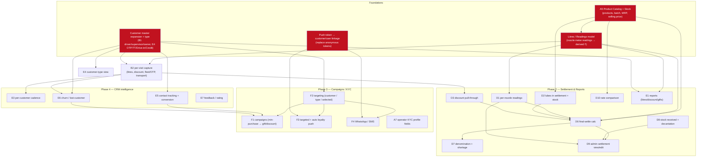

# AceFuels — Phased Implementation Roadmap

> **Status:** Delivery plan. This document sequences the work required to close the
> gap between the shipped system and the full requirement. It does **not** re-specify
> features — for *what* each feature must do read
> [`01-functional-requirements.md`](./01-functional-requirements.md); for *what exists
> today* read [`02-current-architecture.md`](./02-current-architecture.md); for the
> program vocabulary and locked decisions read
> [`00-product-overview.md`](./00-product-overview.md); for the evidence behind each
> Present/Partial/Absent verdict read
> [`40-gap-analysis.md`](40-gap-analysis.md).

> **Progress — Phase 0 COMPLETE ✅ (2026-07-21):** all shipped on every surface, tested — ✅ **C4 global rewards pause** · ✅ **S-PAUSE** · ✅ **fuel types → MS/HSD** · ✅ **S-MYPUMP** · ✅ **A10 admin pump assignment** · ✅ **E2 dashboard drill-through**. Next up: **Phase 1 foundations** (Product Catalog A5, litres/readings model, customer expansion B1/E4/B2, push-token linkage).

> **Progress — Phase 1 (started 2026-07-22):** ✅ **A5 Product Catalog** shipped on all surfaces (priced catalog + admin CRUD web/API/Android, 14 rows seeded, tested; stock ledger deferred to Phase 2). ✅ **litres/readings model** shipped (backend + API) — transactions now store `litres`/`selling_price_snapshot`/`gross_amount`/`discount_amount`/`amount_source`, ₹ derived from the catalog via `FuelPricing`, `PointsCalculator` gains a by-litres mode, `reward_settings.reward_basis`; existing ₹ rows backfilled as legacy; staff transaction API accepts litres/discount. Tested. *(The litres capture **form** ships with B2.)* ✅ **B1 customer master + E4 customer-type** shipped on both surfaces, tested: `customer_type` enum (drive_in/otp/credit) + `transport_name`/`approx_vehicle_count`/`info_note` on `customers`; `customer_contacts` table + model (driver/supervisor/owner/manager + contacted marker) with nested attributes. Web: account-type select + a **contacts editor** (nested form) on the customer edit modal, plus a type chip and a contacts list on the customer page; a segmentation filter (`?type=`) on the admin customers index. Android: a type badge on the customers list, account-type **filter chips**, and the account type + contacts rendered on the customer profile; the staff customers API/serializer expose `customer_type`/contacts. *(Native contact-**editing** folds into B2's per-visit capture form.)* ✅ **B2 per-visit capture** shipped on both surfaces, tested: a `visit_entries` table (litres = source of truth, discount, `fleet_otp`, pump defaulting to My Pump + overridable, driver/manager/owner, transport, approx vehicles) distinct from `transactions`; `VisitEntryRecorder` resolves the customer/vehicle from the plate, upserts the driver/manager/owner contacts, and optionally links a loyalty transaction via the unchanged `TransactionCreator`. Web Capture Visit form + per-pump/day list; Android Capture Visit screen; `POST/GET /api/v1/staff/visit_entries`. *(Plate-scanner prefill on the capture form + admin past-day editing land with the D-series.)* ✅ **Push-token ↔ identity linkage** shipped, tested: `push_subscriptions` gained nullable `customer_id`/`user_id` (FK nullify); `POST /push/subscriptions` now links a signed-in staff user (session) and an identified customer (optional `phone_number`), staying anonymous otherwise; `PushSubscription.for_customer` + the existing `subscriptions:` scope on `FirebasePushService` let F2 target a filtered audience. **➡️ Phase 1 COMPLETE — next: Phase 2 (Daily Settlement D1–D10 + Reports E1).**

> **Progress — Phase 2 (started 2026-07-21):** 🚧 **Staff Daily Settlement surface COMPLETE across all three surfaces (D1–D8, D10 capture + D6/D7 math), tested.** **Foundation:** `daily_settlements` parent + 9 child/audit tables (`settlement_nozzle_readings` D1, `settlement_lube_lines` D2, `settlement_discount_lines` D3, `settlement_credit_lines` D5, `settlement_cash_denominations` D7, `settlement_stock_receipts`/`settlement_decantations` D8, `settlement_rate_comparisons` D10, `settlement_changes` D9-audit); models with nested attributes + `allow_destroy`; line-level math in child `before_validation`, D6/D7 aggregates in `Settlement::Calculator`; `Settlement::Builder` hydrates a draft (yesterday-closing auto-pop per nozzle, catalog-price snapshot, same-day B2 discount pull, lube picklist, denomination grid); `Settlement::Persister` does the atomic nested upsert with **server-side price snapshotting** (client never supplies `unit_price`). Unique `(pump, date, shift)` `NULLS NOT DISTINCT` + model guard; submit gates require a closing reading + resolved price on every nozzle. **API:** `GET/POST/PATCH /api/v1/staff/settlements` (+ `/new`, `/:id`) with full/summary/draft serializers, `DailySettlementPolicy` (reconcile admin-only), staff-scoped, 409 on locked, 422 on duplicate. **Web:** `Staff::SettlementsController` + a sectioned form (`Settlement::FormRows` pre-builds the grids) with `settlement_form.js` live totals (browser-verified); "Daily Settlement" in the staff sidebar. **Android:** `ui/settlement` (Api/Dtos/Repository/ViewModel/Screen) + a home quick-action; compiles clean. 🚧 **Admin D9 console (API + web) shipped — closes G1:** `Settlement::Differ` (field-level audit diffs), `PointsRecomputeService` (C5 ⇄ D9 — an admin discount-line edit linked to a B2 transaction re-derives that transaction's ₹ + earn points atomically), `Persister` admin_edit path (audit row + recompute); `GET/PATCH /api/v1/admin/settlements` (+ `/:id`, `/reconcile`, `/summary`) with cross-pump totals + audit array; `Admin::SettlementsController` + index (cross-pump totals card), show (audit-trail panel + Reconcile), edit (reuses the staff form via `admin_mode` + a required change reason); "Settlements" in the admin sidebar. ✅ **Android admin settlement view** (D9 lockstep): `ui/admin/settlements` (Api/Dtos/Repository/ViewModel/Screen) master-detail — cross-pump list + totals card, detail with the D6/D7 totals, nozzle readings, the audit trail (reason/who/when/changed-fields/points-badge) and Reconcile; "Settlements" tile under admin Ops. ✅ **E1 Reports across all three surfaces:** `Admin::Reports::LedgerReport` (litres/amount/discount/gifts/visits by vehicle/transporter/driver/customer at day/week/month/year, ₹ derived from litres×catalog price, gifts = redemption ₹, CSV export); `GET /api/v1/admin/reports` (json|csv); web `Admin::ReportsController` + filter table + Download CSV; Android `ui/admin/reports` chip-filtered table; sidebar/Ops entries. **➡️ PHASE 2 COMPLETE — tested (467 Rails runs green, brakeman clean, Android compiles).** *Deferred slivers: native decantation D8 tank-dip inputs + native admin settlement line-editing (both web-first). Next: Phase 3 (Campaigns F1/F2, Notifications F3/F4, Operator KYC A7).*

> **Progress — Phase 3 (started 2026-07-22):** 🚧 in progress on branch `acefuels-phase3-campaigns`. ✅ **F2 notification-targeting backbone + F3 auto-milestone shipped (backend + web + API), tested (481 Rails runs green, brakeman clean).** **Foundation:** `notification_messages` + `notification_recipients` (per-person, per-channel delivery log — the persistent record the ephemeral push result never was); `customers` += `whatsapp_opt_in`/`sms_opt_in`/`last_milestone_points`; `push_subscriptions` += `consent_at`. **Engine:** `Notifications::AudienceResolver` (target → candidate customers; `all` = every token incl. anonymous for push / every opted-in for WA/SMS), a `NotificationChannel` abstraction — `PushChannel` (reuses one FCM token per dispatch, skips cleanly when unconfigured) + `WhatsappChannel`/`SmsChannel` (record `skipped` until a real provider is wired — never silently sent), `Notifications::Dispatcher` (fan-out + per-channel opt-in/token gating + counts), `Notifications::Broadcaster` (the shared send entry point). `FirebasePushService` gains a public `deliver_one` + an offer `data` block. **F2 send (web + API):** `POST /api/v1/admin/notifications/send` now takes `channels[]`/`target_type`/`target_customer_type`/`customer_ids[]`/`category` and returns per-channel counts; `GET /notifications` history + `GET /notifications/:id/recipients`; the web "Send Now" form gains an Audience selector + Push/WhatsApp/SMS checkboxes + a Delivery-history table. **F3:** `LoyaltyMilestoneNotifier` fires one auto "you've earned N points" notification per rung (`reward_settings.milestone_step`, default 500) after `TransactionCreator` commits, idempotent via `customers.last_milestone_points`. ✅ **F1 Campaigns (backend + web + API), adversarially reviewed + tested:** `campaigns`/`campaign_targets`/`campaign_qualifications`; `Campaigns::Evaluator` (window aggregation → qualifiers), `Campaigns::Runner` (idempotent grant + offer dispatch), `Campaigns::Preview` (dry run); reward kinds discount/gift/bonus-points, ₹ **and** litre thresholds, targeting all/type/individual/selected; `GET/POST/PATCH/DELETE /api/v1/admin/campaigns` (+ preview/run/activate/pause) + `Admin::Campaigns` web console. A 5-dimension multi-agent adversarial review caught + fixed a **rolling-window daily double-grant** (idempotency key now a stable anchor), **network-IO-inside-the-lock** (claim-then-send: grant under lock, dispatch outside), a **status guard** (only active campaigns grant), and an **N+1 reachability** query. ✅ **F2 reachability:** WhatsApp/SMS opt-in checkboxes on the customer form (both surfaces) + `push_subscriptions.consent_at` stamped on phone-linked registration. **508 Rails runs green, brakeman clean.** ✅ **Android lockstep (partial):** the native **campaigns** admin area (`ui/admin/campaigns` — list/detail + preview/run/activate/pause) and **customer opt-in toggles** (WhatsApp/SMS on the profile, via a new staff customer-update endpoint) shipped; compiles clean. ✅ **A7 Operator KYC (backend + API + web):** ActiveStorage + `has_one_attached :profile_photo/:id_card_photo`; `users` += `address` + Aadhaar (**Active Record Encryption** at rest + **Verhoeff** checksum + masked `XXXX-XXXX-1234` via `aadhaar_last4`); masked-by-default serializer + an admin-only **audited** reveal (`pii_access_logs`) + authenticated ID-card view + Purge-KYC + Aadhaar log-filtering; multipart create/update; password login unchanged (Q3). Tested (524 green, brakeman clean). *(Production must provision GCS durable storage + AR-encryption keys in Secret Manager; native KYC capture UI pending.)* *Next: **Android** (KYC capture UI + notification-targeting send UI + delivery history), **F4 live** WhatsApp/SMS provider (needs MSG91/Twilio creds + DLT templates — abstraction ready), the public `/loyalty/result` opt-in card, and schedule channel/target extensions.*

Feature IDs (A1–A10, B1–B2, C1–C5, D1–D10, E1–E7, F1–F4, G1, S-MYPUMP, S-PAUSE) are
shared across all AceFuels docs.

---

## 1. Governing principles

Three locked decisions from the product overview shape every phase below:

- **Q1 — Litres are the source of truth.** Wherever a feature touches money, the
  physical fact (nozzle reading / litres) is captured and ₹ is *derived* from the
  product-catalog selling price. This is why the **Product Catalog (A5)** and a
  **litres/readings model** sit at the root of the dependency graph: almost nothing
  downstream can be built "correctly" until amounts can be derived rather than typed.
- **Q2 — Both surfaces in lockstep.** Every feature ships on the **Rails PWA**, the
  **native Android app**, and the **JSON API** that backs Android, in the same
  milestone. A feature is not "done" when only one surface has it. Each item below
  names the surfaces it touches; the effort estimate already includes all of them.
- **Q3 — Operator KYC is profile-fields-only.** No OTP/SMS provider is introduced.
  This keeps A7 to ActiveStorage images + PII handling rather than an auth rebuild.

**Lockstep tax.** Because every feature is three surfaces, estimates are larger than a
Rails-only plan would imply. As a rule of thumb we size the Rails+API work, then add
~40–60% for the Android screen(s) + repository/DTO/viewmodel wiring described in the
current-architecture doc. The API is the contract that keeps the two front-ends
honest, so **API-first within each item** is the working order: define/extend the
`/api/v1` endpoint, then build Rails server-rendered views and the Compose screen
against it.

---

## 2. Dependency graph — the four foundations

Four foundational capabilities unblock the bulk of the requirement. Everything in
Phases 2–4 is gated on one or more of them.

**Reading the graph.** The four red nodes are the foundations built in **Phase 1**.
Their fan-out explains the phase ordering:

- **A5 Product Catalog** is the deepest root: the selling price it holds is the
  multiplier that turns litres into ₹, so it feeds the litres model, all of settlement
  (D2/D6/D10), and reporting. Nothing that derives money is correct before it lands.
- **Litres/readings model** turns the current ₹-only `transaction` into a physical
  record. It unblocks D1 (per-nozzle readings), D6 (final settle), B2 (per-visit
  litres), and litre-based reports (E1).
- **Customer master expansion + type** (driver/supervisor/owner triple + OTP/TT/
  Drive-in/Credit taxonomy) is the join key for per-visit capture, targeting,
  contact-tracking, churn, and every customer/transporter report.
- **Push-token linkage** replaces today's anonymous `push_subscriptions` tokens with a
  customer/user association, without which F3 targeted push and F4 WhatsApp/SMS cannot
  address an individual.

---

## 3. Phased milestones

### Phase 0 — Quick wins (no new foundations)

Ships correctness fixes and unblocks-nothing-else value that requires **no** schema
foundation. Good first sprint to establish the both-surfaces-in-lockstep cadence.

| ID | Item | Effort | Surfaces | Blockers |
|---|---|---|---|---|
| — | **Rename fuel types to MS / HSD** (seed `fuel_types.code`/`name` to the requirement's MS + HSD; align nozzle labels) | XS | Rails, Android, API | none |
| C4 | **Global pause** — add a global rewards-pause flag on `reward_settings` (today only per-customer `rewards_paused` exists); honor it in `TransactionCreator` accrual | S | Rails, Android, API | none |
| S-PAUSE | **Remove "pause rewards" from staff login** — gate the per-customer pause + any global pause control behind admin role only | XS | Rails, Android, API | C4 (share the guard) |
| A10 / S-MYPUMP | **Staff-constraint pair fix** — "My Pump" must be an *admin* assignment path (A10), **not** staff self-service; disable the staff "My Pump" screen (S-MYPUMP). These are two halves of one change: move the assignment authority from FSM to admin | M | Rails, Android, API | none |
| E2 | **Dashboard drill-through** — make the existing period tiles (today/this-week/this-month/last-month) clickable into a customer list; wire the customer-list drill-through the tiles already imply | M | Rails, Android, API | none |

**Phase 0 exit:** fuel types read MS/HSD everywhere; rewards can be paused outlet-wide;
staff can no longer pause rewards or self-assign a pump; admin assigns pumps; dashboard
tiles open a customer list on both surfaces.

---

### Phase 1 — Foundations

Builds the four red nodes. This is the highest-leverage and highest-risk phase; it
touches the core `transaction` write path that both surfaces already depend on, so it
must land behind careful migration (keep ₹ `fuel_amount` derivable and backfilled).

| ID | Item | Effort | Surfaces | Blockers |
|---|---|---|---|---|
| A5 | **Product Catalog + stock** — `products` (name, batch, MRP, selling price, product_kind fuel/lube/adblue) seeded from the requirement's catalog rows; opening/closing stock on stockable products; nozzle `fuel_type` reconciled to catalog products | L | Rails, Android, API | none |
| — | **Litres / readings model** — add litres + nozzle meter-reading to the transaction/settlement path; derive ₹ from A5 selling price; backfill existing ₹-only transactions | L | Rails, Android, API | A5 |
| B1 | **Customer master expansion** — driver / supervisor / owner name+mobile triples, contacted-by checkbox + info; extend `customers` (or a `customer_contacts` child) | M | Rails, Android, API | none |
| E4 | **Customer type** — OTP(Fleet) / TT / Drive-in / Credit taxonomy field on customer; type filter surfaced on dashboard | S | Rails, Android, API | B1 |
| B2 | **Per-visit capture** — the FSM CustomerDetailsEntry form (date, vehicle, driver, litres, pump, discount, fleet/OTP, transport, manager, owner, approx-vehicles) replacing the ₹-only transaction on the staff surfaces | L | Rails, Android, API | A5, litres model, B1, E4 |
| — | **Push-token linkage** — add customer/user association to `push_subscriptions`; capture identity on subscribe; keep anonymous tokens working during migration | M | Rails, Android, API | none |

**Phase 1 exit:** a customer visit is captured as litres against a nozzle reading with a
derived ₹, tied to a fully-modeled customer of a known type, on both surfaces; the
product catalog and stock exist; push tokens can address an individual.

---

### Phase 2 — Daily Settlement + Reports

The single largest body of new product surface. Every item is gated on Phase-1
foundations. FSM-mobile-first for capture (D1/D2/D3/D6/D7); admin-first for review
(D9/D10) and reports (E1) — but all three surfaces per Q2.

| ID | Item | Effort | Surfaces | Blockers |
|---|---|---|---|---|
| D1 | **Per-nozzle readings** — today's/yesterday's reading (auto-populated), testing litres, net litres sold per nozzle | M | Rails, Android, API | litres model |
| D2 | **Lubes in settlement + stock** — checkbox-select catalog lubes, qty → amount from price, opening/closing stock movement | M | Rails, Android, API | A5 |
| D3 | **Discount pull-through** — same-day CustomerDetailsEntry discounts (transport, litres, discount, driver/manager/owner) surfaced into settlement | M | Rails, Android, API | B2 |
| D4 | **PhonePe POS + Scanner amounts** — capture the two PhonePe tender lines in settlement | S | Rails, Android, API | D6 (settlement shell) |
| D5 | **Fleet-OTP / TT credit lines** — litres + discount credit lines (e.g. "OTP 136 Lts NL-01/AE-2471") | M | Rails, Android, API | B2, E4 |
| D6 | **Final-settle calc** — `{Fuel sold + Lubes} − {Discounts + PhonePe POS + PhonePe Scanner}`; the settlement aggregate | L | Rails, Android, API | D1, D2, D3, A5 |
| D7 | **Denomination + shortage** — 500/100/50/20/10/5 × qty cash breakdown; counted-vs-expected shortage per pump | M | Rails, Android, API | D6 |
| D8 | **Stock received + decantation** — MS/HSD stock received; tank KL decantation readings | M | Rails, Android, API | A5 |
| D9 | **Admin settlement view/edit** — admin reviews/edits current and past settlements per pump and across pumps (also satisfies G1) | L | Rails, Android, API | D1, D6, D8 |
| D10 | **Rate comparison** — JIO-BP vs own selling price | S | Rails, Android, API | A5 |
| E1 | **Reports** — daily/weekly/monthly/yearly per vehicle / transporter / driver (litres, discount, gifts) | L | Rails, Android, API | litres model, B1, B2 |

**Phase 2 exit:** an FSM can complete a full DailySettlement per the requirement sheet
(readings → lubes → discounts → tenders → final amount → denomination → shortage →
stock → decantation → rate comparison); admin can view and edit it per-pump and
across pumps (closing G1); reports slice litres/discount/gifts by
vehicle/transporter/driver — all on both surfaces.

---

### Phase 3 — Campaigns + Notifications + Operator KYC

Turns the customer dataset into outreach. Gated on customer type (E4) and token
linkage from Phase 1. A7 is grouped here as an independent, low-risk KYC add.

| ID | Item | Effort | Surfaces | Blockers |
|---|---|---|---|---|
| F2 | **Targeting** — address an individual customer, a customer *type* (OTP/TT/Drive-in/Credit), or a hand-selected set; the reusable audience selector | M | Rails, Android, API | E4, B1 |
| F1 | **Campaigns** — min-purchase-per-period → discount/gift rules, bound to an F2 audience | L | Rails, Android, API | F2, E5/E6 signals (optional) |
| F3 | **Targeted + auto loyalty push** — replace untargeted broadcast with an offer object addressed via F2; auto push on accumulated loyalty bonus | M | Rails, Android, API | token linkage, F2 |
| F4 | **WhatsApp / SMS** — outbound offer + loyalty notifications over a messaging provider (new integration) | L | Rails, Android, API | token linkage, F2 |
| A7 | **Operator KYC profile fields** — photo, address, Aadhaar number, ID-card photo (ActiveStorage ×2 + PII handling); keep username/mobile + password (Q3, no OTP) | M | Rails, Android, API | none |

**Phase 3 exit:** admin can define a campaign, target it three ways, and reach targeted
customers by push and WhatsApp/SMS; loyalty accrual triggers an automatic bonus push;
operator records carry KYC profile fields — all on both surfaces.

---

### Phase 4 — CRM intelligence

The "smart" dashboard layer. Every item consumes the per-visit history and customer
model built earlier; nothing here can be meaningful before Phases 1–2 populate the data.

| ID | Item | Effort | Surfaces | Blockers |
|---|---|---|---|---|
| E3 | **Per-customer / transporter cadence** — last-visit + daily/weekly/biweekly rhythm per customer (today only an aggregate visits-distribution chart exists) | M | Rails, Android, API | B2 |
| E5 | **Contact tracking + conversion** — contacted count, last-contact, conversion probability | M | Rails, Android, API | B1, E4 |
| E6 | **Churn / lost-customer** — "came last week, not this week = lost" intelligent lost-customer detection + feedback loop | M | Rails, Android, API | B2, E3 |
| E7 | **Feedback / rating** — capture and surface customer feedback and rating | M | Rails, Android, API | B1 |

**Phase 4 exit:** the dashboard shows per-customer cadence, flags churned customers,
tracks contact-to-conversion, and captures feedback/rating — all on both surfaces —
completing the requirement's intelligent-dashboard vision.

---

## 4. Per-feature effort table (consolidated)

Effort scale: **XS** ≤0.5 day · **S** ~1–2 days · **M** ~3–5 days · **L** ~1–2 weeks ·
**XL** >2 weeks. Estimates are for **all three surfaces** (Rails + Android + API) per Q2.

| Phase | ID | Feature | Effort | Surfaces | Key blocker(s) |
|---|---|---|---|---|---|
| 0 | — | Rename fuel types → MS/HSD | XS | R/A/API | — |
| 0 | C4 | Global rewards pause | S | R/A/API | — |
| 0 | S-PAUSE | Remove staff pause control | XS | R/A/API | C4 |
| 0 | A10/S-MYPUMP | Admin-owned pump assignment; disable staff "My Pump" | M | R/A/API | — |
| 0 | E2 | Dashboard tile drill-through | M | R/A/API | — |
| 1 | A5 | Product Catalog + stock | L | R/A/API | — |
| 1 | — | Litres / readings model | L | R/A/API | A5 |
| 1 | B1 | Customer master expansion | M | R/A/API | — |
| 1 | E4 | Customer type taxonomy | S | R/A/API | B1 |
| 1 | B2 | Per-visit capture form | L | R/A/API | A5, litres, B1, E4 |
| 1 | — | Push-token linkage | M | R/A/API | — |
| 2 | D1 | Per-nozzle readings | M | R/A/API | litres |
| 2 | D2 | Lubes in settlement + stock | M | R/A/API | A5 |
| 2 | D3 | Discount pull-through | M | R/A/API | B2 |
| 2 | D4 | PhonePe POS + Scanner tenders | S | R/A/API | D6 |
| 2 | D5 | Fleet-OTP / TT credit lines | M | R/A/API | B2, E4 |
| 2 | D6 | Final-settle calc | L | R/A/API | D1, D2, D3, A5 |
| 2 | D7 | Denomination + shortage | M | R/A/API | D6 |
| 2 | D8 | Stock received + decantation | M | R/A/API | A5 |
| 2 | D9 | Admin settlement view/edit (+G1) | L | R/A/API | D1, D6, D8 |
| 2 | D10 | Rate comparison | S | R/A/API | A5 |
| 2 | E1 | Reports (litres/discount/gifts) | L | R/A/API | litres, B1, B2 |
| 3 | F2 | Targeting / audience selector | M | R/A/API | E4, B1 |
| 3 | F1 | Campaigns | L | R/A/API | F2 |
| 3 | F3 | Targeted + auto loyalty push | M | R/A/API | token, F2 |
| 3 | F4 | WhatsApp / SMS | L | R/A/API | token, F2 |
| 3 | A7 | Operator KYC profile fields | M | R/A/API | — |
| 4 | E3 | Per-customer / transporter cadence | M | R/A/API | B2 |
| 4 | E5 | Contact tracking + conversion | M | R/A/API | B1, E4 |
| 4 | E6 | Churn / lost-customer | M | R/A/API | B2, E3 |
| 4 | E7 | Feedback / rating | M | R/A/API | B1 |

Rough phase totals: **Phase 0** ≈ 1 sprint · **Phase 1** ≈ 3–4 weeks (foundation-heavy)
· **Phase 2** ≈ 6–8 weeks (largest) · **Phase 3** ≈ 4–5 weeks · **Phase 4** ≈ 3–4 weeks.

---

## 5. Biggest changes — ranking

Ordered by combined **effort × downstream fan-out × migration risk**. These are the
items to staff most carefully and review most closely.

1. **Litres / readings model (foundation, L).** Rewrites the core `transaction` write
   path that *both* front-ends and `TransactionCreator` already depend on. Highest
   blast radius: requires a backfill to keep existing ₹-only rows valid and a
   dual-write window. Get this wrong and every downstream derive-₹ feature is wrong.
2. **A5 Product Catalog + stock (foundation, L).** The deepest root of the dependency
   graph — the selling price it holds is the multiplier for all derived money. Wide
   fan-out into settlement (D2/D6/D10) and reports.
3. **D6 Final-settle calc (L).** The settlement aggregate that ties D1+D2+D3 minus the
   tender lines together; the arithmetic must reconcile against physical litres, and
   it is the node D7/D9 hang off.
4. **B2 Per-visit capture (L).** Replaces the staff transaction flow on both surfaces
   with the full CustomerDetailsEntry form; the join point between operations and CRM
   (feeds D3, E3, E6). Four blockers before it can start.
5. **E1 Reports (L).** Broad read-model over litres + customer + visit history across
   four time grains and three grouping dimensions; cheap to get roughly right, costly
   to get reconciled-to-the-rupee right.
6. **F1 Campaigns (L) / F4 WhatsApp-SMS (L).** F1 is new rules-engine surface; F4 adds
   a brand-new external messaging integration (provider, templates, delivery receipts)
   with its own compliance surface.
7. **D9 Admin settlement view/edit (L).** Also closes G1 (per-pump visualize + edit);
   an editable admin console over the settlement records with cross-pump aggregation.

Everything else is S/M and low fan-out — parallelizable once its foundation lands.

---

## 6. Sequencing notes

- **Do Phase 0 first regardless of staffing** — it corrects two requirement violations
  (S-PAUSE and S-MYPUMP are the *opposite* of the requirement today) and needs no
  foundation, so it de-risks the "both surfaces in lockstep" cadence before the hard
  migrations begin.
- **Within Phase 1, land A5 → litres model before B2.** B1/E4 and token linkage are
  independent and can run in parallel with the A5/litres track.
- **Phase 2 is internally parallel once D6 exists** — D1/D2/D3/D8 can be built
  concurrently, converge on D6, then D4/D5/D7/D9/D10 follow.
- **Phases 3 and 4 can partly overlap:** A7 (KYC) has no blockers and can slot into any
  spare capacity; F1 quality improves if E5/E6 churn signals exist, but does not hard-
  depend on them.
- **API-first per item.** For each feature extend the `/api/v1` contract first, then
  build the Rails server-rendered view and the Compose screen against it — this is how
  the two front-ends stay in lockstep per Q2.
